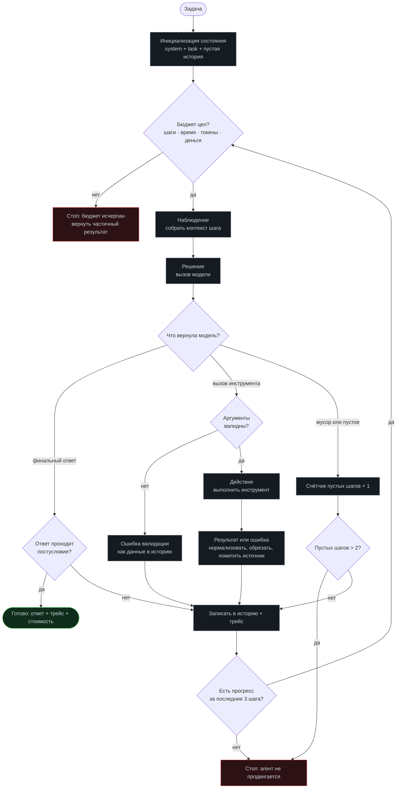

# Модуль 01. Основы агентов

[← К содержанию курса](../README.md) · Следующий модуль: [02. Tool calling](../02-tool-calling/) · Лаба: [lab01-agent-loop](../labs/lab01-agent-loop/)

> **Главный вопрос модуля.** Что именно превращает вызов модели в агента, и в каком случае агент — неверное инженерное решение.

**Время:** 3–4 часа теории и кода, плюс 1,5 часа на лабораторную.
**Критерий приёмки:** `make check m01` — цикл не может уйти в бесконечность, каждый шаг записан в трейс, есть все четыре бюджета.

---

## Содержание

- [1.1 Зачем этот модуль: как выглядит провал без него](#11-зачем-этот-модуль-как-выглядит-провал-без-него)
- [1.2 Определение агента через три признака](#12-определение-агента-через-три-признака)
- [1.3 Четыре уровня автономии](#13-четыре-уровня-автономии)
- [1.4 Цикл: наблюдение → решение → действие](#14-цикл-наблюдение--решение--действие)
- [1.5 Состояние агента: что именно живёт между шагами](#15-состояние-агента-что-именно-живёт-между-шагами)
- [1.6 Четыре бюджета](#16-четыре-бюджета)
- [1.7 Стоп-условия: девять причин закончить прогон](#17-стоп-условия-девять-причин-закончить-прогон)
- [1.8 Минимальная реализация: 120 строк](#18-минимальная-реализация-120-строк)
- [1.9 Трейс: что записывать на каждом шаге](#19-трейс-что-записывать-на-каждом-шаге)
- [1.10 Когда агент не нужен: тест из пяти вопросов](#110-когда-агент-не-нужен-тест-из-пяти-вопросов)
- [1.11 Детерминизм и воспроизводимость](#111-детерминизм-и-воспроизводимость)
- [1.12 Как это ломается: семь типичных ошибок](#112-как-это-ломается-семь-типичных-ошибок)
- [Упражнения](#упражнения)
- [Чек-лист приёмки модуля](#чек-лист-приёмки-модуля)

---

## 1.1 Зачем этот модуль: как выглядит провал без него

Типичная история. Инженер пишет функцию: отправить в модель запрос с описанием инструментов, если модель попросила инструмент — вызвать, результат отправить обратно, повторить. Двадцать строк, работает на первой задаче, демо проходит на ура.

Через неделю в проде: один прогон крутится сорок минут и съедает бюджет месяца, потому что модель зациклилась на «проверю ещё раз»; второй прогон возвращает уверенный ответ, который ни на чём не основан, потому что инструмент вернул ошибку, а модель решила её проигнорировать; третий падает с `RecursionError`, и по логам невозможно понять, на каком шаге. При этом код «правильный»: он делает ровно то, что написано.

Проблема не в коде, а в отсутствующих понятиях. Не было бюджета — появился прогон на сорок минут. Не было стоп-условий — появилось зацикливание. Не было трейса — стало невозможно разобраться. Не было различения «результат» и «ошибка как данные» — появился уверенный ответ ни на чём.

Этот модуль вводит минимальный набор понятий, без которых остальные тринадцать модулей не на что вешать. Он самый теоретический в курсе, и это оправдано: дальше всё будет практикой.

---

## 1.2 Определение агента через три признака

Слово «агент» перегружено до бессмысленности. В курсе оно означает строго следующее.

> **Агент** — программа, которая (1) в цикле выбирает следующее действие на основе результатов предыдущих, (2) имеет доступ к действиям, меняющим состояние мира или получающим новую информацию, и (3) сама решает, когда остановиться, в пределах заданного бюджета.

Все три признака обязательны, и каждый что-то исключает.

**Признак «цикл с обратной связью»** исключает одиночный вызов модели. Если вы отправили запрос и получили ответ — это не агент, каким бы умным ответ ни был. Обратная связь означает, что результат шага N влияет на выбор шага N+1. Без неё нет накопления и нет исправления курса.

**Признак «доступ к действиям»** исключает чистую генерацию текста. Модель, которая пишет план, — не агент. Модель, которая пишет план и выполняет из него первый шаг, читая файл с диска, — уже агент. Действия делятся на два типа: получающие информацию (чтение, поиск, запрос) и меняющие мир (запись, отправка, платёж). Второй тип требует принципиально большей осторожности — этому посвящены модули 08 и 11.

**Признак «сам решает, когда остановиться»** исключает workflow. В workflow количество и порядок шагов заданы автором. В агенте — выбраны в рантайме. Именно этот признак даёт агенту гибкость и одновременно делает его дорогим и непредсказуемым. Ключевое уточнение: «сам решает» не означает «без ограничений». Ограничения задаёт бюджет, и об этом раздел 1.6.

**Практическая польза определения.** Когда вам приносят задачу «нужен агент», проверьте три признака. Если хотя бы один не нужен для задачи — вам нужен не агент, а что-то проще. Это самая частая экономия времени в области.

---

## 1.3 Четыре уровня автономии

Между «один вызов модели» и «автономная система» есть градация. Строить нужно с самого низкого уровня, который решает задачу.

| Уровень | Что это | Кто выбирает порядок шагов | Предсказуемость стоимости | Когда достаточно |
|---|---|---|---|---|
| L0. Один вызов | Промпт → ответ | Автор (шаг один) | Точная | Классификация, извлечение полей, перевод, суммаризация |
| L1. Цепочка (workflow) | Фиксированная последовательность вызовов и функций | Автор | Точная | Пайплайны обработки, где шаги известны заранее |
| L2. Роутер | Модель выбирает одну из N заранее описанных ветвей | Модель, один раз | Почти точная | Поддержка, маршрутизация обращений, выбор шаблона |
| L3. Агент | Модель выбирает действия в цикле | Модель, много раз | Только в пределах бюджета | Задачи, где путь неизвестен: исследование, отладка, многошаговый поиск |
| L4. Автономный прогон | Агент работает без человека длительное время, сам верифицируя себя | Модель + собственные ворота | Только статистически | Ночные прогоны, массовая обработка, долгие рефакторинги |

**Правило перехода.** На следующий уровень переходят только тогда, когда предыдущий доказанно не справился — на вашем наборе задач, с числами. Формулировка «а вдруг понадобится гибкость» не является доказательством.

**Почему это важно экономически.** При переходе L1 → L3 стоимость одной задачи обычно растёт в 3–10 раз, а латентность — в 5–20 раз. Это не потому, что агенты плохо написаны, а потому, что каждый шаг заново отправляет накопленную историю. Если задача решается на L1, агент — это чистый убыток.

**Почему это важно инженерно.** L0 и L1 тестируются обычными юнит-тестами. L3 требует golden set, интервалов доверия и статистики (модуль 09). Вы покупаете гибкость ценой всей инфраструктуры оценки. Иногда это правильная покупка, но она никогда не бесплатна.

---

## 1.4 Цикл: наблюдение → решение → действие

**Что важно на схеме и почти всегда отсутствует в первых реализациях.**

Проверка бюджета стоит **до** вызова модели, а не после. Иначе последний шаг всё равно потратится.

Валидация аргументов стоит **до** выполнения инструмента, и её отказ идёт в историю как обычное наблюдение. Модель должна увидеть, что она передала неверный аргумент, — иначе она повторит.

Есть отдельная ветка «мусор или пустое». Модель иногда возвращает пустой ответ или текст без действия. Без счётчика пустых шагов такой прогон крутится до исчерпания бюджета.

Есть детектор отсутствия прогресса. Формально прогон может делать корректные шаги, но не приближаться к цели: читать один и тот же файл, вызывать один и тот же поиск. Раздел 1.7 даёт три способа это обнаружить.

Есть проверка постусловия перед выдачей ответа. Модель заявляет «готово» гораздо охотнее, чем следует. Если у задачи есть машинно-проверяемое условие завершения — проверяйте его, а не верьте на слово.

---

## 1.5 Состояние агента: что именно живёт между шагами

Самая частая архитектурная ошибка новичка — считать, что состояние агента это «список сообщений». Список сообщений — только одна из шести частей, и не самая важная.

| Часть состояния | Что содержит | Живёт | Кто меняет |
|---|---|---|---|
| Задача | Исходная формулировка, критерий готовности, ограничения | Весь прогон, неизменна | Никто (иммутабельна) |
| История | Сообщения, вызовы, результаты | Весь прогон, растёт | Цикл |
| Рабочее окно | То, что реально отправляется модели на этом шаге | Один шаг | Сборщик контекста |
| Счётчики | Шаги, токены, деньги, время, пустые шаги, повторы | Весь прогон | Цикл |
| Артефакты | Файлы, записи в БД, отправленные запросы — след в мире | Дольше прогона | Инструменты |
| Трейс | Полная запись решений для последующего разбора | Дольше прогона | Цикл и инструменты |

**Почему разделение «история» и «рабочее окно» критично.** История — это правда о прогоне, её нельзя терять. Рабочее окно — то, что влезло в бюджет контекста и признано полезным. Когда эти две вещи слиты в одну переменную, компакция (модуль 04) невозможна без потери данных: вы обрезаете историю и стираете правду.

**Почему артефакты — часть состояния.** Потому что откат прогона не откатывает мир. Если агент на третьем шаге отправил письмо, отмена прогона письмо не вернёт. Отсюда правило 8 из принципов курса: каждое действие либо обратимо, либо подтверждено.

**Иммутабельность задачи.** Задача не должна меняться в процессе. Если модель «уточнила задачу для себя» — это её вывод, он идёт в историю, а не подменяет исходную формулировку. Иначе получается классический дрейф: агент к десятому шагу решает не ту задачу, которую просили, и при этом уверен, что справился.

---

## 1.6 Четыре бюджета

Любой прогон ограничен четырьмя независимыми лимитами. Ограничить нужно все четыре: они защищают от разных сценариев.

| Бюджет | От чего защищает | Разумный старт | Что делать при исчерпании |
|---|---|---|---|
| Шаги (`max_steps`) | Зацикливание, бесконечное «уточню ещё раз» | 12–25 для типовой задачи | Вернуть частичный результат и честно сказать, что не закончил |
| Время (`deadline`) | Зависший инструмент, медленный провайдер, сетевые таймауты | 5–10 минут на интерактивную задачу | Прервать текущий инструмент, сохранить состояние |
| Токены (`max_tokens_total`) | Разбухание контекста, гигантские выводы инструментов | 5–10× ожидаемого объёма | Компакция (модуль 04), затем стоп |
| Деньги (`max_cost_usd`) | Всё вышеперечисленное одновременно, плюс дорогая модель | Цена 3–5 ожидаемых прогонов | Жёсткий стоп с алертом |

**Почему шагов недостаточно.** Двадцать шагов, каждый из которых читает файл на 200 килобайт, разорвут бюджет токенов задолго до двадцатого шага. Токены и шаги ортогональны.

**Почему времени недостаточно.** Пять минут при быстрой модели — это сотни шагов. Время защищает от зависаний, а не от зацикливания.

**Как считать деньги.** Учитывать нужно и вход, и выход, и кэшированные токены по своей цене. Ключевая, обычно недооценённая деталь: в агенте история отправляется заново на каждом шаге. При N шагах и линейно растущей истории суммарный объём входных токенов растёт как N², а не как N. Прогон на 30 шагов может стоить в разы больше, чем интуитивно ожидается. Это единственная формула, которую стоит запомнить из этого модуля.

~~~
Суммарные входные токены ≈ N × (system + task) + (N × (N+1) / 2) × средний_прирост_шага
~~~

**Мягкие и жёсткие пороги.** Хорошая практика — два порога на каждый бюджет: мягкий (80%), при котором агент получает в контекст предупреждение «бюджет заканчивается, переходи к выводам», и жёсткий (100%), при котором цикл прерывается снаружи. Мягкий порог заметно улучшает качество частичных результатов: агент успевает подвести итог вместо того, чтобы быть обрубленным на середине.

---

## 1.7 Стоп-условия: девять причин закончить прогон

Прогон должен заканчиваться по явной причине, и эта причина записывается в трейс. «Просто закончился» — не причина.

| Код | Причина | Как определяется | Результат для пользователя |
|---|---|---|---|
| `done` | Задача выполнена и постусловие проверено | Модель заявила готовность + проверка прошла | Успех |
| `done_unverified` | Модель заявила готовность, проверить нечем | Нет машинного постусловия | Успех с пометкой «не верифицировано» |
| `budget_steps` | Исчерпан лимит шагов | Счётчик | Частичный результат + что осталось |
| `budget_time` | Исчерпан дедлайн | Часы | Частичный результат + состояние |
| `budget_cost` | Исчерпан лимит стоимости | Счётчик | Частичный результат + алерт |
| `no_progress` | Три шага без продвижения | Детектор прогресса, см. ниже | Отчёт о застревании |
| `repeated_action` | Один и тот же вызов с теми же аргументами N раз | Хеш (имя + аргументы) | Отчёт + подозрение на плохое описание инструмента |
| `needs_human` | Агент запросил решение человека | Явный инструмент `ask_human` | Вопрос пользователю |
| `fatal` | Невосстановимая ошибка окружения | Исключение вне инструмента | Ошибка + трейс |

**Три способа детектировать отсутствие прогресса.** Первый и самый простой: хеш от (имя инструмента + нормализованные аргументы); три одинаковых хеша подряд — стоп. Второй: не изменился набор артефактов и не появилось новых фактов за K шагов. Третий, более тонкий: модель сама на каждом шаге отмечает, какой пункт плана продвинулся; если три шага подряд «никакой» — стоп. Первый способ ловит 70% случаев и стоит десять строк, начните с него.

**Почему `done_unverified` отдельный код.** Потому что доля таких завершений — это метрика зрелости вашей обвязки. Если 90% прогонов заканчиваются «модель сказала, что готово, проверить нечем» — у вас нет верификации, и любые улучшения будут вслепую. Хорошая цель — снизить эту долю ниже 30% к концу курса.

---

## 1.8 Минимальная реализация: 120 строк

Полный рабочий код — в [`code/agent.py`](code/agent.py). Здесь — разбор ключевых частей. Код намеренно без фреймворков: каждая строка на своём месте по причине, которую можно объяснить.

**Состояние.**

~~~python
from dataclasses import dataclass, field
from time import monotonic
from typing import Any

@dataclass(frozen=True)
class Task:
    """Иммутабельна: агент не имеет права переписать задачу под себя."""
    prompt: str
    done_when: str | None = None      # машинно-проверяемое постусловие
    max_steps: int = 16
    max_seconds: float = 300.0
    max_tokens: int = 200_000
    max_cost_usd: float = 0.50

@dataclass
class Budget:
    task: Task
    started: float = field(default_factory=monotonic)
    steps: int = 0
    tokens: int = 0
    cost_usd: float = 0.0
    empty_steps: int = 0

    def exceeded(self) -> str | None:
        if self.steps >= self.task.max_steps:
            return "budget_steps"
        if monotonic() - self.started >= self.task.max_seconds:
            return "budget_time"
        if self.tokens >= self.task.max_tokens:
            return "budget_tokens"
        if self.cost_usd >= self.task.max_cost_usd:
            return "budget_cost"
        return None

    def soft_warning(self) -> str | None:
        """Мягкий порог 80%: агент успевает подвести итог."""
        ratios = [
            self.steps / self.task.max_steps,
            (monotonic() - self.started) / self.task.max_seconds,
            self.tokens / self.task.max_tokens,
            self.cost_usd / self.task.max_cost_usd,
        ]
        if max(ratios) >= 0.8:
            return ("Бюджет израсходован более чем на 80%. "
                    "Заверши работу: дай лучший доступный ответ "
                    "и перечисли, что осталось непроверенным.")
        return None
~~~

**Цикл.**

~~~python
def run(task: Task, tools: "ToolRegistry", llm, trace) -> dict[str, Any]:
    budget = Budget(task=task)
    history: list[dict] = [{"role": "user", "content": task.prompt}]
    seen_calls: list[str] = []          # для детектора повторов

    while True:
        # 1. Границы проверяются ДО траты денег
        if reason := budget.exceeded():
            return finish(reason, history, budget, trace)

        # 2. Наблюдение: собрать окно контекста под текущий шаг
        window = build_window(task, history, warning=budget.soft_warning())

        # 3. Решение
        budget.steps += 1
        reply = llm.chat(window, tools=tools.schemas())
        budget.tokens += reply.usage.total
        budget.cost_usd += reply.usage.cost_usd
        trace.step(budget.steps, window, reply)

        # 4. Разбор ответа
        if not reply.tool_calls and not reply.text.strip():
            budget.empty_steps += 1
            if budget.empty_steps > 2:
                return finish("no_progress", history, budget, trace)
            history.append(observation("Пустой ответ. Выбери действие или дай итог."))
            continue

        if not reply.tool_calls:
            ok, note = verify(task, reply.text)
            if ok:
                return finish("done", history, budget, trace, answer=reply.text)
            history.append(observation(f"Постусловие не выполнено: {note}"))
            continue

        history.append({"role": "assistant", "tool_calls": reply.tool_calls})

        # 5. Действия
        for call in reply.tool_calls:
            fp = tools.fingerprint(call)
            if seen_calls[-3:].count(fp) >= 3:
                return finish("repeated_action", history, budget, trace)
            seen_calls.append(fp)

            result = tools.invoke(call)          # ошибки внутри → данные
            trace.tool(budget.steps, call, result)
            history.append(tool_message(call, result))
~~~

**Что здесь принципиально.**

Функция `tools.invoke` никогда не выбрасывает исключение наружу: любая ошибка превращается в структурированный результат и попадает в историю. Это тема модуля 02, но заложено уже здесь.

`build_window` — отдельная функция, а не `history[-10:]` по месту. Именно в ней потом появится компакция, приоритизация и разметка недоверенного контента. Если её не выделить сразу, модули 04 и 11 придётся вставлять в цикл, и цикл станет нечитаемым.

`trace` вызывается на каждом шаге и на каждом инструменте, без исключений и без условий вроде «если включён debug». Трейс — это не отладка, это основной артефакт прогона.

`finish` всегда возвращает причину останова. Ни одного `return` без кода причины.

---

## 1.9 Трейс: что записывать на каждом шаге

Трейс — это то, что позволяет разобраться в прогоне через неделю после того, как он упал. Правило: трейс пишется всегда, в машиночитаемом виде, по одной записи на строку (JSONL), в файл `runs/<run_id>.jsonl`.

**Минимальный набор полей записи шага.**

~~~json
{"t":"step","run_id":"r-2f8a","step":3,"ts":"2026-08-16T10:22:41Z",
 "model":"m-small","in_tokens":4210,"out_tokens":180,"cost_usd":0.0021,
 "latency_ms":1840,"window_hash":"a91c...","decision":"tool_call",
 "tool":"read_file","args_hash":"5b2e...","budget":{"steps":"3/16","cost":"0.014/0.50"}}
~~~

~~~json
{"t":"tool","run_id":"r-2f8a","step":3,"tool":"read_file",
 "args":{"path":"src/api.py"},"status":"error","error_code":"not_found",
 "retryable":true,"hint":"Проверь путь: файла нет. Список: src/app.py, src/api_v2.py",
 "duration_ms":12,"bytes_out":0,"truncated":false}
~~~

**Почему хеши, а не полный контент.** Полное окно контекста на каждом шаге — это гигабайты за день работы. Хеш окна позволяет ответить на главный вопрос отладки: «изменился ли вход между шагами?» Полное окно сохраняйте с семплированием: например, для всех упавших прогонов и для 5% успешных.

**Обязательные поля, которые обычно забывают.** `run_id` — без него невозможно склеить записи, если прогонов много. `latency_ms` отдельно для модели и отдельно для инструмента — иначе непонятно, кто тормозит. `truncated` — флаг, что вывод инструмента был обрезан: это причина примерно каждого пятого «странного» решения агента. `budget` в каждой записи — чтобы видеть динамику расхода, а не только итог.

**Три вопроса, на которые ваш трейс обязан отвечать за минуту.** Первый: на каком шаге агент впервые пошёл не туда? Второй: что он видел в этот момент (окно или его хеш плюс дельта)? Третий: сколько это стоило и где основная трата? Если на любой из вопросов нужно больше минуты — трейс недостаточен, и это стоит починить до перехода к модулю 02.

---

## 1.10 Когда агент не нужен: тест из пяти вопросов

Самое ценное умение из этого модуля — вовремя сказать «здесь агент не нужен». Пять вопросов, каждый со честным ответом.

**1. Известен ли порядок шагов заранее?** Если да — вам нужен workflow (L1). Агент, который каждый раз «решает», в каком порядке делать три известных шага, — это плата за недетерминизм без выгоды.

**2. Число шагов больше трёх?** Если задача решается за один-два вызова модели, цикл не нужен. Два вызова подряд — это функция, а не агент.

**3. Есть ли ветвление, зависящее от данных, которых нет до запуска?** Это главный законный повод для агента: путь неизвестен, потому что зависит от того, что найдётся. Отладка бага, исследование кодовой базы, поиск по документам с уточнениями.

**4. Можно ли проверить результат машинно?** Если нет — агент будет уверенно ошибаться, и вы не узнаете. Это не запрет, но красный флаг: сначала придумайте проверку, потом стройте агента. Иначе вы строите генератор правдоподобного.

**5. Готовы ли вы к десятикратной стоимости и пятикратной задержке?** Если ответ «нет», то дальше можно не идти. Это реальная цена перехода L1 → L3, и её нужно принять до начала разработки, а не обнаружить в первом счёте.

**Матрица решения.**

| Ответы | Решение |
|---|---|
| Порядок известен, шагов мало | L0 или L1. Не агент |
| Порядок известен, шагов много | L1 с параллелизмом. Не агент |
| Порядок зависит от данных, проверка есть | L3. Агент оправдан |
| Порядок зависит от данных, проверки нет | Сначала придумать проверку. Затем L3 |
| Порядок зависит от данных, но бюджета нет | L2 роутер: пусть модель выберет один из готовых сценариев |

**Пример из практики.** Задача «извлечь из 10 000 PDF-договоров дату, сумму и стороны». Соблазн: агент, который сам решает, как читать документ. Правильное решение: L1 — конвертация, извлечение по схеме одним вызовом, валидация, и агент только для 3% документов, где валидация не прошла. Стоимость падает в двадцать раз, качество растёт, потому что 97% идут по детерминированному пути.

---

## 1.11 Детерминизм и воспроизводимость

Агент недетерминирован по своей природе, но степень недетерминизма — ваш инженерный выбор, а не данность.

**Что можно зафиксировать.** Температуру (0 для рабочих задач, не для творческих). Версию модели — явно, со снапшотом, никогда «latest». Порядок инструментов в схеме: некоторые модели чувствительны к нему. Формат вывода — через структурированный вывод, а не «пожалуйста, отвечай JSON». Сам промпт — с версией и хешем в трейсе. Все внешние данные — зафиксированные фикстуры для тестов.

**Что зафиксировать нельзя.** Внутренний недетерминизм провайдера: даже при `temperature=0` ответы могут различаться из-за особенностей вычислений и батчинга на стороне сервера. Поэтому «прогнал один раз — стало лучше» не является выводом. Это причина, по которой в модуле 09 всё измеряется на нескольких прогонах с интервалами.

**Уровни воспроизводимости, к которым стоит стремиться.**

| Уровень | Что достигается | Как |
|---|---|---|
| R0 | Прогон можно пересказать | Трейс есть |
| R1 | Прогон можно повторить с тем же входом | Зафиксированы версия модели, промпт, фикстуры |
| R2 | Прогон можно воспроизвести без сети | Записанные ответы модели и инструментов (режим replay) |
| R3 | Регрессии обнаруживаются автоматически | R2 плюс golden set в CI |

**Режим replay** заслуживает отдельного внимания: это запись всех пар «запрос к модели → ответ» в файл и последующее их проигрывание. Даёт мгновенные и бесплатные тесты цикла, валидации, компакции и обработки ошибок — то есть 80% вашего кода. Один вечер работы, который экономит недели. Реализуется как обёртка вокруг `llm.chat` с кешем по хешу запроса.

---

## 1.12 Как это ломается: семь типичных ошибок

**Ошибка 1. Бюджет только по шагам.** Симптом: прогон укладывается в 16 шагов, но стоит в двадцать раз дороже ожидаемого. Причина: один шаг прочитал файл на миллион символов. Лечение: лимит токенов и обрезка вывода инструментов с флагом `truncated`.

**Ошибка 2. Исключение вместо результата.** Симптом: прогон падает целиком из-за отсутствующего файла. Причина: `invoke` пробрасывает исключение. Лечение: любая ошибка инструмента — структурированный результат с `error_code` и `hint`.

**Ошибка 3. Отсутствие детектора повторов.** Симптом: агент двенадцать раз вызывает один и тот же поиск с одним и тем же запросом. Причина: описание инструмента не даёт понять, что результат уже получен. Лечение: хеш вызова плюс стоп-условие `repeated_action`; и обязательно — исправление описания инструмента, потому что повтор почти всегда его вина.

**Ошибка 4. Слитые история и окно.** Симптом: после включения обрезки истории агент «забывает» принятое решение. Причина: обрезали единственную копию правды. Лечение: раздельные `history` и `build_window()`.

**Ошибка 5. Мутирующая задача.** Симптом: к концу прогона агент решает другую задачу и уверен, что справился. Причина: переформулировка модели записывается в поле задачи. Лечение: `frozen=True` на `Task` и отдельное поле «текущая интерпретация» в истории.

**Ошибка 6. Верификация только по словам модели.** Симптом: 95% прогонов «успешны», а пользователи жалуются. Причина: успех определяется фразой «готово». Лечение: код `done_unverified` как отдельная метрика и постепенное добавление машинных постусловий.

**Ошибка 7. Трейс под флагом отладки.** Симптом: упал ночной прогон, разобраться нечем. Причина: трейс включался вручную. Лечение: трейс всегда включён, семплирование применяется к объёму полей, а не к факту записи.

---

## Упражнения

<b>Задача 1.</b> Классифицируйте пять задач по уровням L0–L4

Задачи: (а) определить тональность отзыва; (б) по описанию бага найти сломанный коммит; (в) перевести 1000 строк интерфейса; (г) ответить на вопрос по 200-страничной инструкции; (д) провести ночной рефакторинг модуля с прогоном тестов.

**Ответ.** (а) L0 — один вызов, порядок известен, проверка машинная. (б) L3 — путь зависит от того, что покажет `git bisect` и тесты. (в) L1 — цепочка с батчингом и валидацией, агент не нужен. (г) L1 или L2 — RAG плюс один вызов; агент нужен только если требуются уточняющие итерации поиска. (д) L4 — длительная автономия с собственными воротами.

Главная ловушка — пункт (г): его почти всегда пытаются сделать агентом, хотя в 90% случаев достаточно поиска и одного вызова.

<b>Задача 2.</b> Посчитайте стоимость прогона

Системный промпт 1500 токенов, задача 200. Каждый шаг добавляет в историю в среднем 700 токенов (решение модели плюс результат инструмента). Прогон занял 20 шагов. Цена входа 0,15 доллара за миллион токенов, выхода — 0,60. Средний выход 150 токенов на шаг.

**Ответ.** Вход: на шаге k отправляется 1700 + 700·(k−1). Сумма за 20 шагов: 20·1700 + 700·(0+1+…+19) = 34 000 + 700·190 = 34 000 + 133 000 = 167 000 токенов. Стоимость входа: 167 000 / 1 000 000 × 0,15 ≈ 0,025 доллара. Выход: 20 × 150 = 3000 токенов → 0,0018. Итого ≈ 0,027 доллара.

Ключевое наблюдение: 92% стоимости — это вход, и он квадратичен по числу шагов. Удвоение числа шагов до 40 даст не 0,054, а примерно 0,095 доллара. Именно поэтому модуль 12 существует.

<b>Задача 3.</b> Найдите пропущенное стоп-условие

Дан цикл: проверяется `steps < max_steps`, проверяется дедлайн, ошибки инструментов возвращаются как данные, есть детектор повторов по хешу вызова. Агент всё равно однажды крутился до предела шагов, ничего не делая.

**Ответ.** Не хватает счётчика пустых шагов. Модель возвращала текст без вызова инструмента и без финального ответа (например, «сейчас подумаю»). Хеш вызова не считался, потому что вызова не было; повторы не ловились. Лечение — ветка «мусор или пустое» из схемы 1.4 с лимитом 2–3.

<b>Задача 4.</b> Спроектируйте постусловие

Задача агента: «исправь падающий тест `test_login`». Придумайте машинно-проверяемое постусловие, которое нельзя обойти.

**Ответ.** Наивное: `pytest test_login` проходит. Обходится тремя способами: тест удалён; тест помечен `skip`; тест изменён так, что проверяет пустоту. Устойчивое постусловие — конъюнкция: (1) `pytest` на всём наборе зелёный; (2) `git diff` не содержит изменений в файлах тестов; (3) число собранных тестов не уменьшилось; (4) нет новых `skip` и `xfail`. Это хорошая иллюстрация закона Гудхарта: любая одиночная метрика, ставшая целью, будет обойдена.

<b>Задача 5.</b> Мягкий порог бюджета

Почему предупреждение на 80% бюджета улучшает результат, хотя не добавляет агенту ни одного шага?

**Ответ.** Оно меняет стратегию модели с «продолжать исследование» на «свести к выводу». Без предупреждения агент обрубается снаружи на середине мысли, и частичный результат бесполезен. С предупреждением он успевает сформулировать, что нашёл и что осталось. Улучшается не pass rate, а полезность неуспешных прогонов — а их обычно от 20 до 40 процентов, так что эффект на пользователя больше, чем кажется.

<b>Задача 6.</b> Режим replay

Реализуйте обёртку, дающую воспроизводимость R2. Какие два подводных камня?

**Ответ.** Обёртка: хеш от (модель, промпт, схемы инструментов, температура) → ответ, сохранённый в `fixtures/replay/<hash>.json`. Первый подводный камень: недетерминированные части входа (метки времени, случайные `run_id`, абсолютные пути) попадают в хеш, и он никогда не совпадает — нужно нормализовать вход перед хешированием. Второй: при изменении промпта все фикстуры инвалидируются молча, тесты начинают ходить в сеть; нужен режим `strict`, который падает при промахе кеша, а не идёт в сеть.

<b>Задача 7.</b> Обоснуйте отказ от агента

Продакт хочет агента для «умного заполнения формы из письма». Напишите три аргумента и предложите альтернативу.

**Ответ.** Аргументы: (1) порядок шагов известен заранее — разобрать письмо, извлечь поля, проверить, заполнить, так что это L1; (2) результат проверяем схемой, значит нет нужды в свободном поиске; (3) стоимость и латентность агента выше на порядок при том же качестве. Альтернатива: один вызов со структурированным выводом по JSON-схеме плюс валидация плюс агент только для писем, где валидация не прошла. Как бонус — на 97% писем система становится детерминированной и тестируемой обычными юнит-тестами.

<b>Задача 8.</b> Проектирование трейса

По вашему трейсу нужно ответить: «почему прогон r-91f стоил в 8 раз дороже среднего». Какие поля обязательны?

**Ответ.** `run_id`, `step`, `in_tokens`, `out_tokens`, `cost_usd` на каждом шаге (иначе не найти, где скачок); `tool` и `bytes_out` с `truncated` (типичная причина — один инструмент вернул огромный вывод); `model` на каждом шаге (вторая типичная причина — роутер ушёл на дорогую модель); `window_hash` (третья — история не компактилась). Агрегат по прогону недостаточен: он говорит «дорого», но не говорит «где».

---

## Чек-лист приёмки модуля

Модуль закрыт, если все пункты выполняются и `make check m01` зелёный.

- [ ] Цикл не может выполниться больше `max_steps` раз — проверено тестом с фиктивной моделью, которая всегда просит инструмент
- [ ] Реализованы все четыре бюджета, и каждый имеет тест на срабатывание
- [ ] Есть мягкий порог 80%, и предупреждение действительно попадает в контекст
- [ ] Каждый `return` из цикла содержит код причины останова из таблицы 1.7
- [ ] Ошибка инструмента не прерывает прогон, а попадает в историю как данные
- [ ] Есть счётчик пустых шагов и стоп по нему
- [ ] Есть детектор повторяющихся вызовов по хешу (имя + аргументы)
- [ ] `Task` иммутабельна
- [ ] `history` и `build_window()` разделены
- [ ] Трейс пишется всегда в JSONL и содержит все поля из 1.9
- [ ] По трейсу за минуту находится шаг, на котором прогон пошёл не туда
- [ ] Заполнена матрица из 1.10 для вашей реальной задачи, и решение «агент или нет» обосновано

**Антиметрика модуля.** Если все тесты зелёные с первого запуска и ни одно стоп-условие ни разу не срабатывало — вы, скорее всего, не проверяли их на живом прогоне. Специально сломайте инструмент, специально поставьте `max_steps=2`, специально верните из модели пустой ответ. Тест, который никогда не падал, ничего не гарантирует.

---

## Связь с другими модулями

| Куда ведёт | Что именно берётся отсюда |
|---|---|
| [02 Tool calling](../02-tool-calling/) | `tools.invoke`, `fingerprint`, ошибка как данные |
| [03 Планирование](../03-planning/) | Детектор прогресса, план как часть состояния |
| [04 Память](../04-memory/) | `build_window()` — точка, куда встраивается компакция |
| [09 Эвалы](../09-evals/) | Коды останова как метрики: доля `done`, доля `done_unverified` |
| [10 Наблюдаемость](../10-observability/) | Трейс из 1.9 превращается в спаны OpenTelemetry |
| [12 Стоимость](../12-cost-optimization/) | Квадратичная формула роста входных токенов |
| [14 Отказы](../14-agent-failures/) | Стоп-условия — первый уровень таксономии отказов |

**Дальше:** [Модуль 02. Tool calling →](../02-tool-calling/)
