# Модуль 03. Планирование

[← 02. Tool calling](../02-tool-calling/) · [К содержанию](../README.md) · [04. Память →](../04-memory/) · Лабы: [05](../labs/lab05-plan-file/), [06](../labs/lab06-critic/)

> **Главный вопрос модуля.** Кто решает, в каком порядке действовать, где этот план живёт, и что происходит, когда он не сработал.

**Время:** 4–5 часов теории и кода, 3 часа лабораторных.
**Критерий приёмки:** `make check m03` — план хранится вне контекста модели как файл, обновляется явно, число перепланирований ограничено, есть детектор отсутствия прогресса по пунктам плана.

---

## Содержание

- [3.1 Провал без этого модуля](#31-провал-без-этого-модуля)
- [3.2 Четыре архитектуры планирования](#32-четыре-архитектуры-планирования)
- [3.3 ReAct: как это работает и где ломается](#33-react-как-это-работает-и-где-ломается)
- [3.4 План-файл: формат, правила, пример](#34-план-файл-формат-правила-пример)
- [3.5 Декомпозиция: как резать задачу](#35-декомпозиция-как-резать-задачу)
- [3.6 Критик и рефлексия](#36-критик-и-рефлексия)
- [3.7 Перепланирование: триггеры и лимит](#37-перепланирование-триггеры-и-лимит)
- [3.8 Детектор прогресса по плану](#38-детектор-прогресса-по-плану)
- [3.9 Бюджет шагов и сколько его отдавать плану](#39-бюджет-шагов-и-сколько-его-отдавать-плану)
- [3.10 Как это ломается: восемь ошибок](#310-как-это-ломается-восемь-ошибок)
- [Упражнения](#упражнения)
- [Чек-лист приёмки модуля](#чек-лист-приёмки-модуля)

---

## 3.1 Провал без этого модуля

Агент без плана ведёт себя как человек, которому каждые тридцать секунд стирают память о том, зачем он пришёл. Три характерных симптома.

**Дрейф цели.** На шаге 1 задача была «починить падающий тест логина». На шаге 7 агент увлечённо рефакторит модуль конфигурации, потому что заметил там дублирование. Формально каждый шаг разумен, суммарно — задача не решена, деньги потрачены. Причина: цель существовала только в первом сообщении и утонула в середине контекста.

**Забытые подзадачи.** Задача состояла из четырёх частей. Агент сделал первую и третью, отчитался «готово». Причина: список частей нигде не зафиксирован, и «готово» определялось ощущением, а не сверкой со списком.

**Бесконечная подготовка.** Двенадцать шагов чтения файлов и ни одного изменения. Агент исследует, потому что исследовать безопаснее, чем действовать, а ограничения на фазу исследования нет.

Все три лечатся одним и тем же: план должен существовать как явный артефакт вне контекста модели, и цикл должен сверяться с ним, а не с воспоминаниями.

---

## 3.2 Четыре архитектуры планирования

```mermaid
flowchart TB
  subgraph P0["A. Без плана (реактивный)"]
    A1["наблюдение"] --> A2["решение"] --> A3["действие"] --> A1
  end

  subgraph P1["B. План заранее (plan-and-execute)"]
    B1["составить план целиком"] --> B2["шаг 1"] --> B3["шаг 2"] --> B4["шаг N"] --> B5["отчёт"]
  end

  subgraph P2["C. План-файл (живой)"]
    C1["составить план"] --> C2["взять первый незакрытый пункт"]
    C2 --> C3["выполнить"] --> C4["обновить статус в файле"]
    C4 --> C5{"нужно<br/>перепланировать?"}
    C5 -->|"нет"| C2
    C5 -->|"да, лимит не исчерпан"| C6["правка плана + запись причины"] --> C2
    C5 -->|"да, лимит исчерпан"| C7["стоп: эскалация"]
  end

  subgraph P3["D. Дерево вариантов"]
    D1["сгенерировать K гипотез"] --> D2["оценить каждую"]
    D2 --> D3["развернуть лучшую"] --> D4{"тупик?"}
    D4 -->|"да"| D2
    D4 -->|"нет"| D5["решение"]
  end

  classDef bad fill:#2d1215,stroke:#f85149,color:#c9d1d9
  classDef ok fill:#0f2d1a,stroke:#3fb950,color:#c9d1d9
  classDef mid fill:#161b22,stroke:#d29922,color:#c9d1d9
  class A1,A2,A3 mid
  class B1,B2,B3,B4,B5 mid
  class C1,C2,C3,C4,C6 ok
  class C7 bad
  class D1,D2,D3,D5 mid
```

| Архитектура | Когда работает | Когда проваливается | Цена |
|---|---|---|---|
| A. Без плана | Задачи до 5 шагов, где цель очевидна и держится в конце контекста | Всё, что длиннее: дрейф цели гарантирован | Минимальная |
| B. План заранее | Задачи с известной структурой, где мир не меняется по ходу | Первая же неожиданность делает весь план недействительным, а агент продолжает по нему идти | Один лишний вызов |
| C. План-файл | Основной рабочий вариант для 90% реальных задач | Требует дисциплины: файл, статусы, лимит правок | Небольшая: одна запись на шаг |
| D. Дерево вариантов | Поиск, где важно сравнить альтернативы: подбор архитектуры, отладка с несколькими гипотезами | Дорого в K раз; редко оправдано вне сложной отладки | Высокая |

**Рекомендация курса.** Начинайте с C. Архитектура A допустима только как осознанное решение для коротких задач. B — почти всегда ошибка: она выглядит аккуратно и разваливается при первом сюрпризе, при этом агент не замечает, что план устарел. D берите точечно, когда измерили, что одиночная гипотеза даёт низкий pass rate на конкретном классе задач.

**Почему план-файл, а не план в контексте.** Четыре причины. Первая: файл не тонет в середине окна и не вытесняется компакцией. Вторая: файл можно прочитать человеку и увидеть, что агент собирается делать, до того как он это сделает. Третья: изменение плана становится наблюдаемым событием — есть diff. Четвёртая: план в файле можно проверить кодом (например, «все пункты имеют критерий проверки»), а план в голове модели — нельзя.

---

## 3.3 ReAct: как это работает и где ломается

ReAct — базовая схема: чередование рассуждения (`thought`), действия (`action`) и наблюдения (`observation`). Она лежит в основе почти всех агентов, и её стоит понимать в деталях, включая слабые места.

~~~
Thought: тест падает на assert response.status == 200. Надо посмотреть,
         что реально возвращает эндпоинт.
Action:  run_tests(pattern="test_login") 
Observation: AssertionError: 500 != 200; в логе KeyError: 'user_id'
Thought: похоже, в сессии нет user_id. Проверю, где он ставится.
Action:  search_code(query="user_id =")
Observation: 3 совпадения: auth.py:41, session.py:12, legacy.py:88
...
~~~

**Что даёт `thought`.** Три вещи. Он повышает качество выбора действия (модель «думает вслух» и реже выбирает наугад). Он делает трейс читаемым для человека — это половина ценности отладки. Он позволяет обнаружить дрейф: если `thought` на шаге 7 не упоминает исходную цель, вы это видите.

**Где ReAct ломается.**

**Рационализация вместо рассуждения.** Модель сначала «решает» действие, потом сочиняет объяснение. Признак: `thought` всегда уверенный, никогда не содержит «не знаю» или «две гипотезы». Лечение: требовать в `thought` структуру — текущая гипотеза, что её подтвердит, что опровергнет. Формат сильно влияет: свободное «подумай» даёт рационализацию, структурированное — реальную проверку.

**Стоимость рассуждений.** `thought` на каждом шаге — это выходные токены (дорогие) плюс входные на всех последующих шагах. На длинных прогонах это заметная доля счёта. Лечение: краткие `thought` (лимит в промпте, 1–3 предложения) и удаление старых `thought` при компакции — они почти никогда не нужны после того, как шаг завершён. Решения нужны, размышления — нет.

**Отсутствие связи с целью.** Классический ReAct не имеет понятия «план»; каждый `thought` опирается на историю. Отсюда дрейф. Лечение — как раз план-файл: `thought` обязан ссылаться на номер пункта плана.

**Улучшенный формат шага, который стоит внедрить сразу.**

~~~
Пункт плана: 2 (найти источник KeyError)
Гипотеза:    user_id не попадает в сессию при входе через OAuth
Проверка:    прочитать auth.py вокруг строки 41
Действие:    read_file(path="src/auth.py", from_line=20, to_line=60)
~~~

Четыре поля вместо одного свободного абзаца. Даёт: привязку к плану, фальсифицируемость (есть что опровергать), и машинную проверяемость — можно кодом убедиться, что номер пункта существует и не закрыт.

---

## 3.4 План-файл: формат, правила, пример

**Где живёт.** `.agent/plan.md` в рабочем каталоге прогона. Markdown, а не JSON: его читает и человек, и модель, и `git diff` по нему информативен.

**Формат.**

~~~markdown
# План: починить падающий тест test_login

Цель (иммутабельна): pytest проходит целиком, тесты не изменены,
число собранных тестов не уменьшилось.

Обновлён: шаг 6. Перепланирований: 1 из 3.

| # | Пункт | Статус | Критерий готовности | Заметка |
|---|---|---|---|---|
| 1 | Воспроизвести падение | done | run_tests(test_login) падает с той же ошибкой | AssertionError 500 != 200 |
| 2 | Найти источник KeyError user_id | done | известен файл и строка | auth.py:41, ветка oauth |
| 3 | Понять, почему ветка oauth не ставит user_id | in_progress | есть объяснение в 2 предложениях | — |
| 4 | Исправить минимальным изменением | todo | diff не больше 15 строк | — |
| 5 | Прогнать весь набор тестов | todo | pytest зелёный, собрано >= 214 тестов | — |
| 6 | Проверить, что тесты не менялись | todo | git diff --stat не содержит tests/ | — |

## Отброшенные варианты
- Заменить assert на 500: обходит проблему, нарушает цель.

## Открытые вопросы
- Нужно ли то же исправление для ветки saml? Вынести в BACKLOG, не в этот прогон.
~~~

**Семь правил плана.**

1. **Цель отдельно и неизменна.** Она копируется из задачи один раз и никогда не правится агентом. Правка цели — признак дрейфа.
2. **У каждого пункта машинно-проверяемый критерий.** «Разобраться в коде» — не пункт. «Известен файл и строка, где теряется user_id» — пункт.
3. **Статусы из закрытого списка:** `todo`, `in_progress`, `done`, `blocked`, `dropped`. Никаких «почти готово».
4. **Одновременно `in_progress` ровно один пункт.** Это WIP=1 на уровне плана, и он резко снижает дрейф.
5. **Размер пункта — 1–3 шага агента.** Пункт, который занимает десять шагов, надо разделить: иначе прогресс не виден.
6. **Отброшенные варианты записываются.** Иначе агент вернётся к ним на шаге 12 и потратит бюджет заново.
7. **Всё, что «заодно», уходит в `BACKLOG.md`, а не в план.** Это главный клапан против расширения скоупа.

**Как план попадает в контекст.** Не целиком на каждом шаге, а компактно: цель, текущий пункт с критерием, следующие два пункта, счётчик перепланирований. Обычно 150–250 токенов вместо тысячи. Полный план подгружается только когда агент вызывает `read_plan()` — и это отдельный инструмент, что полезно: по трейсу видно, как часто агент сверяется с планом.

**Инструменты для работы с планом.**

| Инструмент | Что делает | Ограничение |
|---|---|---|
| `read_plan()` | Возвращает план целиком | — |
| `set_status(item, status, note)` | Меняет статус одного пункта | Нельзя ставить `done` без заполненной заметки |
| `replan(reason, new_items)` | Заменяет незакрытые пункты | Счётчик лимитирован, причина обязательна |
| `add_backlog(text)` | Записывает «заодно» в `BACKLOG.md` | Не влияет на план |

Обратите внимание: нет инструмента `edit_goal`. Это осознанное отсутствие.

---

## 3.5 Декомпозиция: как резать задачу

Плохая декомпозиция — самая частая причина того, что план не помогает. Пять правил резки.

**Правило 1. По проверяемости, а не по темам.** Плохо: «изучить, спроектировать, реализовать, протестировать» — это фазы, у них нет критериев. Хорошо: каждый пункт заканчивается состоянием мира, которое можно проверить командой.

**Правило 2. Первый пункт — воспроизведение или измерение.** Для отладки — воспроизвести ошибку. Для оптимизации — замерить текущее значение. Для фичи — написать падающий тест. Пункт «понять задачу» бесполезен, пункт «получить конкретное наблюдаемое подтверждение проблемы» — полезен.

**Правило 3. Последний пункт — проверка того, что не сломали остальное.** Прогон всего набора тестов, проверка, что диff в ожидаемых границах, проверка инвариантов.

**Правило 4. Пункты упорядочены по убыванию неопределённости.** Сначала то, что может обнулить весь план. Если на шаге 8 может выясниться, что подход невозможен, это должен быть шаг 2.

**Правило 5. Не более 7 пунктов на уровень.** Больше — значит нужен подуровень или это две задачи. Длинный плоский список создаёт иллюзию контроля и не даёт понять, где вы находитесь.

**Пример хорошей и плохой декомпозиции одной задачи.**

Задача: «ускорить эндпоинт `/api/report`, сейчас 4 секунды, нужно меньше 1».

~~~
ПЛОХО                              ХОРОШО
1. Изучить код эндпоинта           1. Замерить: 20 запросов, взять p50 и p95
2. Найти узкие места               2. Получить профиль: где >20% времени
3. Оптимизировать                  3. Сформулировать гипотезу №1 с ожидаемым выигрышем
4. Проверить                       4. Реализовать минимальное изменение под гипотезу №1
                                   5. Перезамерить теми же 20 запросами
                                   6. Если p95 >= 1 c - гипотеза №2 (пункты 3-5 заново)
                                   7. Прогнать тесты; проверить, что ответ идентичен
                                      по 50 сохранённым запросам
~~~

Разница не в подробности, а в том, что каждый правый пункт имеет число или команду, по которой видно «сделано или нет». Плюс правый вариант содержит цикл гипотез — реалистичное описание оптимизации, тогда как левый предполагает, что «оптимизировать» получится с первого раза.

**Приём «пункт-предохранитель».** Полезно вставлять в план явный пункт вида «если после трёх гипотез цель не достигнута — остановиться и отчитаться». Это переводит ограничение из внешнего (бюджет обрубает) во внутреннее (агент планово завершает), а результат для пользователя оказывается заметно полезнее.

---

## 3.6 Критик и рефлексия

Критик — отдельный шаг, который оценивает результат, не будучи тем, кто его произвёл. Это самый дешёвый способ поднять качество на многошаговых задачах, и самый легко испорченный.

**Три способа реализовать критика.**

| Способ | Как | Плюсы | Минусы |
|---|---|---|---|
| Машинный | Тесты, линтер, схема, инварианты | Объективен, бесплатен, не обманывается | Проверяет только то, что формализуемо |
| Модель-критик | Отдельный вызов с рубрикой и без истории «автора» | Ловит смысловые проблемы | Стоит денег; склонен соглашаться, если видел процесс |
| Самокритика | Тот же агент проверяет себя | Дёшево | Наименее надёжно: конфликт интересов |

**Порядок применения.** Сначала машинный — всегда. Модель-критик — только там, где машинного не хватает. Самокритика — как последняя линия, с осознанием её слабости.

**Ключевое правило модели-критика: чистый контекст.** Критик не должен видеть рассуждения автора. Если он видит, как автор пришёл к решению, он подхватывает те же ошибки и почти всегда соглашается. Критику даётся: задача, критерий приёмки, результат. Без `thought`, без истории попыток.

~~~python
def critique(task: Task, artifact: str, rubric: str, llm) -> Critique:
    """Критик без истории автора: только задача, критерий и результат."""
    window = [
        {"role": "system", "content":
            "Ты строгий ревьюер. Твоя задача - найти причины ОТКЛОНИТЬ "
            "результат. Отвечай по схеме. Если причин нет, скажи прямо."},
        {"role": "user", "content":
            f"ЗАДАЧА:\n{task.prompt}\n\n"
            f"КРИТЕРИЙ ПРИЁМКИ:\n{task.done_when}\n\n"
            f"РУБРИКА:\n{rubric}\n\n"
            f"РЕЗУЛЬТАТ:\n{artifact}"},
    ]
    return llm.structured(window, schema=CRITIQUE_SCHEMA)

CRITIQUE_SCHEMA = {
    "type": "object",
    "properties": {
        "verdict": {"enum": ["accept", "reject", "needs_work"]},
        "blocking": {"type": "array", "maxItems": 5, "items": {
            "type": "object",
            "properties": {
                "what": {"type": "string", "description": "что именно не так"},
                "where": {"type": "string", "description": "файл/строка/пункт"},
                "how_to_fix": {"type": "string"},
            },
            "required": ["what", "how_to_fix"], "additionalProperties": False}},
        "confidence": {"type": "number", "minimum": 0, "maximum": 1},
    },
    "required": ["verdict", "blocking", "confidence"],
    "additionalProperties": False,
}
~~~

**Почему промпт критика начинается с «найди причины отклонить».** Модели по умолчанию склонны к согласию. Инструкция «оцени качество» даёт «выглядит хорошо» в 80% случаев. Инструкция «найди причины отклонить» переводит режим в поиск проблем. Обратная сторона: критик начинает придираться, поэтому обязателен `maxItems` и требование «только блокирующее».

**Лимит циклов критики.** Не более двух. Первый цикл ловит большинство реальных проблем, второй — остатки, третий и дальше начинают вносить изменения ради изменений, ухудшая результат. Это стоит проверить на своём наборе, но начинать с лимита 2.

**Метрика полезности критика.** Доля циклов критики, после которых машинная проверка стала лучше. Если она ниже 30%, критик не работает: он либо слишком мягкий, либо придирается к неважному. Считайте её — иначе критик становится дорогим ритуалом.

---

## 3.7 Перепланирование: триггеры и лимит

Перепланирование — законная и необходимая операция. Без лимита она превращается в способ никогда не закончить.

**Шесть законных триггеров.**

| Триггер | Признак | Что делать |
|---|---|---|
| Ошибочная предпосылка | Пункт основан на факте, который оказался неверен | Заменить незакрытые пункты |
| Обнаружен блокер | Пункт невозможно выполнить имеющимися инструментами | `blocked` + альтернативный путь или эскалация |
| Задача проще, чем думали | Три пункта решаются одним действием | Слить пункты, сократить план |
| Задача сложнее | Один пункт требует десяти шагов | Разбить на подпункты |
| Новая информация меняет порядок | Найденное делает пункт 5 обязательным раньше пункта 2 | Переупорядочить |
| Критик отклонил | Есть блокирующие замечания | Добавить пункты на исправление |

**Незаконные триггеры, которые надо ловить.** «Стало скучно/сложно» — маскируется под «изменил подход». «Нашёл красивее» — расширение скоупа. «Не получилось с первого раза» — это повод повторить пункт, а не переписать план.

**Лимит и его реализация.**

~~~python
MAX_REPLANS = 3

def replan(plan: Plan, reason: str, new_items: list[Item]) -> ToolResult:
    if plan.replans >= MAX_REPLANS:
        return ToolResult(
            status="error", error_code="replan_limit", retryable=False,
            hint=(f"Лимит перепланирований ({MAX_REPLANS}) исчерпан. "
                  "Заверши работу: опиши, что сделано, что не получилось "
                  "и какая помощь нужна."))
    if len(reason) < 40:
        return ToolResult(
            status="error", error_code="validation", retryable=True,
            hint="Причина перепланирования должна объяснять, какая "
                 "предпосылка оказалась неверной. Минимум 40 символов.")
    plan.replace_open_items(new_items)
    plan.replans += 1
    plan.log(f"replan #{plan.replans}: {reason}")
    return ToolResult(status="ok",
                      content=f"План обновлён. Осталось перепланирований: "
                              f"{MAX_REPLANS - plan.replans}")
~~~

Три детали. Закрытые пункты не переписываются — иначе теряется история и агент может «отменить» уже сделанное. Причина обязательна и проверяется на минимальную длину: это дешёвый способ заставить сформулировать, а не отписаться. Остаток лимита сообщается модели — она заметно осторожнее расходует ресурс, когда видит счётчик.

**Что делать при исчерпании лимита.** Не падать, а завершать с кодом `needs_human` и структурированным отчётом: цель, что сделано, что мешает, три варианта продолжения. Такой результат полезен, а «бюджет кончился» — нет.

---

## 3.8 Детектор прогресса по плану

Модуль 01 дал грубый детектор по хешу вызовов. План даёт точный.

**Три сигнала, комбинируемые в один.**

~~~python
def progress_stalled(plan: Plan, history: History, window: int = 4) -> bool:
    """True, если за последние window шагов не было настоящего продвижения."""
    # 1. Ни один статус не изменился
    statuses_changed = plan.status_changes_since(history.step - window) > 0
    # 2. Не появилось новых фактов (артефактов, файлов, найденных сущностей)
    facts_added = history.new_facts_since(history.step - window) > 0
    # 3. Все действия - повторы уже виденных отпечатков
    calls = history.calls_since(history.step - window)
    all_repeats = bool(calls) and all(history.seen_before(c) for c in calls)
    return not statuses_changed and not facts_added or all_repeats
~~~

**Что делать при обнаружении застоя.** Не сразу останавливаться. Порядок эскалации: сначала мягкое вмешательство — вставить в контекст наблюдение «за последние 4 шага статус ни одного пункта не изменился; либо закрой текущий пункт, либо объясни блокер и перепланируй». Это спасает примерно половину случаев. Если через 3 шага застой сохраняется — стоп с кодом `no_progress` и отчётом.

**Почему мягкое вмешательство работает.** Модель не «упрямится» — она обычно просто не видит, что ходит по кругу, потому что каждый отдельный шаг выглядит осмысленным. Явное сообщение о факте застоя — это новая информация, и она меняет поведение.

**Метрика.** Доля прогонов, завершённых по `no_progress`. Если она выше 15%, проблема почти никогда не в детекторе: обычно это плохие критерии в пунктах плана (нельзя понять, закрыт пункт или нет) или недостающий инструмент.

---

## 3.9 Бюджет шагов и сколько его отдавать плану

Планирование само тратит шаги. Разумное распределение бюджета из 16 шагов на типовой задаче:

| Фаза | Шагов | Что происходит | Признак перерасхода |
|---|---|---|---|
| Составление плана | 1 | Один вызов, план из 4–7 пунктов | Два и более шагов на планирование |
| Исследование | 3–5 | Чтение, поиск, воспроизведение | Больше 6 шагов без изменений в мире |
| Изменение | 4–6 | Собственно работа | — |
| Проверка | 2–3 | Тесты, линтер, критик | — |
| Перепланирование | 0–2 | По триггерам | Больше 2 — эскалация |
| Резерв | 2 | На неожиданности | — |

**Практический приём: лимит фазы исследования.** Явное правило в системном промпте: «не более 5 шагов только чтения подряд; после этого обязано произойти изменение или обновление плана». Это лечит «бесконечную подготовку» — один из трёх симптомов из раздела 3.1. Реализуется счётчиком подряд идущих вызовов инструментов класса A из [модуля 02](../02-tool-calling/).

**Приём «сначала скелет, потом детали».** Для задач создания (не отладки) заметно эффективнее сначала за один шаг сделать нерабочий, но полный скелет всех частей, а потом наполнять. Это даёт раннюю обратную связь по структуре и защищает от ситуации «идеально сделана первая четверть, бюджет кончился».

---

## 3.10 Как это ломается: восемь ошибок

**1. План в контексте, а не в файле.** Признак: после компакции агент «забыл» пункт 4. Лечение: файл.

**2. Пункты без критериев.** Признак: агент ставит `done` на «изучить архитектуру». Лечение: валидатор плана, отклоняющий пункты без проверяемого критерия.

**3. Цель правится агентом.** Признак: `git diff` плана показывает изменение строки «Цель». Лечение: нет инструмента для правки цели, плюс проверка в `set_status`.

**4. Более одного `in_progress`.** Признак: три пункта в работе, ни один не закрыт. Лечение: инвариант в `set_status`.

**5. Перепланирование без лимита.** Признак: шесть версий плана за прогон, задача не решена. Лечение: `MAX_REPLANS` и обязательная причина.

**6. Критик видит рассуждения автора.** Признак: критик соглашается в 95% случаев. Лечение: чистый контекст критика.

**7. Критика без машинной проверки.** Признак: критик хвалит код, который не компилируется. Лечение: машинный критик первым, всегда.

**8. Плоский список из 15 пунктов.** Признак: невозможно сказать, на какой стадии прогон. Лечение: не более 7 пунктов, подуровни или разделение задачи.

---

## Упражнения

<b>Задача 1.</b> Найдите пункты без критериев

План: (1) разобраться в модуле оплаты; (2) найти, где теряется идемпотентность; (3) исправить; (4) проверить.

**Ответ.** Критерий есть только у неявно у (2), и то нечётко. Переписать: (1) построить список всех точек входа в оплату — команда `grep -rn "def charge" src/` даёт непустой список, он выписан; (2) известны файл и строка, где ключ идемпотентности не передаётся — указаны конкретно; (3) diff не более 20 строк, `pytest -k payment` зелёный; (4) полный набор тестов зелёный, число тестов не уменьшилось, добавлен тест на двойной вызов, который падал до правки. Обратите внимание: в (4) появился новый тест — без него исправление не доказано.

<b>Задача 2.</b> Определите тип триггера

Агент на шаге 9 сообщает: «Понял, что подход через middleware неудобен, лучше переписать через декораторы» и вызывает `replan`. Законно?

**Ответ.** Недостаточно данных, и это важный ответ. «Неудобно» — незаконный триггер (эстетика). «Невозможно, потому что middleware не имеет доступа к сессии» — законный (ошибочная предпосылка). Именно поэтому `replan` требует причину минимум 40 символов с объяснением, какая предпосылка оказалась неверной: формулировка «неудобно» такую проверку не пройдёт, и агенту придётся либо обосновать, либо продолжить по плану.

<b>Задача 3.</b> Спроектируйте валидатор плана

Напишите пять проверок, которые код должен применять к `plan.md` перед каждым шагом.

**Ответ.** (1) Ровно один пункт `in_progress`. (2) Каждый пункт имеет непустой критерий, и в критерии есть либо команда, либо число, либо имя файла. (3) Строка «Цель» совпадает с исходной задачей по хешу. (4) Счётчик перепланирований не превышает лимит. (5) Нет пунктов `done` с пустой заметкой. Дополнительно полезно: (6) число пунктов не превышает 7; (7) нет пункта `in_progress`, находящегося в плане ниже пункта `todo` без объяснения порядка.

<b>Задача 4.</b> Почему критик соглашается

Критик отклоняет 3% результатов, при этом pass rate на golden set 62%. Что не так и как проверить?

**Ответ.** Критик бесполезен: он должен отклонять примерно столько, сколько реально плохо, то есть около 38%. Три вероятные причины: он видит историю автора; промпт просит «оценить», а не «найти причины отклонить»; у него нет критерия приёмки в контексте. Проверка: взять 30 результатов, из которых 15 заведомо провалили машинную проверку, и дать критику вслепую. Если он ловит меньше 10 из 15 — переписывать. Это, по сути, измерение согласия критика с истиной, и его нужно делать до того, как полагаться на критика.

<b>Задача 5.</b> Распределите бюджет

Задача «добавить кэширование в 3 эндпоинта», бюджет 24 шага. Составьте план и распределение.

**Ответ.** План из 6 пунктов: замерить базовую латентность всех трёх; выбрать механизм кэша и записать решение; реализовать на одном эндпоинте; проверить корректность инвалидации тестом; распространить на два остальных; прогнать полный набор и перезамерить. Распределение: 1 шаг на план, 3 на замер, 1 на решение, 4 на первый эндпоинт, 2 на тест инвалидации, 4 на остальные два, 3 на финальную проверку, 2 на перепланирование, 4 резерв. Ключевое: первый эндпоинт делается полностью и проверяется до того, как трогаем остальные — это защита от «сделали три раза неправильно».

<b>Задача 6.</b> Детектор застоя даёт ложные срабатывания

Детектор останавливает прогоны, где агент правомерно читает пять файлов подряд, разбираясь в незнакомом коде. Как починить, не отключая?

**Ответ.** Проблема в сигнале «не появилось новых фактов»: чтение пяти разных файлов даёт новые факты, если их регистрировать. Решение: считать фактом каждое новое прочитанное место (файл плюс диапазон строк) и каждую найденную сущность; тогда пять разных чтений — это прогресс, а пять одинаковых — нет. Дополнительно: разрешить до 5 шагов только чтения (лимит фазы исследования), а детектор застоя применять к окну 4 шага после первого изменения. Так честные исследовательские серии не режутся, а бесконечные — режутся.

<b>Задача 7.</b> Когда план вредит

Приведите класс задач, где план-файл ухудшает результат, и объясните почему.

**Ответ.** Очень короткие задачи (1–3 шага): накладные расходы на составление и обновление плана превышают выгоду, а лишний вызов на планирование увеличивает и цену, и латентность на 30–50%. Также задачи с полностью неизвестной структурой на старте, где любой план — фантазия: там лучше сначала одна фаза исследования с жёстким лимитом шагов, и только потом составление плана по фактам. Практическое правило: план создавать после первого наблюдения, а не до него, и только если оценка задачи превышает 4 шага.

---

## Чек-лист приёмки модуля

- [ ] План хранится в `.agent/plan.md`, а не в контексте
- [ ] Цель зафиксирована по хешу и не может быть изменена агентом
- [ ] У каждого пункта есть машинно-проверяемый критерий; есть валидатор, который это проверяет
- [ ] Статусы из закрытого списка; `in_progress` ровно один
- [ ] В контекст попадает компактная выжимка плана (цель, текущий пункт, следующие два), а не весь план
- [ ] `replan` требует причину и ограничен `MAX_REPLANS`; остаток сообщается модели
- [ ] Закрытые пункты не перезаписываются при перепланировании
- [ ] Есть `BACKLOG.md` и инструмент `add_backlog`; «заодно» не попадает в план
- [ ] Машинный критик запускается всегда, до модели-критика
- [ ] Модель-критик работает на чистом контексте, без `thought` автора
- [ ] Цикл критики ограничен двумя итерациями
- [ ] Детектор застоя сначала вмешивается мягко, потом останавливает
- [ ] Есть лимит подряд идущих шагов только чтения
- [ ] Измерена доля прогонов с `no_progress` и доля полезных циклов критики

**Антиметрика модуля.** Если план всегда выполняется без единого перепланирования, скорее всего пункты сформулированы настолько общо, что их нельзя не выполнить. Здоровое значение — 20–40% прогонов с одним перепланированием. Ноль перепланирований на сложных задачах — признак того, что план декоративен.

---

## Связь с другими модулями

| Куда ведёт | Что берётся отсюда |
|---|---|
| [04 Память](../04-memory/) | Выжимка плана — обязательная часть окна; решения из плана переживают компакцию |
| [07 Мульти-агент](../07-multi-agent/) | План — интерфейс между супервизором и исполнителями |
| [09 Эвалы](../09-evals/) | Доля `no_progress`, число перепланирований, полезность критика — метрики |
| [10 Наблюдаемость](../10-observability/) | `git diff` плана по шагам — лучший артефакт для разбора прогона |
| [12 Стоимость](../12-cost-optimization/) | Стоимость `thought` и лимит фазы исследования |
| [14 Отказы](../14-agent-failures/) | Дрейф цели, застой, лимит перепланирований — три класса отказов |

**Дальше:** [Модуль 04. Память →](../04-memory/)
