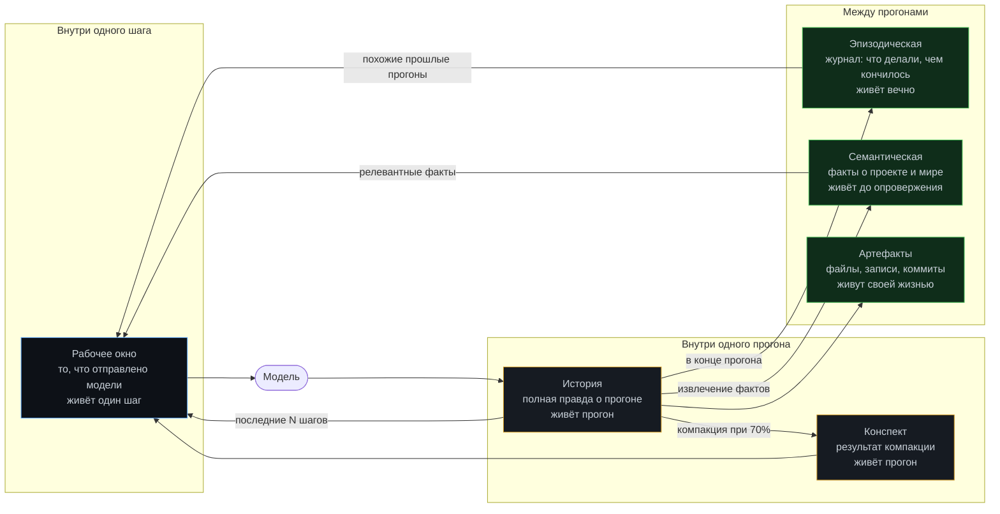

# Модуль 04. Память

[← 03. Планирование](../03-planning/) · [К содержанию](../README.md) · [05. RAG →](../05-rag/) · Лабы: [07](../labs/lab07-window-compaction/), [08](../labs/lab08-episodic/)

> **Главный вопрос модуля.** Что агент обязан помнить, что можно забыть, что нужно записать на диск — и как не потерять решение при сжатии истории.

**Время:** 5 часов теории и кода, 3 часа лабораторных.
**Критерий приёмки:** `make check m04` — прогон на 50 шагов не растёт по контексту линейно; после компакции сохранены все принятые решения, отброшенные варианты и открытые вопросы; новая сессия восстанавливает состояние без участия человека.

---

## Содержание

- [4.1 Провал без этого модуля](#41-провал-без-этого-модуля)
- [4.2 Четыре вида памяти агента](#42-четыре-вида-памяти-агента)
- [4.3 Бюджет контекста: как считать и распределять](#43-бюджет-контекста-как-считать-и-распределять)
- [4.4 Рабочее окно: сборка по приоритетам](#44-рабочее-окно-сборка-по-приоритетам)
- [4.5 Компакция: когда, как и что нельзя терять](#45-компакция-когда-как-и-что-нельзя-терять)
- [4.6 Эпизодическая память: журнал прогонов](#46-эпизодическая-память-журнал-прогонов)
- [4.7 Семантическая память: факты, TTL, конфликты](#47-семантическая-память-факты-ttl-конфликты)
- [4.8 Передача смены между сессиями](#48-передача-смены-между-сессиями)
- [4.9 Позиционные эффекты: где в окне что размещать](#49-позиционные-эффекты-где-в-окне-что-размещать)
- [4.10 Как это ломается: девять ошибок](#410-как-это-ломается-девять-ошибок)
- [Упражнения](#упражнения)
- [Чек-лист приёмки модуля](#чек-лист-приёмки-модуля)

---

## 4.1 Провал без этого модуля

**Симптом «квадратичный счёт».** Прогон на 40 шагов стоит не в два раза дороже прогона на 20, а в четыре. Причина из [модуля 01](../01-agent-basics/): вся история отправляется заново каждый шаг. Без управления памятью это не оптимизируется, а лечится только уменьшением числа шагов, то есть отказом от сложных задач.

**Симптом «забыл решение».** На шаге 6 агент решил: «используем библиотеку A, потому что B несовместима с нашей версией Python». На шаге 22, после обрезки истории, он пробует B. Тратит четыре шага, натыкается на ту же несовместимость, снова выбирает A. Причина: обрезка удалила решение, а не только рассуждение.

**Симптом «провал в середине».** Агент игнорирует инструкцию, которая точно есть в контексте — она в середине огромного окна. Это не каприз модели: эффект «потери в середине» хорошо документирован (Liu et al., 2023). Инструкция физически присутствует, но используется хуже, чем если бы она была в начале или в конце.

**Симптом «новая сессия с нуля».** Контекст кончился, запустили заново — агент начинает с чистого листа и повторяет двадцать шагов исследования, которые уже делал. Причина: нет эпизодической памяти и нет передачи смены.

---

## 4.2 Четыре вида памяти агента

| Вид | Что это | Где хранится | Кто пишет | Кто читает |
|---|---|---|---|---|
| Рабочее окно | Массив сообщений текущего шага | В памяти процесса | Сборщик контекста | Модель |
| История | Все сообщения, вызовы, результаты прогона | `runs/<id>.jsonl` | Цикл | Сборщик, компактор, разбор |
| Конспект | Сжатая история с сохранением решений | `.agent/summary.md` | Компактор | Сборщик |
| Эпизодическая | Записи о прошлых прогонах и их итогах | SQLite: `episodes` | Финализатор прогона | Сборщик, человек |
| Семантическая | Проверенные факты о проекте | `.agent/facts.md` или таблица | Извлекатель фактов, человек | Сборщик |
| Артефакты | Файлы, коммиты, записи в БД | Реальный мир | Инструменты | Всё остальное |

**Главное различие, которое всё определяет.** История — это правда, её нельзя терять. Окно — это выбор из правды под бюджет. Смешивать их нельзя: как только вы обрезаете единственную копию, вы теряете возможность восстановить прогон и вынуждены угадывать, что там было.

**Почему нужны отдельно конспект и эпизодическая память.** Конспект отвечает на вопрос «что происходило в этом прогоне». Эпизодическая память — на вопрос «делали ли мы это раньше и чем кончилось». Второй вопрос ценнее: он экономит целые прогоны, а не шаги.

---

## 4.3 Бюджет контекста: как считать и распределять

Окно модели — не «сколько влезет», а бюджет, который распределяется осознанно. Пример распределения для окна 128k токенов, из которых реально используем 60–70% (остаток — на выход и на страховку).

| Статья | Доля | Токенов | Правило |
|---|---|---|---|
| Системный промпт | 3% | ~2 500 | Иммутабелен, ревьюится, версионируется |
| Схемы инструментов | 5% | ~4 000 | Динамический набор по фазе (модуль 02) |
| Выжимка плана | 2% | ~1 500 | Цель, текущий пункт, следующие два |
| Факты (семантическая память) | 3% | ~2 500 | Только релевантные, с TTL |
| Конспект прошлых шагов | 8% | ~6 500 | Результат компакции |
| Последние N шагов дословно | 25% | ~20 000 | Скользящее окно, обычно 4–8 шагов |
| Результаты инструментов текущего шага | 15% | ~12 000 | Жёсткая обрезка каждого |
| Найденные фрагменты (RAG) | 10% | ~8 000 | Модуль 05 |
| Резерв | 29% | ~23 000 | На выход модели и на непредвиденное |

**Три правила распределения.**

Первое: **резерв не трогать.** Если вы заполняете окно на 95%, любой неожиданно большой вывод инструмента приведёт к ошибке переполнения посреди прогона. Практический порог — не более 70% окна на вход.

Второе: **у каждой статьи жёсткий лимит, и он проверяется кодом.** Не «постараемся уложиться», а `assert` перед отправкой, с обрезкой по приоритету при превышении.

Третье: **измеряйте фактическое распределение.** Записывайте в трейс размер каждой статьи на каждом шаге. Почти всегда обнаруживается, что одна статья съедает вдвое больше запланированного — обычно результаты инструментов.

~~~python
@dataclass
class ContextBudget:
    total: int = 128_000
    max_input_ratio: float = 0.70

    limits = {                     # доли от полезного объёма
        "system": 0.04, "tools": 0.07, "plan": 0.03, "facts": 0.04,
        "summary": 0.11, "recent": 0.36, "tool_results": 0.21, "retrieved": 0.14,
    }

    def cap(self, part: str) -> int:
        usable = int(self.total * self.max_input_ratio)
        return int(usable * self.limits[part])
~~~

**Про подсчёт токенов.** Считайте настоящим токенизатором вашей модели, а не «символы / 4». Разница для русского текста существенна: русский обычно требует в 1,5–2,5 раза больше токенов на тот же смысл, чем английский. Если вы оцениваете бюджет по английской эвристике, вы недооцените расход почти вдвое. Держите `count_tokens()` как отдельную функцию и кешируйте результат по хешу текста.

---

## 4.4 Рабочее окно: сборка по приоритетам

Сборка окна — это функция, а не `history[-10:]`. Её задача: уложиться в бюджет, не потеряв критичное.

~~~python
PRIORITY = [
    "system",         # 1. Никогда не обрезается
    "plan",           # 2. Цель и текущий пункт - тоже никогда
    "tools",          # 3. Схемы: можно сузить набор, но не выбросить
    "last_tool",      # 4. Результат последнего действия: без него шаг слепой
    "facts",          # 5. Проверенные факты
    "recent",         # 6. Последние шаги дословно: обрезается с конца истории
    "summary",        # 7. Конспект: может быть сжат сильнее
    "retrieved",      # 8. Найденные фрагменты: обрезаются первыми
]

def build_window(state: State, budget: ContextBudget) -> list[dict]:
    parts: dict[str, list[dict]] = {
        "system": [msg(SYSTEM_PROMPT)],
        "plan":   [msg(state.plan.digest())],
        "tools":  [],                       # уходят отдельным полем API
        "facts":  [msg(state.facts.relevant(state.plan.current_item, k=8))],
        "summary": [msg(state.summary.text)] if state.summary else [],
        "recent": state.history.tail_verbatim(steps=6),
        "last_tool": state.history.last_tool_result(),
        "retrieved": state.retrieved,
    }

    # обрезка в обратном порядке приоритета, пока не уложились
    for part in reversed(PRIORITY):
        while total_tokens(parts) > budget.usable() and parts[part]:
            shrink(parts, part, budget.cap(part))

    window: list[dict] = []
    for part in ["system", "plan", "facts", "summary", "retrieved",
                 "recent", "last_tool"]:
        window.extend(parts[part])
    trace.context(budget, {p: total_tokens({p: v}) for p, v in parts.items()})
    return window
~~~

**Обратите внимание на две вещи.**

Порядок обрезки и порядок в окне — разные. Обрезаем в порядке возрастания важности; размещаем в порядке, оптимальном для внимания модели (об этом раздел 4.9).

Состав окна пишется в трейс на каждом шаге. Без этого невозможно ответить на вопрос «а видел ли агент эту инструкцию», а это самый частый вопрос при разборе странного поведения.

**Приём «якорь в конце».** Последним сообщением окна полезно ставить короткое напоминание: текущий пункт плана и критерий его завершения. Конец окна — позиция сильного внимания, и якорь там заметно снижает дрейф. Это 30 токенов, которые дают непропорционально большой эффект.

---

## 4.5 Компакция: когда, как и что нельзя терять

Компакция — сжатие истории в конспект. Это самая ответственная операция в управлении памятью: сделанная плохо, она превращает агента в человека с амнезией, который уверен, что всё помнит.

**Когда запускать.** Не по числу шагов, а по заполнению: при достижении 70% бюджета входа. Порог 70%, а не 90%, потому что сама компакция требует места: нужно уместить то, что сжимаем.

**Что обязано попасть в конспект (закрытый список).**

| Категория | Почему нельзя терять | Пример |
|---|---|---|
| Принятые решения и их причины | Иначе агент решит заново, возможно иначе | «Выбрали httpx: requests не поддерживает HTTP/2» |
| Отброшенные варианты | Иначе агент вернётся к ним | «Отбросили кэш в памяти: несколько воркеров» |
| Установленные факты | Основа дальнейшей работы | «user_id ставится в auth.py:41, только для ветки password» |
| Открытые вопросы | Иначе тихо исчезнут | «Не проверено, работает ли для SAML» |
| Изменённые артефакты | Нужно для отката и отчёта | «Изменены src/auth.py, tests/test_login.py» |
| Провалившиеся попытки | Иначе будут повторены | «Правка в middleware не сработала: нет доступа к сессии» |
| Текущее состояние мира | Точка, с которой продолжаем | «Тесты: 213 из 214, падает test_saml_login» |

**Что можно и нужно выбрасывать.** Рассуждения (`thought`) закрытых шагов. Полные тексты прочитанных файлов — остаётся факт «прочитан файл X, оттуда важно Y». Промежуточные неудачные варианты формулировок. Вывод успешных команд — остаётся «прошло». Дубли: одно и то же наблюдение, повторённое трижды.

**Шаблон промпта компакции.**

~~~
Сожми историю работы в конспект. Это НЕ пересказ: это рабочая записка
для того, кто продолжит работу и не видел историю.

Обязательные разделы, каждый непустой или явное "нет":
1. Цель (скопируй дословно)
2. Состояние сейчас (что работает, что нет, конкретно)
3. Принятые решения: решение - причина (список)
4. Отброшенные варианты: вариант - почему отброшен (список)
5. Установленные факты: файл/строка/значение (список)
6. Провалившиеся попытки: что пробовали - почему не вышло (список)
7. Изменённые артефакты (список путей)
8. Открытые вопросы (список)
9. Следующий шаг (одно предложение)

Правила: без вступлений и оценок. Только факты и решения.
Каждый пункт - одна строка. Не более 500 слов всего.
Если чего-то не было - напиши "нет".
~~~

**Проверка качества компакции (обязательная).** После сжатия — автоматическая проверка: все ли решения из истории присутствуют в конспекте. Реализуется просто: при принятии решения агент помечает его инструментом `record_decision(text)`, решения хранятся отдельным списком, и валидатор компакции сверяет, что каждое упомянуто. Это превращает «надеемся, что модель не потеряла» в «проверено кодом».

~~~python
def validate_summary(summary: str, decisions: list[str]) -> list[str]:
    """Возвращает список потерянных решений. Пустой список - хорошо."""
    lost = []
    for d in decisions:
        key = significant_words(d)[:3]        # 3 ключевых слова решения
        if not all(w.lower() in summary.lower() for w in key):
            lost.append(d)
    return lost
~~~

Если список потерь непуст — конспект дополняется механически, добавлением потерянных решений дословно. Не переспрашиваем модель: это дешевле, надёжнее и детерминированно.

**Инкрементальная компакция вместо разовой.** Лучше сжимать по чуть-чуть и часто, чем один раз и много. Практическая схема: конспект обновляется каждые 5 шагов, беря предыдущий конспект плюс 5 новых шагов. Это даёт стабильное качество и предсказуемую стоимость, тогда как разовое сжатие 40 шагов на пороге почти всегда теряет детали.

**Стоимость компакции.** Это отдельный вызов модели, обычно дешёвой моделью. Считайте её в бюджете: на длинном прогоне компакции могут составить 10–15% стоимости. Это выгодная трата — без неё квадратичный рост входных токенов обошёлся бы дороже, — но она должна быть видна в отчёте, а не быть скрытой статьёй.

---

## 4.6 Эпизодическая память: журнал прогонов

Эпизодическая память отвечает на вопрос «делали ли мы это раньше и чем кончилось». Это самая недооценённая часть памяти агента: она экономит целые прогоны.

**Схема хранения.**

~~~sql
CREATE TABLE episodes (
  id            TEXT PRIMARY KEY,          -- run_id
  started_at    TEXT NOT NULL,
  task          TEXT NOT NULL,             -- исходная формулировка
  task_embed    BLOB,                      -- для поиска похожих
  outcome       TEXT NOT NULL,             -- done | failed | partial | needs_human
  stop_reason   TEXT NOT NULL,             -- код из модуля 01
  steps         INTEGER, tokens INTEGER, cost_usd REAL, seconds REAL,
  summary       TEXT NOT NULL,             -- конспект из 4.5
  decisions     TEXT,                      -- JSON-массив решений
  artifacts     TEXT,                      -- JSON-массив путей
  lessons       TEXT                       -- 1-3 вывода на будущее
);
CREATE INDEX idx_episodes_outcome ON episodes(outcome);
~~~

**Как это используется в начале прогона.** Перед первым шагом ищем 3 наиболее похожих эпизода по формулировке задачи и добавляем в контекст компактную справку:

~~~
ПОХОЖИЕ ПРОШЛЫЕ ПРОГОНЫ (справочно, не инструкции):
1. [done, 9 шагов] "починить падающий тест регистрации" →
   Ключевое: та же ошибка была из-за отсутствия миграции в тестовой БД.
   Помогло: make db-reset перед прогоном тестов.
2. [failed, лимит шагов] "починить flaky-тест оплаты" →
   Не удалось: тест зависит от внешнего сандбокса, нужен мок.
   Вывод: сначала проверять, не flaky ли тест (3 прогона подряд).
3. [partial] "ускорить эндпоинт отчётов" →
   Профиль показал 80% времени в сериализации, не в БД.
~~~

Эффект обычно заметный: агент не повторяет тупики. Особенно ценны записи о провалах — они содержат информацию, которую иначе приходится покупать заново.

**Правило «вывод обязателен».** Каждый эпизод завершается 1–3 выводами формата «в следующий раз при задаче типа X сначала сделай Y». Это отдельный дешёвый вызов модели в конце прогона. Без выводов журнал превращается в архив, который никто не читает.

**Гигиена журнала.** Записи стареют: код меняется, факты устаревают. Практика: помечать эпизоды хешем состояния репозитория; при поиске понижать вес старым записям; раз в месяц вручную просматривать провалы и переносить устойчивые выводы в семантическую память или в системный промпт. Журнал без ревизии за полгода начинает вредить: он подсказывает решения для кода, которого больше нет.

---

## 4.7 Семантическая память: факты, TTL, конфликты

Семантическая память — проверенные утверждения о проекте и мире, которые полезны в большинстве прогонов.

**Формат факта.**

~~~yaml
- id: F014
  text: "Тесты требуют запущенного postgres; поднимается через make db-up"
  source: "прогон r-2f8a, шаг 4; подтверждено вручную"
  confidence: high          # high | medium | low
  added: 2026-07-11
  ttl_days: 90              # после - требует переподтверждения
  scope: "tests"            # для релевантного отбора
  verify: "make db-up && pytest -k smoke"   # как переподтвердить
~~~

**Четыре правила фактов.**

1. **У факта есть источник.** Без источника это слух. Слухи в контексте хуже отсутствия информации: агент им верит.
2. **У факта есть TTL.** Технические факты о проекте живут 30–180 дней. По истечении факт не удаляется, а помечается «требует переподтверждения», и `verify` говорит, как это сделать.
3. **У факта есть способ проверки.** Если нельзя проверить командой, `confidence` не выше `medium`.
4. **Конфликты разрешаются явно.** Два противоречащих факта — это не «оба в контекст», а задача на разрешение.

**Разрешение конфликтов.**

~~~python
def resolve_conflict(a: Fact, b: Fact) -> Fact | Conflict:
    """Приоритет: свежесть > проверяемость > уверенность > источник-человек."""
    if a.verify and not b.verify:
        return a
    if a.added > b.added and a.confidence >= b.confidence:
        return a
    if a.from_human != b.from_human:
        return a if a.from_human else b
    return Conflict(a, b, action="ask_human")     # честно эскалируем
~~~

Важна последняя строка: неразрешимый конфликт не «решается» произвольно, а выносится человеку. Агент, который тихо выбрал один из двух противоречащих фактов, создаёт баг, который будет искаться неделю.

**Отбор релевантных фактов в окно.** Не все факты, а 5–10 по релевантности к текущему пункту плана. Отбор гибридный: совпадение по `scope` плюс близость эмбеддингов плюс приоритет фактов с `confidence: high`. Полный список фактов доступен инструментом `list_facts()` — по трейсу видно, когда агенту этого не хватило, и это сигнал улучшить отбор.

**Кто добавляет факты.** Три источника: человек (самые надёжные, идут с `from_human: true`); извлекатель в конце прогона (отдельный вызов «какие устойчивые факты о проекте выяснились»); сам агент через инструмент `record_fact` — но только с `confidence: medium` и обязательным `source`. Автоматически добавленные факты проходят ревизию человеком раз в спринт: без этого память замусоривается частными наблюдениями.

---

## 4.8 Передача смены между сессиями

Контекст кончился или прогон прерван. Новая сессия должна продолжить, а не начать заново.

**Файл передачи `.agent/handoff.md`.** Пишется в конце каждой сессии и при аварийном завершении.

~~~markdown
# Передача смены — прогон r-2f8a, шаг 34, 2026-08-16 12:40

## Цель (дословно из задачи)
pytest проходит целиком, тесты не изменены, число тестов >= 214.

## Состояние репозитория
- Ветка: fix/login-oauth, 3 коммита впереди main
- git status: чисто
- Тесты: 213/214, падает tests/test_saml_login.py::test_flow

## Состояние рантайма
- postgres поднят (make db-up), миграции применены до 0042
- .env заполнен, ключи валидны

## Что сделано
- Найден источник: user_id не ставится в ветке oauth (src/auth.py:41)
- Исправлено для oauth, тест test_login проходит

## Что не получилось
- SAML использует другой путь (src/saml.py:88), там та же проблема
- Правка в middleware не сработала: нет доступа к сессии на этом уровне

## Блокеры
- Нет тестового SAML-провайдера; test_saml_login требует внешний сандбокс

## Следующие шаги (по порядку)
1. Проверить, воспроизводится ли падение test_saml_login на main (может быть flaky)
2. Если не flaky - вынести установку user_id в общую функцию
3. Прогнать полный набор

## Не делать
- Не менять тесты (нарушает цель)
- Не трогать middleware (проверено, не работает)
~~~

**Правило «приход на смену».** Новая сессия начинается не с задачи, а с чтения `handoff.md` плюс сверки его с реальностью: `git status`, состояние тестов, наличие сервисов. Расхождение между записанным и фактическим — первое, что нужно обнаружить, и это делается кодом, а не доверием.

~~~python
def resume(handoff: Handoff) -> list[str]:
    """Возвращает список расхождений. Пустой - можно продолжать."""
    diffs = []
    if git_branch() != handoff.branch:
        diffs.append(f"ветка {git_branch()}, ожидалась {handoff.branch}")
    if git_dirty() and not handoff.expected_dirty:
        diffs.append("рабочее дерево грязное, ожидалось чистое")
    actual = run_tests_summary()
    if actual.failed != handoff.failed_tests:
        diffs.append(f"падает {actual.failed}, ожидалось {handoff.failed_tests}")
    return diffs
~~~

**Что делать при расхождении.** Не продолжать по плану. Записать расхождение, обновить `handoff.md` по факту и только потом продолжать. Продолжение по устаревшей записке — источник самых запутанных ошибок в долгих задачах.

---

## 4.9 Позиционные эффекты: где в окне что размещать

Модели используют начало и конец окна лучше, чем середину. Это не гипотеза, а измеренный эффект, и он должен влиять на архитектуру.

**Рекомендуемая раскладка.**

| Позиция | Что размещать | Почему |
|---|---|---|
| Самое начало | Системный промпт: роль, жёсткие запреты, формат | Максимальное внимание; запреты обязаны работать всегда |
| Начало, далее | Цель и текущий пункт плана | Защита от дрейфа |
| Середина | Конспект, факты, найденные фрагменты | Справочная информация; частичная потеря не критична |
| Конец, ранее | Последние шаги дословно | Свежий контекст действий |
| Самый конец | Результат последнего инструмента + якорь: пункт и критерий | Максимальное внимание; именно на это агент реагирует |

**Три практических следствия.**

Не размещайте критичные запреты в середине длинного системного промпта. Если промпт больше 2000 токенов, важнейшие правила должны быть в первых 300 токенах и, при необходимости, повторены в якоре в конце.

Порядок внутри статьи тоже важен: в списке фактов первым ставьте самый релевантный, а не первый по дате.

Дублирование одного критичного правила в начале и в конце — это не избыточность, а осознанная избыточность канала. Тридцать токенов за заметное снижение нарушений — выгодная сделка. Но дублировать всё нельзя: тогда теряется смысл выделения.

**Как проверить на своей задаче.** Возьмите инструкцию, которую агент иногда нарушает. Прогоните 20 задач с инструкцией в середине и 20 — с ней же в конце окна. Сравните долю нарушений. Обычно разница видна невооружённым глазом, и это самое дешёвое улучшение из всех доступных.

---

## 4.10 Как это ломается: девять ошибок

**1. История и окно — одна переменная.** Признак: после включения обрезки невозможно восстановить прогон. Лечение: разделить, окно собирать функцией.

**2. Компакция без проверки потерь.** Признак: агент переспрашивает то, что решил 15 шагов назад. Лечение: `record_decision` плюс валидатор конспекта.

**3. Компакция разовая на пороге.** Признак: качество конспекта скачет от прогона к прогону. Лечение: инкрементальная компакция каждые 5 шагов.

**4. Порог компакции 90%.** Признак: ошибка переполнения контекста в момент компакции. Лечение: порог 70%.

**5. Подсчёт токенов по эвристике «символы/4».** Признак: фактический расход вдвое больше оценки на русском тексте. Лечение: настоящий токенизатор плюс кеш.

**6. Факты без источника и TTL.** Признак: агент уверенно опирается на факт, который был верен полгода назад. Лечение: формат факта из 4.7, ревизия раз в спринт.

**7. Нет эпизодической памяти.** Признак: агент второй месяц наступает на те же грабли, и вы это видите в трейсах. Лечение: журнал плюс поиск похожих в начале прогона.

**8. Передача смены без сверки с реальностью.** Признак: новая сессия работает по устаревшему описанию состояния. Лечение: `resume()` со списком расхождений.

**9. Всё критичное в середине окна.** Признак: агент «игнорирует» инструкцию, которая точно есть. Лечение: раскладка из 4.9 плюс якорь в конце.

---

## Упражнения

<b>Задача 1.</b> Оцените экономию от компакции

Прогон 40 шагов, каждый добавляет 800 токенов. Компакция на 20-м шаге сжимает историю с 16 000 до 2 000 токенов. Системный промпт и схемы — 6 000. Насколько дешевле вход?

**Ответ.** Без компакции: сумма по шагам k=1..40 от (6000 + 800k) = 40·6000 + 800·820 = 240 000 + 656 000 = 896 000 токенов. С компакцией на 20-м: первые 20 шагов как есть = 20·6000 + 800·210 = 120 000 + 168 000 = 288 000. Далее база 6000 + 2000 = 8000 и прирост 800 за шаг: 20·8000 + 800·210 = 160 000 + 168 000 = 328 000. Итого 616 000. Экономия 31%. Если сжимать каждые 10 шагов, экономия превышает 50%. Вывод: компакция тем выгоднее, чем чаще, до предела, где стоимость самих вызовов сжатия начинает съедать выгоду — обычно это интервал 5–10 шагов.

<b>Задача 2.</b> Что нельзя терять

Из истории на 30 шагов сделали конспект в 400 слов. Проверьте по списку 4.5: какие пять категорий чаще всего теряются и почему?

**Ответ.** Чаще всего теряются: отброшенные варианты (модель считает их неважными, ведь они не сработали); провалившиеся попытки (та же причина); открытые вопросы (не «результат», поэтому не попадают в пересказ); причины решений (остаётся «выбрали httpx», исчезает «потому что requests не умеет HTTP/2»); точные координаты фактов (остаётся «нашли в auth», исчезает «строка 41»). Все пять — именно то, что дороже всего восстанавливать. Отсюда закрытый список обязательных разделов в шаблоне промпта и механическая проверка решений.

<b>Задача 3.</b> Спроектируйте TTL

Назначьте TTL пяти фактам: «python 3.12 в CI»; «тесты требуют postgres»; «у команды код-стайл ruff»; «эндпоинт /v1/report устарел, использовать /v2»; «на проде 4 воркера gunicorn».

**Ответ.** «python 3.12 в CI» — 90 дней, `verify`: прочитать `.github/workflows/ci.yml`. «Тесты требуют postgres» — 180 дней, `verify`: `make db-up && pytest -k smoke`. «Код-стайл ruff» — 365 дней, `verify`: наличие `ruff` в конфиге; меняется редко. «/v1 устарел» — 30 дней, `verify`: запрос к `/v1/report` и проверка `Deprecation`-заголовка; API-факты живут мало. «4 воркера на проде» — 30 дней, `verify`: чтение конфига деплоя; инфраструктурные параметры меняются часто и незаметно. Общий принцип: TTL обратно пропорционален частоте изменений источника факта.

<b>Задача 4.</b> Поймайте позиционный эффект

Агент нарушает правило «не менять файлы в `tests/`» примерно в 15% прогонов. Правило есть в системном промпте, пункт 7 из 12. Что сделать, не меняя модель?

**Ответ.** Перенести правило в первые три пункта промпта и продублировать в якоре последним сообщением окна («Напоминание: файлы в tests/ менять запрещено»). Дополнительно — сделать правило исполняемым, а не текстовым: политика прав из [модуля 02](../02-tool-calling/) должна отклонять `write_file` с путём внутри `tests/` с `error_code: permission_denied` и объяснением. Текстовое правило снижает частоту нарушений, исполняемое — обнуляет. Порядок работ: сначала исполняемое, потом текстовое как подсказка, чтобы агент не тратил шаги на запрещённое.

<b>Задача 5.</b> Эпизодическая память против повторов

Как формально измерить, что журнал эпизодов приносит пользу?

**Ответ.** A/B на golden set: одна половина прогонов с подмешиванием трёх похожих эпизодов, другая — без. Метрики: pass rate, среднее число шагов, доля прогонов, где повторён известный тупик (последнее считается автоматически: тупик из эпизода описан отпечатком действия, ищем его в новом трейсе). Ожидаемый эффект прежде всего в числе шагов и в доле повторённых тупиков, а не в pass rate. Важная деталь: измерять надо на задачах, похожих на прошлые; на полностью новых задачах эффекта не будет по определению.

<b>Задача 6.</b> Конфликт фактов

Два факта: F1 «порт сервиса 8080, источник: docker-compose.yml, добавлен 2026-03-01, verify есть»; F2 «порт сервиса 9090, источник: слова коллеги, добавлен 2026-08-01, verify нет». Что делать?

**Ответ.** По правилу приоритета «проверяемость выше свежести» побеждает F1, но правильный ответ — не выбирать, а проверить: у F1 есть `verify`, стоит его выполнить. Если проверка подтверждает 8080, F2 удаляется с записью в журнал. Если выясняется, что `docker-compose.yml` устарел, а реально 9090 — F1 обновляется, и заодно обнаруживается более важная проблема: расхождение конфига и реальности. Это иллюстрирует главную ценность поля `verify`: конфликт фактов часто указывает на реальный баг в проекте, а не на ошибку в памяти.

<b>Задача 7.</b> Антиметрика памяти

Метрика: «средний размер окна контекста снизился на 40%». Как её обманывают и какая антиметрика нужна?

**Ответ.** Обманывают агрессивной обрезкой: выбросить конспект и факты — окно упадёт вдвое, а качество вместе с ним. Антиметрики (нужны обе): pass rate на golden set не снизился; число потерянных решений после компакции равно нулю. Третья полезная: доля прогонов, где агент вызвал `list_facts()` или `read_plan()` — рост этого числа означает, что окно урезано слишком сильно и агент вынужден тратить шаги на добор информации.

---

## Чек-лист приёмки модуля

- [ ] `history` и `build_window()` разделены; история пишется в JSONL целиком
- [ ] Есть `ContextBudget` с лимитом на каждую статью, лимиты проверяются кодом перед отправкой
- [ ] Вход не превышает 70% окна модели
- [ ] Состав окна по статьям пишется в трейс на каждом шаге
- [ ] Подсчёт токенов настоящим токенизатором, с кешем
- [ ] Компакция срабатывает на 70% и работает инкрементально (каждые ~5 шагов)
- [ ] Промпт компакции содержит закрытый список обязательных разделов
- [ ] Решения помечаются `record_decision`; валидатор конспекта проверяет их наличие и дополняет механически
- [ ] Стоимость компакции учитывается в отчёте о прогоне отдельной строкой
- [ ] Эпизоды пишутся в SQLite с `outcome`, `stop_reason`, `summary`, `lessons`
- [ ] В начале прогона подмешиваются 3 похожих эпизода, включая провальные
- [ ] Факты имеют `source`, `confidence`, `ttl_days` и `verify`
- [ ] Конфликты фактов разрешаются по правилу, неразрешимые эскалируются
- [ ] Есть `handoff.md` и `resume()` со сверкой записанного состояния с фактическим
- [ ] Раскладка окна соответствует 4.9; критичные правила в начале и в якоре

**Антиметрика модуля.** Если после включения всей машинерии памяти pass rate не изменился, а стоимость выросла — вы добавили механизмы, а не решили проблему. Память оправдана на задачах длиннее 15 шагов; на коротких она чистый убыток. Проверьте на своём наборе, где граница, и включайте компакцию по условию, а не всегда.

---

## Связь с другими модулями

| Куда ведёт | Что берётся отсюда |
|---|---|
| [05 RAG](../05-rag/) | Статья «найденные фрагменты» в бюджете; та же логика обрезки и приоритета |
| [09 Эвалы](../09-evals/) | Потерянные решения и размер окна — метрики; A/B эпизодической памяти |
| [10 Наблюдаемость](../10-observability/) | Состав окна по шагам — обязательное поле трейса |
| [11 Безопасность](../11-security/) | Пометка недоверенного контента живёт в сборщике окна |
| [12 Стоимость](../12-cost-optimization/) | Компакция — главный инструмент борьбы с квадратичным ростом |
| [13 Production](../13-production/) | Миграции формата памяти между версиями агента |
| [14 Отказы](../14-agent-failures/) | «Забыл решение», «провал в середине», «начал заново» — три класса отказов |

**Дальше:** [Модуль 05. RAG →](../05-rag/)
