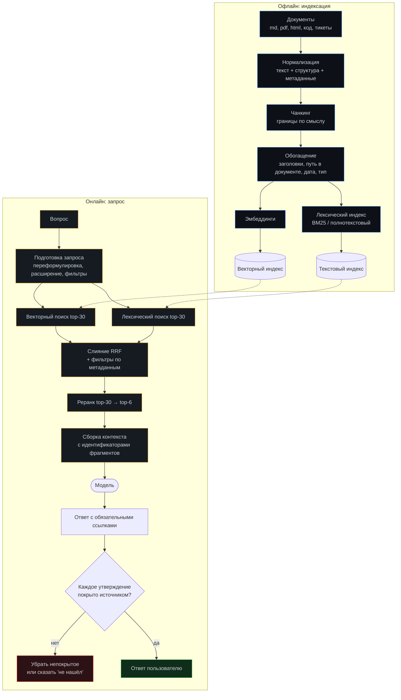

# Модуль 05. RAG: знания, которых нет в модели

[← 04. Память](../04-memory/) · [К содержанию](../README.md) · [06. MCP →](../06-mcp/) · Лабы: [09](../labs/lab09-index-search/), [10](../labs/lab10-hybrid/), [11](../labs/lab11-rerank-cite/)

> **Главный вопрос модуля.** Как дать агенту доступ к вашим документам так, чтобы он находил нужное, не выдумывал и мог показать, откуда взял.

**Время:** 6 часов теории и кода, 4 часа лабораторных.
**Критерий приёмки:** `make check m05` — измерен recall@k на собственном наборе вопросов; каждое утверждение в ответе имеет ссылку на источник; ответ «не нашёл» появляется, когда действительно не нашёл.

---

## Содержание

- [5.1 Провал без этого модуля](#51-провал-без-этого-модуля)
- [5.2 Пайплайн: от документа до ответа](#52-пайплайн-от-документа-до-ответа)
- [5.3 Чанкинг: главное решение всего пайплайна](#53-чанкинг-главное-решение-всего-пайплайна)
- [5.4 Эмбеддинги и индекс](#54-эмбеддинги-и-индекс)
- [5.5 Гибридный поиск: лексика плюс семантика](#55-гибридный-поиск-лексика-плюс-семантика)
- [5.6 Реранк](#56-реранк)
- [5.7 Цитирование и защита от выдумок](#57-цитирование-и-защита-от-выдумок)
- [5.8 Оценка: как измерить, что поиск работает](#58-оценка-как-измерить-что-поиск-работает)
- [5.9 Agentic RAG: поиск как инструмент агента](#59-agentic-rag-поиск-как-инструмент-агента)
- [5.10 Когда RAG не нужен](#510-когда-rag-не-нужен)
- [5.11 Как это ломается: десять ошибок](#511-как-это-ломается-десять-ошибок)
- [Упражнения](#упражнения)
- [Чек-лист приёмки модуля](#чек-лист-приёмки-модуля)

---

## 5.1 Провал без этого модуля

**«Всё влезет в контекст».** Соблазн современных больших окон: закинуть все документы в промпт. Три проблемы. Первая — деньги: 200 000 токенов на каждый запрос при 100 000 запросах в месяц дают счёт, который закроет проект. Вторая — качество: эффект потери в середине никуда не исчез, и в огромном окне модель хуже находит нужное, чем в маленьком с релевантными фрагментами. Третья — актуальность: документы меняются, а промпт нет.

**«Векторный поиск сам разберётся».** Загрузили документы, разбили по 1000 символов, взяли топ-5 по косинусной близости. Работает на демо-вопросах и проваливается на реальных: не находит по точному коду ошибки, потому что векторный поиск плох на редких токенах; возвращает фрагменты из середины таблицы без заголовка; на вопрос «какая версия API актуальна» отдаёт фрагмент из документа 2023 года, потому что он семантически ближе.

**«Модель сказала, значит в документах есть».** Без обязательного цитирования RAG превращается в генератор правдоподобного: модель дополняет найденное собственными знаниями, и различить это в ответе невозможно. Самый опасный класс ошибок, потому что он не выглядит как ошибка.

---

## 5.2 Пайплайн: от документа до ответа

**Где обычно теряется качество, в порядке частоты.** Чанкинг (около 40% проблем), отсутствие лексического поиска (25%), отсутствие реранка (15%), плохая подготовка запроса (10%), остальное (10%). Обратите внимание: выбор модели эмбеддингов в этом списке далеко не первый, хотя именно на него тратят больше всего времени.

---

## 5.3 Чанкинг: главное решение всего пайплайна

Чанк — единица поиска. Если границы неудачны, никакая модель эмбеддингов не спасёт: вы просто не сможете найти цельный ответ, потому что он разрезан пополам.

| Стратегия | Как | Когда хорошо | Когда плохо |
|---|---|---|---|
| Фиксированный размер | Каждые N символов | Никогда как основная; годится для черновика | Рвёт таблицы, код, списки посередине |
| С перекрытием | N символов, нахлёст 10–20% | Улучшение фиксированного почти бесплатно | Дублирование в индексе, рост объёма |
| По структуре документа | Границы по заголовкам markdown, разделам | Документация, вики, статьи — основной выбор | Документы без структуры |
| По абзацам с объединением | Абзацы, склеенные до целевого размера | Тексты, статьи, переписка | Технические справочники с таблицами |
| По синтаксису кода | Функция, класс, метод целиком | Кодовые базы — единственно верный выбор | Требует парсер на каждый язык |
| По логическим единицам | Один тикет, одно письмо, одна запись | Тикеты, письма, логи | Очень длинные единицы нужно резать |
| Иерархический | Мелкие чанки для поиска, крупные для контекста | Лучший результат в большинстве случаев | Сложнее реализация |

**Иерархический чанкинг — приём, который стоит внедрить сразу.** Идея: ищем по мелким фрагментам (200–400 токенов, высокая точность попадания), а в контекст отдаём родительский блок (1000–1500 токенов, полный смысл). Реализация проста: у каждого чанка есть `parent_id`.

~~~python
@dataclass
class Chunk:
    id: str
    doc_id: str
    parent_id: str | None       # для иерархии
    text: str                   # то, по чему ищем
    heading_path: list[str]      # ["API", "Аутентификация", "OAuth"]
    doc_title: str
    doc_date: str
    doc_type: str               # "docs" | "code" | "ticket" | "changelog"
    url: str | None
    start_line: int | None
    version: str | None

    def for_embedding(self) -> str:
        """Контекст в тексте эмбеддинга критичен: без него фрагмент
        'Значение по умолчанию 30 секунд' не найдётся ни по чему."""
        crumbs = " > ".join([self.doc_title, *self.heading_path])
        return f"{crumbs}\n\n{self.text}"
~~~

**Правило «фрагмент должен быть понятен в одиночку».** Проверка: прочитайте случайный чанк из индекса без контекста. Если непонятно, о чём речь, — обогащение недостаточно. Это самый быстрый способ найти проблему в индексации: возьмите 20 случайных чанков и прочитайте их. Обычно половина оказывается непонятной, и это объясняет плохой поиск лучше любых метрик.

**Особые случаи, которые ломают наивный чанкинг.**

Таблицы: разрезанная таблица бесполезна. Правило — таблица целиком в одном чанке вместе с заголовком; если не влезает, повторять строку заголовка в каждой части. Код: резать по границам функций, сохранять `import`-блок в метаданных или в начале каждого чанка файла. Списки шагов: инструкция «шаги 1–7», разрезанная после шага 4, приведёт к неполному ответу — резать по границе всего списка. Диалоги и тикеты: единица — тикет с комментариями, а не отдельная реплика. Изображения и диаграммы: подпись и окружающий текст в один чанк, иначе фрагмент теряет смысл.

**Размер.** Практический диапазон для поиска: 200–500 токенов. Меньше — фрагменты теряют смысл, растёт шум. Больше — падает точность попадания, растёт стоимость контекста. Для родительских блоков в иерархии: 1000–2000 токенов.

---

## 5.4 Эмбеддинги и индекс

**Что действительно важно при выборе модели эмбеддингов.** Поддержка русского языка (многие модели формально многоязычны, а практически заметно хуже на русском — проверяйте на своих данных). Длина входа: если модель принимает 512 токенов, а ваши чанки 800, то часть текста просто отбрасывается молча. Размерность: 384–1024 достаточно почти всегда; большие размерности дают небольшой прирост при заметном росте объёма и стоимости. Стабильность версии: смена версии модели требует переиндексации всего.

**Что не важно.** Позиция в общих рейтингах. Разница между топ-5 моделями на вашей задаче обычно меньше, чем эффект от правильного чанкинга. Не тратьте на выбор больше дня; тратьте на измерение на своих данных.

**Обязательное правило: асимметрия запроса и документа.** Многие модели требуют префиксов вида `query:` и `passage:`. Если вы их не используете, качество падает, и это не видно без измерения. Читайте карточку модели.

**Хранилище.**

| Вариант | Когда выбирать | Ограничения |
|---|---|---|
| `numpy` в памяти | До 50 000 чанков, прототип, тесты | Нет персистентности, полный перебор |
| `sqlite-vec` | До 1 млн чанков, один процесс, простой деплой | Нет распределённости |
| `chromadb` / `lancedb` | Средние объёмы, локальная разработка | Меньше контроля над индексом |
| `qdrant` / `weaviate` / `pgvector` | Прод, миллионы чанков, фильтры | Отдельный сервис в эксплуатации |

Рекомендация для курса: начните с `numpy` (полный перебор на 20 000 чанках занимает миллисекунды и не требует зависимостей), переходите на `sqlite-vec`, когда нужна персистентность, и на `qdrant` или `pgvector` — когда нужны фильтры по метаданным на больших объёмах. Не начинайте с распределённого хранилища: вы потратите неделю на инфраструктуру вместо чанкинга.

**Фильтры по метаданным — недооценённая половина качества.** Большинство реальных вопросов имеет неявные фильтры: «в актуальной версии» (фильтр по `version`), «в документации, а не в коде» (`doc_type`), «за последний квартал» (`doc_date`). Без поддержки фильтров вы обречены на ответы из устаревших документов. Проектируйте метаданные до индексации: добавить их потом означает переиндексацию.

---

## 5.5 Гибридный поиск: лексика плюс семантика

Векторный поиск и лексический ошибаются по-разному, и именно поэтому их сочетание даёт заметно больше, чем каждый по отдельности.

| Тип запроса | Вектор | BM25 | Вывод |
|---|---|---|---|
| «как настроить таймаут» | хорошо | средне | Вектор понимает перифраз |
| `ERR_CONN_RESET_9004` | плохо | отлично | Редкие токены — работа лексики |
| `max_retries` (имя параметра) | средне | отлично | Точное совпадение важнее смысла |
| «почему падает после обновления» | хорошо | плохо | Смысловой запрос |
| «версия 2.14.3» | плохо | отлично | Числа вектор почти не различает |
| «что делать если пользователь не может войти» | хорошо | средне | Перифраз |

**Слияние через Reciprocal Rank Fusion.** Простейший и на практике очень устойчивый метод: не требует калибровки шкал, работает с любыми двумя списками.

~~~python
def rrf(ranked_lists: list[list[str]], k: int = 60) -> list[tuple[str, float]]:
    """Reciprocal Rank Fusion. k=60 - стандартное значение из литературы."""
    scores: dict[str, float] = {}
    for lst in ranked_lists:
        for rank, doc_id in enumerate(lst, start=1):
            scores[doc_id] = scores.get(doc_id, 0.0) + 1.0 / (k + rank)
    return sorted(scores.items(), key=lambda x: -x[1])

def hybrid_search(query: str, filters: dict, top_k: int = 30) -> list[Chunk]:
    vec = vector_search(query, filters, top_k)     # список id по убыванию
    lex = bm25_search(query, filters, top_k)
    fused = rrf([vec, lex])[:top_k]
    return [store.get(cid) for cid, _ in fused]
~~~

**Почему RRF, а не взвешенная сумма скоров.** Скоры вектора (косинус, 0..1) и BM25 (неограниченный) находятся в разных шкалах, и их нормализация зависит от распределения в конкретном запросе. RRF использует только порядок, поэтому не требует настройки и не ломается при смене модели эмбеддингов. Взвешенная сумма может дать чуть лучший результат после тщательной калибровки — но калибровка устареет при первом изменении индекса.

**Подготовка запроса — дешёвое улучшение.** Три приёма, каждый стоит одного вызова дешёвой модели или вообще нуля.

Извлечение фильтров из вопроса: «что изменилось в API в третьем квартале» → `doc_type=changelog`, `date>=2026-07-01`. Делается одним вызовом со структурированным выводом и даёт больше, чем любая настройка эмбеддингов.

Мульти-запрос: сгенерировать 3 переформулировки и объединить результаты через RRF. Помогает на плохо сформулированных вопросах; стоит одного вызова и трёх поисков.

Расширение аббревиатур и синонимов по словарю проекта: `ЛК` → «личный кабинет», `RPS` → «запросов в секунду». Словарь на 50 строк, поддерживается вручную, эффект на лексическом поиске значительный.

**Чего не делать.** Не полагайтесь на переформулировку запроса моделью как на единственный механизм: она иногда меняет смысл. Всегда включайте исходный запрос в набор для RRF.

---

## 5.6 Реранк

Поиск отдаёт 30 кандидатов, в контекст влезает 6. Реранк решает, какие именно 6, и делает это точнее, чем исходный поиск.

**Почему реранк работает лучше поиска.** Векторный поиск сравнивает независимо посчитанные представления запроса и документа. Реранкер (cross-encoder) видит пару «запрос + документ» одновременно и оценивает релевантность напрямую. Это дороже, поэтому применяется к 30 кандидатам, а не к миллиону.

**Три варианта реализации.**

| Вариант | Стоимость | Качество | Когда |
|---|---|---|---|
| Cross-encoder модель | Низкая (локально, ~30 мс на 30 пар) | Высокое | Основной выбор для прода |
| LLM-реранк по рубрике | Высокая (один вызов) | Высокое, объяснимое | Когда нужны объяснения выбора |
| Эвристики | Нулевая | Среднее | Как дополнение, не замена |

**Полезные эвристики поверх любого реранка.** Понижать вес документам старше N месяцев (кроме явно исторических запросов). Повышать вес документам, чей `doc_type` совпадает с типом вопроса. Дедупликация: не больше 2 фрагментов из одного документа в финальной выборке — иначе один длинный документ вытеснит остальные и ответ будет односторонним. Разнообразие: если 6 фрагментов почти идентичны, вы потратили контекст на одно и то же.

~~~python
def rerank(query: str, cands: list[Chunk], top_n: int = 6) -> list[Chunk]:
    scored = cross_encoder.score([(query, c.for_embedding()) for c in cands])
    for c, s in zip(cands, scored):
        c.score = s
        age_days = days_since(c.doc_date)
        if age_days > 365:
            c.score *= 0.85          # мягкое понижение устаревшего
        if c.doc_type == guess_type(query):
            c.score *= 1.10

    out, per_doc = [], {}
    for c in sorted(cands, key=lambda x: -x.score):
        if per_doc.get(c.doc_id, 0) >= 2:        # не более 2 из документа
            continue
        if any(similar(c.text, o.text) > 0.9 for o in out):   # дедуп
            continue
        out.append(c)
        per_doc[c.doc_id] = per_doc.get(c.doc_id, 0) + 1
        if len(out) == top_n:
            break
    return out
~~~

**Порог отсечения — обязателен.** Если лучший кандидат имеет низкий скор, правильный ответ — «в документах этого нет», а не шесть нерелевантных фрагментов. Без порога система всегда что-то отвечает, и это худшее из возможных поведений. Порог подбирается на своём наборе: возьмите 20 вопросов, ответов на которые в документах заведомо нет, и настройте порог так, чтобы система честно молчала минимум на 18 из них.

---

## 5.7 Цитирование и защита от выдумок

**Механизм: идентификаторы фрагментов в контексте.**

~~~
[F1] docs/api/auth.md > Аутентификация > OAuth (2026-06-14)
Токен живёт 3600 секунд. Обновление через POST /oauth/refresh
с refresh_token. Повторное использование refresh_token запрещено.

[F2] CHANGELOG.md > 2.14.0 (2026-07-02)
Изменено: время жизни токена уменьшено с 3600 до 900 секунд.
...

Правила ответа:
- После каждого утверждения ставь [F<номер>] источника.
- Если утверждение не подтверждается ни одним фрагментом - не пиши его.
- Если фрагменты противоречат друг другу - укажи оба и отметь противоречие.
- Если ответа нет во фрагментах - напиши "не нашёл в документах" и всё.
- Не используй знания вне фрагментов, даже если уверен.
~~~

**Пример правильного ответа с противоречием.** «Время жизни токена — 900 секунд [F2]. Обратите внимание: в документации указано 3600 секунд [F1], но changelog версии 2.14.0 сообщает об уменьшении до 900 [F2]; документация, вероятно, не обновлена.» Это и есть основная ценность цитирования: система не выбирает молча, а показывает конфликт. Молчаливый выбор одного из двух противоречащих источников — самая дорогая ошибка RAG, потому что она незаметна.

**Машинная проверка покрытия.** Не полагайтесь на то, что модель соблюдёт правила: проверяйте.

~~~python
def check_citations(answer: str, chunks: dict[str, Chunk]) -> list[str]:
    """Возвращает список проблем. Пустой список - ответ проходит."""
    problems = []
    sentences = split_sentences(answer)
    for s in sentences:
        if is_meta(s):                        # вводные фразы пропускаем
            continue
        refs = re.findall(r"\[F(\d+)\]", s)
        if not refs:
            problems.append(f"без источника: {s[:70]}")
            continue
        for r in refs:
            if f"F{r}" not in chunks:
                problems.append(f"ссылка на несуществующий фрагмент F{r}")
    return problems
~~~

При непустом списке проблем — не показывать ответ пользователю, а либо переспросить модель с указанием проблем (один повтор), либо вернуть «не могу подтвердить источниками». Второе честнее и дешевле.

**Дополнительный слой: проверка подтверждаемости.** Для критичных применений — второй вызов дешёвой моделью: «подтверждается ли утверждение X фрагментом F2: да / нет / частично». Это ловит случаи, когда ссылка стоит, но фрагмент говорит о другом. Стоит примерно 10% стоимости ответа и снимает основную часть незаметных ошибок.

---

## 5.8 Оценка: как измерить, что поиск работает

Без измерения RAG настраивается вслепую, и любые улучшения — вопрос веры.

**Собрать набор вопросов — работа на один день, окупается неделями.**

~~~yaml
# eval/retrieval.yaml
- id: Q01
  question: "Сколько живёт access-токен?"
  relevant: ["docs/api/auth.md#oauth", "CHANGELOG.md#2.14.0"]
  must_mention: ["900"]
  category: factual
- id: Q02
  question: "ERR_CONN_RESET_9004"
  relevant: ["docs/errors.md#9004"]
  category: exact_match
- id: Q03
  question: "Какая максимальная зарплата в компании?"
  relevant: []                    # в документах этого нет
  expect: "не нашёл"
  category: no_answer
~~~

Ориентир по составу: 60–100 вопросов, из них 20% `exact_match` (коды, имена параметров), 20% `multi_hop` (ответ требует двух документов), 15% `no_answer` (проверка честного молчания), 15% `temporal` (актуальность), остальное — обычные factual. Категория `no_answer` обязательна и обычно отсутствует у всех, кто жалуется на галлюцинации.

**Метрики двух уровней.**

| Уровень | Метрика | Что означает | Целевой ориентир |
|---|---|---|---|
| Поиск | recall@30 | Есть ли нужный документ среди кандидатов | > 0,90 |
| Поиск | recall@6 (после реранка) | Дошёл ли нужный документ до контекста | > 0,80 |
| Поиск | MRR | Насколько высоко стоит первый релевантный | > 0,70 |
| Ответ | faithfulness | Доля утверждений, подтверждённых фрагментами | > 0,95 |
| Ответ | correctness | Доля правильных ответов по `must_mention` | измеряйте, растите |
| Ответ | честное «не нашёл» | Доля правильных отказов на `no_answer` | > 0,90 |

**Порядок отладки по метрикам.** Если recall@30 низкий — проблема в индексации и поиске (чанкинг, отсутствие лексики, фильтры). Если recall@30 высокий, а recall@6 низкий — проблема в реранке. Если recall@6 высокий, а correctness низкий — проблема в промпте ответа или в размере фрагментов. Эта диагностическая последовательность экономит дни: она сразу говорит, какой слой чинить, вместо того чтобы менять всё сразу.

**Дешёвый прогон.** Метрики поиска не требуют вызовов модели вообще (кроме эмбеддингов запросов, которые кешируются). Их можно считать в CI на каждый коммит: изменение чанкинга или фильтров сразу покажет регрессию.

---

## 5.9 Agentic RAG: поиск как инструмент агента

В агенте поиск — не однократный этап, а инструмент, который вызывается по необходимости и многократно. Это меняет проектирование.

**Что даёт agentic-подход.** Уточняющие итерации: первый поиск дал общее, второй — конкретику. Разложение сложного вопроса на подзапросы. Проверку: агент может искать подтверждение своей гипотезы. Отказ: агент видит, что не нашёл, и сообщает об этом, вместо того чтобы отвечать по неподходящим фрагментам.

**Как описать инструмент поиска (по правилам [модуля 02](../02-tool-calling/)).**

~~~python
Tool(
  name="search_docs",
  description=(
    "Ищет по внутренней документации, коду и changelog. Возвращает до 6 "
    "фрагментов с идентификаторами [F1..F6], путём в документе и датой. "
    "Используй для любых вопросов о том, как устроена система. "
    "Формулируй запрос как фразу из документа, а не как вопрос: "
    "'время жизни access токена' лучше, чем 'сколько живёт токен?'. "
    "Если нужен точный код ошибки или имя параметра - пиши его дословно. "
    "Фильтры сужают поиск и заметно повышают точность."
  ),
  parameters={
    "type": "object",
    "properties": {
      "query": {"type": "string", "description": "фраза для поиска"},
      "doc_type": {"enum": ["docs", "code", "changelog", "tickets", "any"],
                   "default": "any"},
      "since": {"type": "string",
                "description": "ISO-дата, только документы новее"},
      "top_k": {"type": "integer", "minimum": 1, "maximum": 10, "default": 6},
    },
    "required": ["query"], "additionalProperties": False,
  },
)
~~~

Обратите внимание на подсказку «формулируй как фразу из документа». Это одна строка, которая заметно улучшает качество поиска: модели по умолчанию передают вопрос целиком, а вопросительная форма хуже совпадает с текстом документов.

**Лимит поисков.** Три-пять вызовов `search_docs` на прогон. Больше почти всегда означает, что нужного в индексе нет, и правильное поведение — сказать это, а не искать в шестой раз. Реализуется счётчиком: после четвёртого поиска в результат добавляется подсказка «поиск использован 4 раза из 5; если нужного не нашлось, скажи об этом прямо».

**Дедупликация между поисками.** Если второй поиск вернул те же фрагменты, что первый, не дублируйте их в контексте — верните «те же фрагменты, что в предыдущем поиске» и сэкономьте токены. Это также сигнал агенту, что стоит менять формулировку, а не повторять.

---

## 5.10 Когда RAG не нужен

Три случая, когда RAG — избыточное усложнение.

**Документов мало и они стабильны.** Если весь корпус — 20 000 токенов инструкции, которая меняется раз в квартал, положите её в системный промпт и включите кэширование промпта (модуль 12). Это будет дешевле, быстрее и точнее любого RAG.

**Данные структурированы.** Вопрос «сколько заказов за июль» решается SQL-запросом, а не векторным поиском по таблице. Инструмент `sql_select` даёт точный ответ; RAG по выгрузке даст правдоподобный. Общее правило: структурированные данные — запрос, неструктурированные — поиск.

**Нужна полнота, а не релевантность.** «Перечисли все упоминания X в документах» — это задача полного перебора с фильтром, а не топ-k поиска. RAG по определению возвращает лучшие k, а не все. Для таких задач нужен обычный поиск по подстроке или регулярному выражению по всему корпусу.

---

## 5.11 Как это ломается: десять ошибок

**1. Фиксированный чанкинг по символам.** Признак: в индексе есть фрагменты, начинающиеся с середины предложения. Лечение: структурный или иерархический чанкинг.

**2. Чанк без контекста.** Признак: фрагмент «Значение по умолчанию — 30 секунд» невозможно понять. Лечение: `heading_path` и `doc_title` в тексте эмбеддинга.

**3. Только векторный поиск.** Признак: не находит по коду ошибки и по именам параметров. Лечение: гибрид с BM25 и RRF.

**4. Нет фильтров по метаданным.** Признак: ответы из устаревших документов. Лечение: метаданные с датой и версией плюс фильтры в инструменте.

**5. Нет порога отсечения.** Признак: система всегда что-то отвечает, даже когда нечего. Лечение: порог, настроенный на наборе `no_answer`.

**6. Нет реранка.** Признак: recall@30 высокий, recall@6 низкий. Лечение: cross-encoder.

**7. Цитирование «по желанию модели».** Признак: часть утверждений без ссылок. Лечение: `check_citations` и отказ показывать непроверенный ответ.

**8. Один документ занял все 6 слотов.** Признак: односторонний ответ, противоречия не видны. Лечение: лимит фрагментов на документ.

**9. Нет набора `no_answer` в оценке.** Признак: жалобы на галлюцинации при «хороших метриках». Лечение: 15% вопросов без ответа в наборе.

**10. Смена модели эмбеддингов без переиндексации.** Признак: поиск внезапно деградировал до случайного. Лечение: версия модели в метаданных индекса и проверка совместимости при старте — жёсткая, с падением, а не с предупреждением.

---

## Упражнения

<b>Задача 1.</b> Почините чанкинг

Документ: инструкция с таблицей параметров на 40 строк и разделом «Шаги настройки» из 9 пунктов. Наивный чанкинг по 800 символов дал 6 фрагментов. Что плохо и как резать?

**Ответ.** Плохо: таблица разрезана на три части, две из них без заголовка (значения без имён колонок — мусор); список шагов разрезан после пятого пункта, ответ на «как настроить» будет неполным. Резать: таблица целиком в один чанк, даже если это 1200 токенов; если совсем не влезает — по группам строк с повторением строки заголовка в каждой части. Список шагов целиком в один чанк. Плюс иерархия: родительский чанк — весь раздел, дочерние — таблица и список отдельно.

<b>Задача 2.</b> Диагностика по метрикам

recall@30 = 0,94; recall@6 = 0,52; faithfulness = 0,97; correctness = 0,48. Где проблема?

**Ответ.** Поиск находит нужное (0,94), но реранк его теряет (0,52) — значит проблема именно в реранке, и correctness низкий как следствие. Faithfulness высокий, потому что модель честно отвечает по тем фрагментам, что дали, — она не виновата. Порядок действий: проверить, применяется ли реранк вообще; проверить асимметричные префиксы; проверить, не выбрасывает ли дедупликация нужное; убедиться, что понижение веса по дате не режет актуальные документы. Менять модель эмбеддингов бессмысленно — она свою работу сделала.

<b>Задача 3.</b> Спроектируйте набор no_answer

Придумайте 5 вопросов категории `no_answer` для документации внутреннего API и объясните, почему каждый опасен.

**Ответ.** (1) «Какой SLA у эндпоинта /v3/report?» — если /v3 не существует, модель охотно придумает по аналогии с /v2. (2) «Как отключить двухфакторную аутентификацию?» — функции нет, но ответ звучит правдоподобно и опасен. (3) «Сколько стоит запрос к API для внешних клиентов?» — цены нет в документации, модель подставит типичные числа. (4) «Кто отвечает за модуль биллинга?» — персональные данные, которых в индексе нет. (5) «Какое ограничение на размер загружаемого файла?» — есть похожие ограничения на другие сущности, и модель их перенесёт. Общий признак опасных `no_answer`: в корпусе есть близкие по форме факты, и модель склонна к переносу.

<b>Задача 4.</b> Посчитайте экономию против «всё в контекст»

Корпус 400 000 токенов. 50 000 запросов в месяц. Цена входа 0,15 доллара за миллион, кэш даёт скидку 90% на неизменную часть. Сравните: всё в контекст с кэшем против RAG с 6 фрагментами по 400 токенов.

**Ответ.** Всё в контекст с кэшем: 400 000 × 0,1 (эффективно после скидки) = 40 000 «платных» токенов на запрос, × 50 000 = 2 млрд, это 300 долларов в месяц. RAG: 2 400 токенов фрагментов плюс ~2 000 системного и вопроса = 4 400, × 50 000 = 220 млн токенов, это 33 доллара, плюс эмбеддинги запросов (пренебрежимо) и реранк локально (бесплатно). Экономия почти в девять раз. Но главный аргумент не деньги: у RAG выше точность на большинстве вопросов, потому что модель не тонет в 400 тысячах токенов. Обратная сторона — RAG может не найти, а «всё в контекст» видит всё; поэтому на маленьких корпусах (до 30 000 токенов) выбор в пользу контекста с кэшем часто правильный.

<b>Задача 5.</b> Противоречие в источниках

Поиск вернул F1 (документация, 3600 секунд, июнь) и F2 (changelog, 900 секунд, июль). Как должна вести себя система и как это проверить автотестом?

**Ответ.** Система обязана указать оба значения, отметить противоречие и указать, какой источник свежее. Автотест: добавить в набор вопрос с `expect_conflict: true` и проверять, что ответ содержит оба числа и слово-маркер противоречия. Дополнительно — детектор на уровне пайплайна: если среди отобранных фрагментов есть два с одинаковым `heading_path`, но разными `doc_date` и численно расходящимися фактами, добавить в промпт явное указание «обрати внимание: фрагменты F1 и F2 могут противоречить». Это ловит противоречия даже когда модель их не замечает.

<b>Задача 6.</b> Антиметрика RAG

Метрика: faithfulness 0,99. Как её обманывают?

**Ответ.** Двумя способами. Первый: отвечать почти ничего — «согласно [F1], тема освещена в документации». Формально подтверждено, пользы ноль. Второй: отвечать «не нашёл» на всё; тогда нет утверждений, нет и неподтверждённых. Антиметрики: correctness по `must_mention` (проверяет содержательность) и доля отказов на вопросах, где ответ есть (должна быть близка к нулю). Тройка faithfulness + correctness + доля ложных отказов честна; каждая метрика по отдельности обманывается тривиально.

---

## Чек-лист приёмки модуля

- [ ] Чанкинг структурный или иерархический, не по фиксированному числу символов
- [ ] Таблицы, списки шагов и функции кода не разрезаны
- [ ] Текст эмбеддинга включает `doc_title` и `heading_path`
- [ ] Прочитано 20 случайных чанков из индекса; все понятны в одиночку
- [ ] Метаданные включают `doc_type`, `doc_date`, `version`, `url`
- [ ] Работает гибридный поиск (вектор + BM25) со слиянием RRF
- [ ] Поддерживаются фильтры по метаданным и они используются инструментом
- [ ] Применяются асимметричные префиксы модели эмбеддингов, если требуются
- [ ] Есть реранк, лимит фрагментов на документ и дедупликация
- [ ] Есть порог отсечения, настроенный на наборе `no_answer`
- [ ] Фрагменты в контексте имеют идентификаторы `[F1]…` с путём и датой
- [ ] Работает `check_citations`; ответ без покрытия не показывается
- [ ] Набор оценки: 60+ вопросов, включая 15% `no_answer` и 20% `exact_match`
- [ ] Метрики поиска считаются в CI без вызовов модели
- [ ] Версия модели эмбеддингов записана в метаданных индекса; несовместимость роняет старт
- [ ] Инструмент `search_docs` описан по правилам модуля 02, включая подсказку о формулировке запроса
- [ ] Есть лимит числа поисков за прогон и подсказка о его исчерпании

**Антиметрика модуля.** Если ваш RAG никогда не отвечает «не нашёл», он не работает — он угадывает. Проверьте на 20 вопросах, ответов на которые в корпусе точно нет. Честное молчание на 18 из 20 — признак настроенной системы; ответ на все 20 — признак генератора правдоподобного.

---

## Связь с другими модулями

| Куда ведёт | Что берётся отсюда |
|---|---|
| [02 Tool calling](../02-tool-calling/) | `search_docs` — образцовое описание инструмента с подсказками по формулировке |
| [04 Память](../04-memory/) | Найденные фрагменты — статья бюджета контекста, обрезается первой |
| [09 Эвалы](../09-evals/) | Набор вопросов и метрики поиска — часть общего golden set |
| [11 Безопасность](../11-security/) | Найденные фрагменты — недоверенный вход; инъекции через документы |
| [12 Стоимость](../12-cost-optimization/) | Сравнение RAG и «всё в контекст с кэшем» |
| [14 Отказы](../14-agent-failures/) | Ответ по неподходящим фрагментам — отдельный класс отказов |

**Дальше:** [Модуль 06. MCP →](../06-mcp/)
