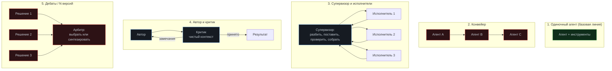

# Модуль 07. Мульти-агент: когда несколько лучше одного

[← 06. MCP](../06-mcp/) · [К содержанию](../README.md) · [08. Песочницы →](../08-sandboxes/) · Лаба: [15](../labs/lab15-supervisor/)

> **Главный вопрос модуля.** В каких случаях разделение на несколько агентов реально помогает — и почему в большинстве случаев оно ухудшает результат при росте стоимости.

**Время:** 4 часа теории и кода, 3 часа лабораторной.
**Критерий приёмки:** `make check m07` — мульти-агентная схема сравнена с одиночным агентом на одном наборе задач, с числами по pass rate, стоимости и латентности; решение «использовать или нет» обосновано этими числами.

---

## Содержание

- [7.1 Провал без этого модуля: культ мульти-агентности](#71-провал-без-этого-модуля-культ-мультиагентности)
- [7.2 Налог на оркестрацию](#72-налог-на-оркестрацию)
- [7.3 Пять топологий и их свойства](#73-пять-топологий-и-их-свойства)
- [7.4 Три случая, когда мульти-агент оправдан](#74-три-случая-когда-мультиагент-оправдан)
- [7.5 Контракт передачи между агентами](#75-контракт-передачи-между-агентами)
- [7.6 Супервизор: реализация](#76-супервизор-реализация)
- [7.7 Изоляция контекста как главная выгода](#77-изоляция-контекста-как-главная-выгода)
- [7.8 Отказы, специфичные для мульти-агента](#78-отказы-специфичные-для-мультиагента)
- [7.9 Как решить: протокол сравнения](#79-как-решить-протокол-сравнения)
- [Упражнения](#упражнения)
- [Чек-лист приёмки модуля](#чек-лист-приёмки-модуля)

---

## 7.1 Провал без этого модуля: культ мульти-агентности

Типичная картина: команда рисует схему из шести агентов — «архитектор», «разработчик», «тестировщик», «ревьюер», «документатор», «менеджер». Схема выглядит убедительно, потому что повторяет структуру человеческой команды. Результат: стоимость в 5–8 раз выше одиночного агента, латентность в 6 раз, pass rate — ниже, чем у одиночного агента с хорошими инструментами.

Причина почти всегда одна: **разделение на роли, скопированное с людей, не отражает реальные границы задачи.** Люди делятся на роли из-за ограничений человека: рабочий день, специализация, невозможность держать в голове весь проект. У модели этих ограничений нет, зато есть другое — потери при передаче информации между вызовами. Скопировав структуру команды, вы получаете все издержки коммуникации и ни одной из выгод специализации.

**Второй частый провал: «агент-менеджер» без работы.** Агент, который только распределяет и собирает, тратит токены на пересказ, не добавляя решений. Если у супервизора нет собственной логики (проверок, отсечения, решений о продолжении), он лишний: его роль выполняет обычный код.

**Третий: потеря контекста в передаче.** «Разработчик» знал, что выбор библиотеки обусловлен несовместимостью. «Ревьюер» этого не знает и предлагает поменять библиотеку. Три итерации спорят об одном и том же. Это прямое следствие того, что передача между агентами — узкий канал, и через него проходит меньше, чем кажется.

---

## 7.2 Налог на оркестрацию

Любое разделение на агентов имеет измеримую цену. Полезно посчитать её до, а не после.

| Статья налога | Откуда берётся | Порядок величины |
|---|---|---|
| Дублирование системного промпта | У каждого агента свой промпт и свои схемы | +1,5–3k токенов на агента на шаг |
| Пересказ контекста | Супервизор описывает задачу, исполнитель — результат | +500–2000 токенов на передачу |
| Потери в передаче | Часть контекста не переносится, работа повторяется | +10–30% шагов |
| Латентность последовательности | Вызовы не параллельны при зависимостях | ×2–5 к времени |
| Отладка | Трейс распадается на несколько, нужна корреляция | +часы работы инженера |
| Согласование версий | Промпты агентов должны быть совместимы | постоянные накладные расходы |

**Оценка на конкретных числах.** Одиночный агент: 18 шагов, 160 000 входных токенов, 0,03 доллара, 90 секунд. Схема из трёх агентов на той же задаче: 26 шагов суммарно, 310 000 входных токенов, 0,06 доллара, 210 секунд. Почти вдвое дороже и вдвое медленнее. Это нормальная цена — вопрос лишь в том, покупаете ли вы за неё что-то реальное.

**Правило.** Мульти-агент оправдан, если даёт измеренный прирост pass rate либо снимает непреодолимое иначе ограничение (лимит контекста, разделение прав). «Выглядит правильнее» — не выгода.

---

## 7.3 Пять топологий и их свойства

| Топология | Когда работает | Главный риск | Цена к базовой |
|---|---|---|---|
| Одиночный | Почти всегда — начинайте здесь | Переполнение контекста на очень больших задачах | ×1 |
| Конвейер | Фазы независимы, интерфейс узкий и формальный | Потеря контекста на стыках; ошибка первой фазы отравляет остальные | ×1,5–2,5 |
| Супервизор | Подзадачи независимы и параллелятся | Супервизор без своей логики; неверное разбиение | ×2–4 |
| Автор и критик | Есть чёткая рубрика приёмки; критик на чистом контексте | Соглашающийся критик; бесконечные итерации | ×1,3–1,8 |
| Дебаты / N версий | Высокая цена ошибки, есть способ выбрать лучший вариант | Дорого в N раз; арбитр не умеет выбирать | ×N+1 |

**Практическая рекомендация.** Устойчиво окупаются две топологии: «автор и критик» (разобрана в [модуле 03](../03-planning/)) и «супервизор» на честно параллельных подзадачах. Конвейер обычно лучше реализуется обычным кодом, где каждая фаза — детерминированная функция плюс, возможно, один вызов модели. Дебаты оправданы редко и точечно.

---

## 7.4 Три случая, когда мульти-агент оправдан

**Случай 1. Честная параллельность независимых подзадач.** Пример: «проверить 40 файлов на соответствие правилу». Сорок независимых проверок, слияние тривиально. Здесь мульти-агент — просто параллелизм, он даёт линейное ускорение по времени при той же суммарной стоимости. Признак: подзадачи можно перечислить заранее, и порядок не влияет на результат.

**Случай 2. Изоляция контекста при исследовании.** Пример: «найди, какой из шести сервисов вызывает рост задержки». Каждая гипотеза требует чтения большого объёма логов и кода. Одним агентом контекст забивается шестью объёмами, и к шестой гипотезе он уже не помнит первую. Подагент на каждую гипотезу читает своё и возвращает 200 токенов вывода — главный агент видит шесть чистых выводов вместо шести килобайт мусора. Самая ценная и самая недооценённая выгода.

**Случай 3. Разные права.** Агент, который пишет в репозиторий, и агент, который читает продакшен-данные. Объединять их означает выдать одному процессу оба набора прав. Разделение здесь — архитектура безопасности, и налог платится осознанно.

**Случаи, которые оправданными не являются.** «Роли как у людей». «Специализация промптов» — делается сменой системного промпта в одном агенте. «Разделение ответственности в коде» — это модули, а не агенты. «Чтобы проще отлаживать» — на практике мульти-агент отлаживать сложнее.

---

## 7.5 Контракт передачи между агентами

Если вы всё же разделяете, качество определяется контрактом передачи. Свободный текст между агентами — главная причина потерь.

~~~python
@dataclass(frozen=True)
class SubTask:
    id: str
    goal: str                      # одна фраза, проверяемая
    done_when: str                 # машинно-проверяемый критерий
    context: str                   # ТОЛЬКО необходимое, не вся история
    allowed_tools: list[str]       # минимальный набор
    forbidden: list[str]           # что явно нельзя делать
    budget_steps: int              # свой бюджет, обычно 4-8
    budget_cost_usd: float
    return_schema: dict            # структура ожидаемого результата

@dataclass
class SubResult:
    id: str
    status: str                    # done | failed | partial | needs_info
    answer: str                    # не более 300 слов: вывод, не пересказ
    evidence: list[str]            # конкретные факты: файл:строка, значения
    decisions: list[str]           # принятые решения с причинами
    unknowns: list[str]            # что осталось непроверенным
    cost_usd: float
    steps: int
~~~

**Пять правил контракта.**

1. **Структура, а не проза.** Свободный текст теряет 30–50% полезной информации при передаче. Схема заставляет заполнить поля, которые иначе выпадают.
2. **Вывод, а не пересказ.** `answer` ограничен по объёму осознанно: подагент существует, чтобы сжать много контекста в мало вывода.
3. **`evidence` обязателен.** Без конкретных фактов супервизор не может проверить вывод и вынужден верить. Верить нельзя.
4. **`unknowns` не может быть пустым по умолчанию.** Подагент, который «всё выяснил», обычно чего-то не проверил.
5. **Свой бюджет у каждого подагента.** Сумма бюджетов подагентов должна быть меньше общего с запасом на работу супервизора.

**Что нельзя передавать.** Полную историю родителя (смысл изоляции исчезает). Право менять план верхнего уровня. Право вызывать опасные инструменты без подтверждения — подтверждения собираются на уровне супервизора, у которого есть полная картина.

---

## 7.6 Супервизор: реализация

~~~python
def supervise(task: Task, llm, tools, trace) -> dict:
    """Супервизор с собственной логикой: разбить, проверить, собрать."""
    plan = decompose(task, llm)                  # 1 вызов, 3-6 подзадач
    if not plan.parallelizable():
        # Честная проверка: если подзадачи зависимы, мульти-агент не нужен
        trace.note("подзадачи зависимы, работаем одним агентом")
        return run_single(task, llm, tools, trace)

    results: list[SubResult] = []
    with ThreadPoolExecutor(max_workers=4) as pool:
        futures = {pool.submit(run_subagent, st, llm, tools, trace): st
                   for st in plan.subtasks}
        for fut in as_completed(futures):
            st = futures[fut]
            try:
                res = fut.result(timeout=st.budget_seconds)
            except Exception as exc:
                res = SubResult(id=st.id, status="failed",
                                answer=f"подагент упал: {exc}", evidence=[],
                                decisions=[], unknowns=["всё"],
                                cost_usd=0.0, steps=0)
            # СВОЯ логика супервизора: проверка, а не пересылка
            ok, why = verify_subresult(st, res)
            if not ok and st.retries_left:
                res = retry_with_feedback(st, res, why, llm, tools, trace)
            results.append(res)

    conflicts = find_conflicts(results)
    if conflicts:
        trace.note(f"конфликты между подагентами: {conflicts}")
        return resolve_and_finish(task, results, conflicts, llm, trace)
    return synthesize(task, results, llm, trace)
~~~

**Что делает этот супервизор полезным, а не транспортным.** Он проверяет, оправдано ли разделение, и честно откатывается к одиночному агенту. Он верифицирует каждый результат по `done_when`, а не пересылает. Он умеет повторить подзадачу с обратной связью. Он ищет конфликты между результатами — то, чего одиночный агент не делает и не может.

**Обнаружение конфликтов — обязательная часть.** Два подагента могут вернуть противоречащие факты («порт 8080» и «порт 9090»), предложить несовместимые изменения одного файла, или оба «исправить» одну проблему разными способами. Без явного поиска конфликтов вы получите результат, который выглядит цельным и внутренне противоречив.

~~~python
def find_conflicts(results: list[SubResult]) -> list[str]:
    out = []
    # 1. Один файл изменён двумя подагентами
    by_file: dict[str, list[str]] = {}
    for r in results:
        for path in extract_paths(r.evidence):
            by_file.setdefault(path, []).append(r.id)
    out += [f"{p}: изменён подагентами {ids}"
            for p, ids in by_file.items() if len(ids) > 1]
    # 2. Противоречащие факты об одной сущности
    out += contradicting_facts(results)
    # 3. Несовместимые решения
    out += incompatible_decisions(results)
    return out
~~~

---

## 7.7 Изоляция контекста как главная выгода

Если из всего модуля запомнить одну мысль, то эту: **основная реальная выгода подагентов — не параллелизм и не специализация, а сжатие.**

Подагент читает 40 000 токенов логов и возвращает 200 токенов вывода. Главный агент получает вывод, а не логи. При шести таких исследованиях экономия составляет около 240 000 токенов контекста, которые иначе вытеснили бы всё остальное. Это позволяет решать задачи, которые одиночному агенту физически недоступны.

**Как проектировать подагента-исследователя.**

| Свойство | Значение |
|---|---|
| Бюджет шагов | 4–8: он делает одну вещь |
| Набор инструментов | Только чтение, 2–3 инструмента |
| Права записи | Нет вообще |
| Объём ответа | Жёсткий лимит, 200–400 токенов |
| Обязательные поля | `answer`, `evidence`, `unknowns` |
| Модель | Часто дешёвая: задача узкая |

**Приём «подагент вместо большого чтения».** Правило для главного агента: если ожидаемый объём чтения превышает 10 000 токенов, вместо чтения запускается подагент с вопросом. Реализуется как инструмент `investigate(question, scope)`, который внутри поднимает подагента. Для главного агента это выглядит как обычный инструмент, возвращающий короткий ответ, — и это лучший интерфейс: никакой сложности мульти-агентности в его контексте.

**Экономический эффект.** Дешёвая модель на исследовании плюс сжатие вывода обычно дают снижение стоимости, а не рост, несмотря на налог на оркестрацию. Это единственная топология из пяти, которая регулярно окупается в деньгах, а не только в качестве.

---

## 7.8 Отказы, специфичные для мульти-агента

| Отказ | Признак в трейсе | Лечение |
|---|---|---|
| Потеря контекста в передаче | Подагент спрашивает то, что было у родителя | Обязательное `context` в `SubTask` с проверкой полноты |
| Конфликт результатов | Два подагента изменили один файл | `find_conflicts` перед слиянием |
| Бесконечный пинг-понг | Автор и критик обменялись больше 2 раз | Жёсткий лимит итераций |
| Каскадный отказ | Падение одного подагента роняет прогон | Изоляция: `failed` как результат, а не исключение |
| Супервизор-транспорт | Супервизор не принимает ни одного решения | Проверка: есть ли верификация и отсечение |
| Дублирование работы | Два подагента прочитали одно и то же | Общий кеш чтений на уровне прогона |
| Расползание бюджета | Сумма расходов подагентов превысила общий лимит | Иерархический бюджет с проверкой на каждом уровне |
| Несогласованность промптов | После правки промпта супервизора подагенты стали ошибаться | Версионирование набора промптов целиком |

**Отдельно про трассировку.** В мульти-агенте у каждого подагента свой прогон, и без корреляции разобраться невозможно. Обязательно: единый `trace_id` на всю задачу, `parent_run_id` у каждого подагента, дерево прогонов в отчёте. Подробно — в [модуле 10](../10-observability/), но заложить это надо здесь, иначе первый сложный отказ обойдётся в день работы.

---

## 7.9 Как решить: протокол сравнения

Не спорьте о топологиях — измеряйте. Протокол на один день.

**Шаг 1.** Возьмите 20–30 задач из своего golden set, характерных для вашей нагрузки.
**Шаг 2.** Реализуйте базовую линию: одиночный агент с хорошими инструментами, планом и памятью. Именно с хорошими — сравнение с плохим одиночным агентом ничего не доказывает.
**Шаг 3.** Реализуйте мульти-агентный вариант минимально: без «красивых» ролей, только нужная топология.
**Шаг 4.** Прогоните каждый вариант по 5 раз на каждой задаче.
**Шаг 5.** Сравните по таблице.

| Метрика | Одиночный | Мульти | Порог решения |
|---|---|---|---|
| pass rate | — | — | Мульти выше минимум на 5 п.п. с непересекающимися интервалами |
| Стоимость на успешный результат | — | — | Рост более чем вдвое требует отдельного обоснования |
| Латентность p95 | — | — | Должна оставаться в пределах SLO |
| Доля прогонов с конфликтами | 0 | — | Выше 10% — топология неверна |
| Время на разбор одного отказа | — | — | Рост более чем вдвое — серьёзный минус |

**Правило принятия решения.** Если мульти-агент не даёт статистически значимого прироста pass rate и не снимает жёсткого ограничения, выбирайте одиночного агента. Это не консерватизм: каждая лишняя часть системы — долг, который придётся обслуживать.

---

## Упражнения

<b>Задача 1.</b> Разоблачите схему

Схема: «архитектор» проектирует, «кодер» пишет, «тестировщик» тестирует, «ревьюер» проверяет. Четыре агента. Найдите четыре проблемы и предложите альтернативу.

**Ответ.** (1) Фазы не независимы: кодер постоянно нуждается в решениях архитектора, это даёт либо пинг-понг, либо потери. (2) «Тестировщик» как агент избыточен — тесты запускает машина, это машинный критик, а не роль. (3) «Ревьюер» без чистого контекста будет соглашаться, а с чистым ему не хватит информации о решениях, если не передать её структурно. (4) Четыре системных промпта и четыре набора схем на каждом шаге — налог без выгоды. Альтернатива: один агент с планом из [модуля 03](../03-planning/), машинным критиком (тесты, линтер, типы) и одним циклом модели-критика на чистом контексте. Топология «автор и критик» с ценой ×1,3 вместо ×4.

<b>Задача 2.</b> Посчитайте налог

Одиночный: 20 шагов, промпт 2000, схемы 2500, прирост истории 700 на шаг. Три агента: у каждого промпт 2000 и схемы 1500, суммарно 28 шагов, 4 передачи по 1200 токенов, прирост истории у подагентов 500. Сравните входные токены.

**Ответ.** Одиночный: 20·4500 + 700·190 = 90 000 + 133 000 = 223 000. Мульти: около 3·(10·3500 + 500·45) = 3·57 500 = 172 500, плюс передачи 4800, плюс работа супервизора (разбиение, верификация, слияние) около 25 000 — итого примерно 202 000. Вывод неочевиден: при коротких историях у подагентов мульти может оказаться дешевле по токенам. Именно поэтому нужно считать на своих числах, а не полагаться на правило «мульти всегда дороже». Но латентность почти всегда хуже, и это отдельный аргумент.

<b>Задача 3.</b> Спроектируйте подагента-исследователя

Задача: выяснить, почему выросло время ответа сервиса. Шесть возможных причин. Опишите `SubTask` для одной из них.

**Ответ.** `goal`: «проверить, выросло ли время запросов к БД в сервисе orders за последние 7 дней». `done_when`: «есть числа p50 и p95 по дням, вывод — выросло или нет, с указанием величины». `context`: имя сервиса, где лежат метрики, окно времени, значение «до» из тикета. `allowed_tools`: `read_metrics`, `sql_select` (только реплика). `forbidden`: любые записи, чтение логов приложения (это другая подзадача). `budget_steps`: 6. `return_schema`: `{grew: bool, p50_before, p50_after, p95_before, p95_after, evidence[]}`. Ключевое: жёстко ограниченный `scope` и структурированный возврат — иначе подагент вернёт пересказ логов и изоляция контекста не сработает.

<b>Задача 4.</b> Найдите конфликт

Два подагента исправляли разные баги. Первый: «добавил `@lru_cache` на `get_config()`». Второй: «сделал `get_config()` читающей файл при каждом вызове, чтобы подхватывать правки». Что произойдёт и как это должно было быть поймано?

**Ответ.** Изменения взаимно уничтожаются: кеш делает бессмысленным перечитывание, перечитывание — бессмысленным кеш. Итог зависит от порядка применения, и оба подагента отчитались «done». Поймать это должен `find_conflicts` по признаку «одна функция изменена двумя подагентами» — самый простой и самый полезный детектор. Дальше — эскалация: супервизор обязан не выбирать сам, а вернуть конфликт как решение для человека или для отдельного шага с полным контекстом обеих правок. Профилактика: разбиение подзадач так, чтобы области изменений не пересекались, и явное указание в `forbidden` файлов, за которые отвечает другой подагент.

<b>Задача 5.</b> Антиметрика мульти-агента

Метрика: «мульти-агентная схема решает задачи на 12% чаще». Как это может быть обманом?

**Ответ.** Три способа. Первый: базовая линия слабая — одиночный агент без плана, без памяти и с плохими описаниями инструментов; тогда сравнивается не топология, а качество обвязки. Второй: мульти-версия делает больше шагов суммарно, то есть ей дали больший бюджет; сравнение при равном бюджете часто даёт обратный результат. Третий: прогонов мало, и 12% лежат внутри доверительного интервала. Антиметрики: стоимость на успешный результат, латентность p95, и обязательное требование непересекающихся интервалов при 5+ прогонах на задачу. Плюс проверка, что базовая линия честная: она должна проходить те же чек-листы модулей 01–04.

---

## Чек-лист приёмки модуля

- [ ] Есть честная базовая линия: одиночный агент с планом, памятью и хорошими инструментами
- [ ] Мульти-агентный вариант сравнён с базовой линией на 20+ задачах, 5 прогонов каждая
- [ ] Решение принято по числам: pass rate, стоимость на успех, латентность p95
- [ ] Бюджеты иерархические; сумма подагентов меньше общего с запасом
- [ ] `SubTask` и `SubResult` — структуры, а не свободный текст
- [ ] `evidence` и `unknowns` обязательны и проверяются на непустоту
- [ ] Подагенты-исследователи не имеют прав записи
- [ ] Есть жёсткий лимит объёма ответа подагента
- [ ] Супервизор верифицирует результаты, а не пересылает
- [ ] Работает `find_conflicts`; конфликты не разрешаются молча
- [ ] Падение подагента не роняет прогон
- [ ] Единый `trace_id` и `parent_run_id`; в отчёте есть дерево прогонов
- [ ] Есть общий кеш чтений, исключающий дублирование работы
- [ ] Набор промптов версионируется целиком

**Антиметрика модуля.** Если вы не можете назвать конкретное ограничение, которое снимает ваша мульти-агентная схема, — она не нужна. Проверка: попробуйте описать выгоду одним предложением без слов «правильнее», «чище», «как в команде». Если не получается, вернитесь к одиночному агенту и потратьте это время на описания инструментов.

---

## Связь с другими модулями

| Куда ведёт | Что берётся отсюда |
|---|---|
| [03 Планирование](../03-planning/) | «Автор и критик» — та же схема, реализованная внутри одного агента |
| [04 Память](../04-memory/) | Изоляция контекста — способ обойти лимит окна |
| [08 Песочницы](../08-sandboxes/) | Разные права у разных агентов реализуются разными песочницами |
| [10 Наблюдаемость](../10-observability/) | Дерево прогонов, корреляция по `trace_id` |
| [12 Стоимость](../12-cost-optimization/) | Налог на оркестрацию и дешёвая модель для подагентов |
| [14 Отказы](../14-agent-failures/) | Восемь отказов из 7.8 — отдельный раздел таксономии |

**Дальше:** [Модуль 08. Песочницы →](../08-sandboxes/)
