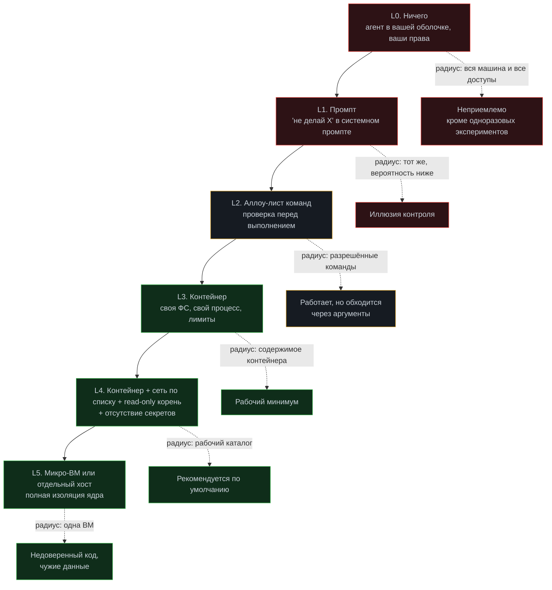

# Модуль 08. Песочницы: где агенту можно бегать

[← 07. Мульти-агент](../07-multi-agent/) · [К содержанию](../README.md) · [09. Эвалы →](../09-evals/) · Лаба: [12](../labs/lab12-sandbox/)

> **Главный вопрос модуля.** Как ограничить агента физически, а не просьбами в промпте — и как посчитать радиус поражения одного неверного действия.

**Время:** 4,5 часа теории и практики, 2,5 часа лабораторной.
**Критерий приёмки:** `make check m08` — агент физически не может выйти за пределы рабочего каталога, обратиться к хосту вне белого списка, съесть больше выделенных CPU и памяти или проработать дольше таймаута; попытка выхода фиксируется в трейсе как событие.

---

## Содержание

- [8.1 Провал без этого модуля](#81-провал-без-этого-модуля)
- [8.2 Радиус поражения: как считать](#82-радиус-поражения-как-считать)
- [8.3 Пять уровней изоляции](#83-пять-уровней-изоляции)
- [8.4 Файловая система: что монтировать](#84-файловая-система-что-монтировать)
- [8.5 Сеть: белый список вместо чёрного](#85-сеть-белый-список-вместо-чёрного)
- [8.6 Ресурсы: CPU, память, диск, время](#86-ресурсы-cpu-память-диск-время)
- [8.7 Секреты: как их не отдать агенту](#87-секреты-как-их-не-отдать-агенту)
- [8.8 Рабочий Dockerfile и compose](#88-рабочий-dockerfile-и-compose)
- [8.9 Изолированные воркспейсы для параллельных прогонов](#89-изолированные-воркспейсы-для-параллельных-прогонов)
- [8.10 Как это ломается: десять ошибок](#810-как-это-ломается-десять-ошибок)
- [Упражнения](#упражнения)
- [Чек-лист приёмки модуля](#чек-лист-приёмки-модуля)

---

## 8.1 Провал без этого модуля

**Промпт — не граница.** «Не удаляй файлы вне рабочего каталога» в системном промпте снижает вероятность, но не устраняет возможность. Между «модель обычно слушается» и «действие невозможно» — пропасть, и она измеряется в инцидентах.

Три реальных класса происшествий, каждый из которых происходил в реальных командах.

**Уборка, которая зашла далеко.** Агенту поручили «удалить временные файлы проекта». Он вызвал `rm -rf` с путём, собранным из переменной, которая оказалась пустой. Без изоляции это удаление в корне. С контейнером, у которого смонтирован только рабочий каталог, — удаление внутри каталога, восстановимое из git.

**Утечка через переменные окружения.** Агент выполнил `env` при отладке, вывод попал в контекст, контекст ушёл провайдеру модели, а в `env` был продакшен-токен. Никакого злого умысла — просто `env` выглядит безобидной командой. Лечение: секретов нет в окружении процесса агента вообще.

**Бесконечный процесс.** Агент запустил сборку, она зависла на ожидании ввода. Прогон висел до утра, потребляя CPU. Лечение: таймаут на процесс и лимит CPU, а не «агент должен был заметить».

---

## 8.2 Радиус поражения: как считать

Радиус поражения — максимальный ущерб от одного неверного действия агента. Это число, которое нужно знать до запуска, а не после инцидента.

**Протокол оценки: пять вопросов.**

| Вопрос | Пример хорошего ответа |
|---|---|
| Что агент может прочитать? | Только файлы в `/work`; `.env` исключён; `/proc` недоступен |
| Что агент может изменить? | Только `/work`, который является git-worktree; всё восстановимо `git checkout` |
| Куда агент может отправить данные? | Только `api.provider.com` и `pypi.org`; остальное отклоняется на уровне сети |
| Сколько ресурсов он может съесть? | 2 CPU, 4 ГБ памяти, 10 ГБ диска, 20 минут |
| Что произойдёт при полном захвате процесса? | Потеря содержимого `/work`, восстановление за 1 минуту; доступа к другим системам нет |

**Правило.** Если на любой из пяти вопросов ответ «не знаю» или «в принципе всё», агента нельзя запускать автономно. Не потому, что он злонамерен, а потому что вы не можете оценить последствия ошибки, а ошибки будут.

**Полезное упражнение — «худший сценарий на бумаге».** Представьте, что модель на одном шаге сгенерировала максимально разрушительную команду, и она выполнилась. Опишите последствия в трёх строках. Если эти строки вас не устраивают, вы знаете, что чинить. Это упражнение занимает пять минут и обычно находит одну-две реальные дыры.

---

## 8.3 Пять уровней изоляции

**Где вы, скорее всего, находитесь сейчас.** L1. Это самый распространённый уровень и самый опасный, потому что он даёт чувство защищённости. Целевой уровень для большинства применений — L4, и он достигается за один вечер работы.

**Когда нужен L5.** Если агент выполняет код, который он сам сгенерировал, и этот код может быть произвольным; если он обрабатывает данные, пришедшие от недоверенных пользователей; если в контейнере есть что-то, чего вы не готовы потерять. Контейнеры дают изоляцию процессов, но общее ядро — известное ограничение, и для действительно недоверенного кода нужна виртуализация.

**Про L2 отдельно.** Белый список команд полезен, но обходится через аргументы: `git` разрешён, а `git config core.pager='rm -rf /'` — это уже другое. Поэтому L2 не заменяет L3, а дополняет его: список команд снижает шум и ловит очевидные ошибки, контейнер ограничивает последствия неочевидных.

---

## 8.4 Файловая система: что монтировать

**Принцип: по умолчанию ничего, добавляем по необходимости.**

| Путь | Режим | Зачем | Комментарий |
|---|---|---|---|
| `/work` | rw | Рабочая копия проекта | Отдельный git-worktree, не основной каталог |
| `/work/.git` | rw | Коммиты внутри песочницы | Или `ro`, если коммиты делает хост |
| `/cache/pip` | rw | Кеш зависимостей | Ускоряет, не влияет на безопасность |
| `/opt/toolchain` | ro | Компиляторы, интерпретаторы | Read-only обязательно |
| `/` (корень образа) | ro | Всё остальное | `--read-only` плюс `tmpfs` для `/tmp` |
| `~/.ssh`, `~/.aws`, `~/.config` | не монтировать | — | Самая частая ошибка |
| `/var/run/docker.sock` | не монтировать | — | Это выдача прав root на хосте |

**Правило worktree.** Не давайте агенту основной рабочий каталог. Создайте отдельный `git worktree` на отдельной ветке: агент работает там, вы видите результат как ветку, откат — удаление worktree. Это одна команда и полностью меняет цену ошибки.

~~~bash
# создать изолированный воркспейс под задачу
git worktree add -b agent/task-142 ../ws-task-142 origin/main
docker run --rm -v "$PWD/../ws-task-142:/work" ... agent-sandbox
# посмотреть результат
git -C ../ws-task-142 diff main
# откатить целиком
git worktree remove --force ../ws-task-142 && git branch -D agent/task-142
~~~

**Список запрещённых файлов внутри разрешённого каталога.** Даже в `/work` есть то, чего агенту читать не нужно: `.env`, `*.pem`, `id_rsa`, `credentials*`. Реализуется на двух уровнях: файлы не попадают в worktree (через `.gitignore` они и так не в git), и `DENY`-список в функции проверки пути из [модуля 06](../06-mcp/). Два уровня, потому что один всегда однажды не сработает.

---

## 8.5 Сеть: белый список вместо чёрного

**Чёрный список не работает.** Перечислить все опасные адреса невозможно. Работает обратное: запретить всё, разрешить перечисленное.

**Три способа реализации, от простого к надёжному.**

**Способ 1: `--network none` плюс прокси-инструмент.** Контейнер вообще без сети. Все сетевые обращения идут через инструмент `http_get(url)`, который выполняется на хосте и проверяет URL по списку. Самый простой и самый надёжный вариант; подходит, когда сетевых обращений мало и они предсказуемы.

**Способ 2: отдельная сеть с HTTP-прокси.** Контейнер в своей сети, единственный выход — прокси, который разрешает по списку хостов. Позволяет работать `pip`, `npm` и обычным клиентам без переписывания.

~~~yaml
# docker-compose.yml (фрагмент)
services:
  proxy:
    image: ubuntu/squid:latest
    volumes: ["./squid.conf:/etc/squid/squid.conf:ro"]
    networks: [egress]
  agent:
    build: .
    environment:
      HTTP_PROXY: "http://proxy:3128"
      HTTPS_PROXY: "http://proxy:3128"
      NO_PROXY: "localhost,127.0.0.1"
    networks: [inside]
    depends_on: [proxy]
networks:
  inside: {internal: true}     # нет выхода наружу
  egress: {}
~~~

~~~
# squid.conf: белый список
acl allowed_hosts dstdomain api.provider.example pypi.org files.pythonhosted.org
acl allowed_hosts dstdomain registry.npmjs.org github.com
http_access allow allowed_hosts
http_access deny all
~~~

**Способ 3: политики на уровне сетевого стека.** Правила `iptables` или сетевые политики оркестратора. Надёжнее всего, требует администрирования.

**Что обязательно логировать.** Каждое отклонённое обращение — с URL и шагом прогона. Это не только безопасность: отклонённые запросы показывают, чего агенту не хватает, и часто это сигнал добавить легальный инструмент вместо расширения списка.

**Особый случай: DNS.** Разрешение имён — это тоже канал утечки данных (имя запрашиваемого домена может кодировать информацию). Для строгих сценариев DNS ограничивается или заменяется статическим `hosts`.

---

## 8.6 Ресурсы: CPU, память, диск, время

| Ресурс | Как ограничить | Разумное значение | Что происходит при исчерпании |
|---|---|---|---|
| CPU | `--cpus=2` | 1–4 | Замедление, не отказ |
| Память | `--memory=4g --memory-swap=4g` | 2–8 ГБ | Процесс убивается ядром |
| Диск | Квота на том или `--storage-opt` | 5–20 ГБ | Ошибка записи |
| Процессы | `--pids-limit=256` | 128–512 | Защита от форк-бомбы |
| Время процесса | `timeout` на каждую команду | 30–600 с по типу | Процесс убивается, `error_code: timeout` |
| Время прогона | Дедлайн из [модуля 01](../01-agent-basics/) | 5–30 мин | Безопасное завершение |
| Файловые дескрипторы | `--ulimit nofile=1024` | 1024 | Ошибка открытия |

**Важно про память.** `--memory` без `--memory-swap` разрешает своп и превращает жёсткий лимит в мягкий: процесс не убивается, а начинает мучительно свопиться, съедая диск и время. Ставьте оба значения равными.

**Важно про таймауты.** Таймаут нужен на каждую команду, а не только на прогон. Разные типы команд — разные значения: линтер 30 секунд, тесты 600, сборка 900. Единый большой таймаут бесполезен: зависшая команда съест весь бюджет прогона.

**Обязательное правило: убивать группу процессов.** `timeout` на родительский процесс не убивает его детей. Запускайте команды в отдельной группе и убивайте группу целиком, иначе в контейнере накапливаются осиротевшие процессы.

~~~python
def run_isolated(cmd: list[str], timeout: int, cwd: str) -> Result:
    """Запуск с таймаутом и убийством всей группы процессов."""
    proc = subprocess.Popen(
        cmd, cwd=cwd, stdout=subprocess.PIPE, stderr=subprocess.PIPE,
        text=True, start_new_session=True,       # своя группа процессов
    )
    try:
        out, err = proc.communicate(timeout=timeout)
        return Result(proc.returncode, out, err, timed_out=False)
    except subprocess.TimeoutExpired:
        os.killpg(os.getpgid(proc.pid), signal.SIGTERM)
        time.sleep(2)
        with contextlib.suppress(ProcessLookupError):
            os.killpg(os.getpgid(proc.pid), signal.SIGKILL)
        out, err = proc.communicate()
        return Result(124, out, err, timed_out=True)
~~~

---

## 8.7 Секреты: как их не отдать агенту

**Главное правило: у процесса агента нет секретов в окружении.** Не «агенту запрещено читать `env`», а «в `env` нечего читать».

**Три уровня работы с секретами.**

**Уровень 1: секрет нужен инструменту, но не агенту.** Инструмент выполняется на хосте (вне песочницы) и сам подставляет ключ. Агент вызывает `send_email(to, subject, body)` и никогда не видит SMTP-пароль. Это правильная схема для 90% случаев.

**Уровень 2: секрет нужен внутри песочницы.** Например, токен для `pip` из приватного индекса. Тогда: отдельный токен с минимальными правами, только на время прогона, через файл в `tmpfs` (не через `env`, потому что `env` виден в `/proc` и попадает в вывод `env`), с удалением после использования.

**Уровень 3: секрет вообще не должен существовать в песочнице.** Продакшен-доступы, платёжные ключи, доступ к персональным данным. Такие операции выполняются вне агента, а агент только формирует запрос на подтверждение.

**Сканер утечек на выходе.** Даже при аккуратной схеме что-то однажды попадёт в вывод инструмента. Ставьте фильтр на пути из песочницы в контекст: регулярные выражения на типовые форматы ключей плюс список известных значений (хеши ваших реальных секретов, чтобы сравнивать без хранения самих секретов).

~~~python
SECRET_PATTERNS = [
    (r"(?i)(api[_-]?key|token|secret|password)\s*[:=]\s*\S{8,}", "kv"),
    (r"sk-[A-Za-z0-9]{16,}", "provider_key"),
    (r"-----BEGIN [A-Z ]*PRIVATE KEY-----", "private_key"),
    (r"(?i)postgres(ql)?://[^:]+:[^@]+@", "db_url_with_password"),
    (r"eyJ[A-Za-z0-9_-]{10,}\.[A-Za-z0-9_-]{10,}\.", "jwt"),
]

def redact(text: str) -> tuple[str, list[str]]:
    """Возвращает очищенный текст и список сработавших правил."""
    hits = []
    for pattern, name in SECRET_PATTERNS:
        text, n = re.subn(pattern, f"[СКРЫТО:{name}]", text)
        if n:
            hits.append(f"{name}x{n}")
    return text, hits
~~~

Срабатывание сканера — это не только очистка, это инцидент: он означает, что секрет был доступен там, где не должен. Логируйте факт и разбирайтесь с причиной, а не только с симптомом.

---

## 8.8 Рабочий Dockerfile и compose

~~~dockerfile
# templates/docker/Dockerfile.sandbox
FROM python:3.12-slim AS base

# 1. Непривилегированный пользователь с фиксированным uid
RUN groupadd -g 10001 agent && useradd -u 10001 -g agent -m -s /bin/bash agent

# 2. Только необходимые утилиты. Каждая строка - осознанное решение
RUN apt-get update && apt-get install -y --no-install-recommends \
        git ripgrep jq ca-certificates \
    && rm -rf /var/lib/apt/lists/*

# 3. Зависимости отдельным слоем: кешируются, не пересобираются
COPY requirements.txt /tmp/
RUN pip install --no-cache-dir -r /tmp/requirements.txt

# 4. Никаких секретов в образе, никаких ARG с токенами
ENV PYTHONDONTWRITEBYTECODE=1 PYTHONUNBUFFERED=1 HOME=/home/agent

# 5. Рабочий каталог монтируется снаружи
WORKDIR /work
USER agent

# 6. Ничего не запускаем по умолчанию: команду задаёт вызывающий
ENTRYPOINT ["/bin/bash", "-lc"]
~~~

~~~bash
# Запуск: каждый флаг - отдельная граница
docker run --rm \
  --name "agent-${RUN_ID}" \
  --user 10001:10001 \
  --read-only \
  --tmpfs /tmp:rw,noexec,nosuid,size=512m \
  --tmpfs /home/agent:rw,size=64m \
  -v "${WORKSPACE}:/work:rw" \
  -v "${CACHE}/pip:/home/agent/.cache/pip:rw" \
  --network none \
  --cpus 2 --memory 4g --memory-swap 4g \
  --pids-limit 256 --ulimit nofile=1024:1024 \
  --cap-drop ALL --security-opt no-new-privileges \
  --env-file /dev/null \
  agent-sandbox:latest "make test"
~~~

**Разбор флагов, каждый закрывает конкретную дыру.**

`--user 10001` — не root внутри контейнера; иначе запись в смонтированный том создаёт файлы, принадлежащие root на хосте. `--read-only` — корневая ФС неизменяема; всё изменяемое явно перечислено. `--tmpfs /tmp` с `noexec` — временные файлы есть, но исполнять их нельзя. `--network none` — сети нет; для варианта с прокси заменяется на внутреннюю сеть. `--memory-swap` равен `--memory` — жёсткий лимит без свопа. `--pids-limit` — защита от форк-бомбы. `--cap-drop ALL` — ни одной capability ядра. `--security-opt no-new-privileges` — запрет повышения прав через setuid-бинарники. `--env-file /dev/null` — явное указание, что окружение не наследуется.

**Проверка песочницы тестами.** Изоляция — это код, и он должен быть покрыт тестами, как любой другой.

~~~bash
# tests/sandbox_test.sh — каждая проверка ДОЛЖНА провалиться внутри
run_in_sandbox 'cat /etc/shadow'          && fail "прочитал shadow"
run_in_sandbox 'touch /usr/bin/x'         && fail "записал в /usr"
run_in_sandbox 'cat ../../etc/passwd'     && fail "вышел из /work"
run_in_sandbox 'curl -m 3 https://example.com' && fail "вышел в сеть"
run_in_sandbox 'id -u | grep -q "^0$"'    && fail "работает как root"
run_in_sandbox 'python -c "print(open(\"/work/.env\").read())"' && fail "прочитал .env"
run_in_sandbox 'python -c "
import multiprocessing as m
[m.Process(target=lambda: None).start() for _ in range(1000)]"' && fail "нет pids-limit"
echo "все негативные проверки провалились корректно"
~~~

Обратите внимание на логику: тест считается пройденным, когда команда внутри песочницы **не** сработала. Это тесты-мутации: они проверяют, что барьер существует. Тест, который просто запускает `make test` внутри контейнера, не проверяет изоляцию вообще.

---

## 8.9 Изолированные воркспейсы для параллельных прогонов

Когда прогонов несколько одновременно, они не должны видеть друг друга.

~~~makefile
# Makefile: изолированный воркспейс на задачу
WS ?= ws-$(shell date +%s)

agent-ws:
	git worktree add -b agent/$(WS) ../$(WS) origin/main
	mkdir -p ../.cache/$(WS)/pip
	docker run --rm --name agent-$(WS) 	  --user 10001:10001 --read-only 	  --tmpfs /tmp:rw,noexec,nosuid,size=512m 	  -v "$(PWD)/../$(WS):/work:rw" 	  -v "$(PWD)/../.cache/$(WS)/pip:/home/agent/.cache/pip:rw" 	  --network none --cpus 2 --memory 4g --memory-swap 4g 	  --pids-limit 256 --cap-drop ALL --security-opt no-new-privileges 	  agent-sandbox:latest "$(CMD)"

agent-ws-diff:
	git -C ../$(WS) diff origin/main

agent-ws-clean:
	-docker rm -f agent-$(WS)
	git worktree remove --force ../$(WS) || true
	git branch -D agent/$(WS) || true
	rm -rf ../.cache/$(WS)
~~~

**Три свойства, которые это даёт.** Полная изоляция состояния: два прогона не мешают друг другу ни в git, ни в кешах, ни в портах. Тривиальный откат: удаление worktree и ветки. Наблюдаемость результата: `git diff` показывает всё, что агент сделал, одной командой — это лучший отчёт о работе агента из возможных.

**Про порты.** Если агенту нужен запуск сервиса, порты назначайте динамически и не публикуйте на хост без необходимости. Два параллельных прогона, оба поднимающие сервис на 8000, — источник загадочных падений.

---

## 8.10 Как это ломается: десять ошибок

**1. Изоляция только промптом.** Признак: в `DANGEROUS.md` есть запреты, а в `docker run` нет ни одного флага. Лечение: L4.

**2. Монтирование основного каталога проекта.** Признак: агент работает там, где вы работаете. Лечение: `git worktree`.

**3. Root внутри контейнера.** Признак: файлы в смонтированном томе принадлежат root на хосте. Лечение: `--user` с фиксированным uid.

**4. `--memory` без `--memory-swap`.** Признак: прогон не падает, а бесконечно свопится. Лечение: равные значения.

**5. Монтирование `docker.sock`.** Признак: «агенту нужен Docker». Лечение: не давать; если нужна сборка образов — отдельный сервис с ограниченным API.

**6. Секреты в `env`.** Признак: `env` в трейсе содержит токены. Лечение: инструменты на хосте подставляют секреты сами.

**7. Чёрный список хостов.** Признак: список «запрещённых» доменов. Лечение: белый список плюс логирование отказов.

**8. Таймаут только на прогон.** Признак: одна команда съела весь бюджет времени. Лечение: таймаут на каждую команду с убийством группы процессов.

**9. Нет тестов изоляции.** Признак: вы уверены, что барьеры работают, но не проверяли. Лечение: негативные тесты из 8.8 в CI.

**10. Отказы изоляции не логируются.** Признак: агент десять раз пытался выйти в сеть, вы об этом не знаете. Лечение: каждое отклонённое действие — событие в трейсе с шагом и причиной.

---

## Упражнения

<b>Задача 1.</b> Посчитайте радиус поражения

Конфигурация: агент запускается локально, без контейнера, из каталога проекта, с `.env` в этом каталоге, с `~/.ssh` доступным, с полным доступом в сеть, без таймаутов. Опишите худший сценарий.

**Ответ.** Прочитан `.env` (все ключи проекта) и `~/.ssh/id_rsa` (доступ ко всем репозиториям и серверам, куда ходит владелец ключа). Содержимое ушло провайдеру модели в контексте и, при неудачном стечении, во внешний сервис. Изменения возможны в любом файле, доступном пользователю, включая другие проекты и `~/.bashrc` (постоянное присутствие). Сеть открыта: данные могут уйти куда угодно. Ресурсы не ограничены: возможен бесконечный процесс. Радиус — весь рабочий аккаунт разработчика плюс всё, куда этот аккаунт имеет доступ. Приемлемо только для одноразовых экспериментов на пустой виртуальной машине.

<b>Задача 2.</b> Обойдите белый список команд

Разрешены `git`, `python`, `pytest`. Найдите три способа выполнить произвольную команду.

**Ответ.** (1) `python -c "import os; os.system('...')"` — интерпретатор в списке, значит доступно всё. (2) `git` поддерживает внешние команды через конфигурацию: `git -c core.pager='...' log` или алиасы с `!`. (3) `pytest` выполняет `conftest.py` из рабочего каталога — достаточно записать туда код. Вывод: белый список команд не является границей безопасности, если в нём есть хотя бы один интерпретатор или программа с расширяемостью. Он полезен как фильтр очевидных ошибок, но настоящая граница — контейнер с ограничениями (L3–L4).

<b>Задача 3.</b> Спроектируйте работу с секретом

Агенту нужно отправлять сообщения в корпоративный чат. Как организовать, чтобы токен не попал ни в контекст, ни в песочницу?

**Ответ.** Инструмент `post_message(channel, text)` выполняется на хосте, вне контейнера агента, и сам берёт токен из хранилища секретов. Агент передаёт только `channel` и `text`. Дополнительно: `channel` проверяется по белому списку разрешённых каналов (иначе агент отправит в `#general`); `text` проходит через `redact()` перед отправкой (иначе агент случайно опубликует то, что нашёл в коде); операция классифицируется как класс E из [модуля 02](../02-tool-calling/), то есть требует ключа идемпотентности и, для внешне видимых каналов, подтверждения. Токен при этом не существует ни в `env` контейнера, ни в контексте модели.

<b>Задача 4.</b> Напишите негативный тест

Проверьте, что агент не может прочитать файл вне `/work`, тремя разными способами.

**Ответ.** (1) `cat /etc/passwd` — прямой абсолютный путь. (2) `cat /work/../etc/passwd` — выход через `..`; проверяет, что монтирование, а не только код, ограничивает доступ. (3) `ln -s /etc/passwd /work/link && cat /work/link` — симлинк; проверяет, что либо симлинки запрещены проверкой, либо файл физически недоступен в контейнере. Все три должны провалиться. Четвёртый полезный: `python -c "open('/proc/1/environ').read()"` — проверка, что окружение первого процесса недоступно. Тесты должны быть именно негативными: успех теста означает провал команды.

<b>Задача 5.</b> Антиметрика изоляции

Метрика: «ноль инцидентов безопасности за квартал». Почему этого недостаточно и что измерять дополнительно?

**Ответ.** Ноль инцидентов может означать и хорошую изоляцию, и отсутствие обнаружения, и малую нагрузку. Дополнительно измеряйте: число заблокированных попыток выхода за границы (должно быть больше нуля — это признак, что барьеры работают и агент их иногда касается); долю негативных тестов изоляции, проходящих в CI (должна быть 100%); время от запроса нового доступа до его выдачи (если расширение прав занимает секунды и не требует ревью, границы декоративны); долю прогонов, запущенных вне песочницы (должна быть нулевой, и это надо проверять автоматически, а не спрашивать).

---

## Чек-лист приёмки модуля

- [ ] Заполнены ответы на пять вопросов о радиусе поражения
- [ ] Агент работает в контейнере с `--read-only` и явным списком изменяемых путей
- [ ] Внутри контейнера непривилегированный пользователь с фиксированным uid
- [ ] Смонтирован отдельный `git worktree`, а не основной каталог проекта
- [ ] `~/.ssh`, `~/.aws`, `docker.sock` не смонтированы
- [ ] Сеть: `none` или внутренняя с прокси и белым списком хостов
- [ ] Отклонённые сетевые обращения логируются с шагом прогона
- [ ] Заданы лимиты CPU, памяти (с `memory-swap`), диска, `pids`, `nofile`
- [ ] Таймаут на каждую команду, с убийством всей группы процессов
- [ ] `--cap-drop ALL` и `no-new-privileges`
- [ ] В окружении процесса агента нет секретов; инструменты подставляют их на хосте
- [ ] Работает `redact()` на выходе из песочницы; срабатывание считается инцидентом
- [ ] Есть негативные тесты изоляции, и они в CI
- [ ] Параллельные прогоны используют отдельные воркспейсы и кеши
- [ ] Откат прогона — одна команда, меньше минуты

**Антиметрика модуля.** Если ни один негативный тест изоляции никогда не падал при изменениях конфигурации, вероятно, они проверяют не то. Специально ослабьте один флаг (уберите `--read-only`) и убедитесь, что соответствующий тест покраснел. Барьер, существование которого нельзя опровергнуть тестом, ничем не отличается от отсутствующего.

---

## Связь с другими модулями

| Куда ведёт | Что берётся отсюда |
|---|---|
| [02 Tool calling](../02-tool-calling/) | Классы опасности A–E определяют, что вообще пускать в песочницу |
| [06 MCP](../06-mcp/) | `stdio`-серверы запускаются в контейнере с минимальным монтированием |
| [11 Безопасность](../11-security/) | Изоляция — второй барьер после разделения доверенного и недоверенного |
| [10 Наблюдаемость](../10-observability/) | Отклонённые действия и срабатывания `redact` — события трейса |
| [13 Production](../13-production/) | Воркспейсы и лимиты переносятся в конфигурацию деплоя |
| [14 Отказы](../14-agent-failures/) | Таймауты и убийство процессов — часть безопасного завершения |

**Дальше:** [Модуль 09. Эвалы →](../09-evals/)
