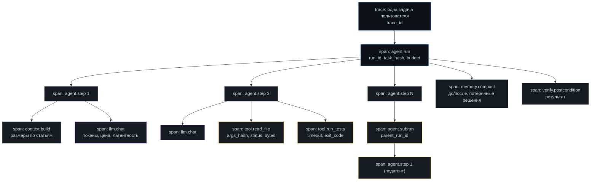

# Модуль 10. Наблюдаемость

[← 09. Эвалы](../09-evals/) · [К содержанию](../README.md) · [11. Безопасность →](../11-security/) · Лаба: [14](../labs/lab14-otel-traces/)

> **Главный вопрос модуля.** Прогон упал ночью. Что именно произошло, на каком шаге, что агент видел в этот момент и сколько это стоило — и можно ли ответить за минуту, не запуская отладчик.

**Время:** 4,5 часа теории и практики, 3 часа лабораторной.
**Критерий приёмки:** `make check m10` — по `run_id` восстанавливается вся цепочка решений без запуска отладчика; есть дашборд с пятью обязательными графиками; алерты срабатывают на симптомы, а не на всё подряд.

---

## Содержание

- [10.1 Провал без этого модуля](#101-провал-без-этого-модуля)
- [10.2 Три вопроса, на которые обязана отвечать система](#102-три-вопроса-на-которые-обязана-отвечать-система)
- [10.3 Модель данных: спаны, трейсы, атрибуты](#103-модель-данных-спаны-трейсы-атрибуты)
- [10.4 OpenTelemetry для агента: практическая схема](#104-opentelemetry-для-агента-практическая-схема)
- [10.5 Структурные логи и что в них писать](#105-структурные-логи-и-что-в-них-писать)
- [10.6 Семплирование и приватность](#106-семплирование-и-приватность)
- [10.7 Метрики: пять графиков, которые нужны всегда](#107-метрики-пять-графиков-которые-нужны-всегда)
- [10.8 Алерты: на что будить человека](#108-алерты-на-что-будить-человека)
- [10.9 Разбор прогона: протокол за десять минут](#109-разбор-прогона-протокол-за-десять-минут)
- [10.10 Как это ломается: девять ошибок](#1010-как-это-ломается-девять-ошибок)
- [Упражнения](#упражнения)
- [Чек-лист приёмки модуля](#чек-лист-приёмки-модуля)

---

## 10.1 Провал без этого модуля

**Классика: «работало вчера».** Пользователь жалуется, что агент дал неверный ответ. Вы спрашиваете, что он вводил. Он не помнит точно. Воспроизвести не получается — недетерминированная система. В логах есть строка «ERROR: tool failed» без указания, какой инструмент, с какими аргументами и на каком шаге. Разбор занимает день и заканчивается фразой «наверное, модель ошиблась».

**Логи, написанные для человека.** `logger.info(f"Обрабатываю задачу {task}")`. Через месяц у вас 40 гигабайт прозы, по которой невозможно посчитать ни одну метрику. Каждый вопрос вида «сколько прогонов упало по таймауту на прошлой неделе» требует написания одноразового скрипта с регулярными выражениями.

**Стоимость как загадка.** В конце месяца счёт от провайдера в три раза больше ожидаемого. Понять, какие прогоны его сформировали, невозможно: расходы нигде не привязаны к `run_id` и к типу задачи.

**Мульти-агент без корреляции.** Прогон с тремя подагентами оставил четыре независимых лога. Восстановить порядок событий и передачи между ними — работа на полдня.

---

## 10.2 Три вопроса, на которые обязана отвечать система

Проверочный критерий наблюдаемости: на каждый из трёх вопросов вы отвечаете **за минуту, имея только `run_id`**.

**Вопрос 1: где прогон пошёл не туда?** Нужно: последовательность шагов с решениями модели, вызовами инструментов и их результатами; момент первого расхождения с ожидаемым; статус пунктов плана по шагам.

**Вопрос 2: что агент видел в этот момент?** Нужно: состав окна контекста по статьям, хеш окна (чтобы понять, менялся ли вход), какие инструменты были доступны, какие факты и фрагменты были подмешаны, был ли обрезан вывод инструмента.

**Вопрос 3: сколько это стоило и где основная трата?** Нужно: токены и деньги по шагам, разбивка по моделям, доля кэшированных токенов, латентность модели и инструментов отдельно.

**Практическое следствие.** Если для ответа нужно грепать текстовые логи, наблюдаемости нет. Целевое состояние: одна команда `make trace RUN=r-2f8a` печатает всё нужное в читаемом виде, и одна ссылка открывает трейс в системе трассировки.

---

## 10.3 Модель данных: спаны, трейсы, атрибуты

**Иерархия для агента.**

**Обязательные атрибуты по типу спана.**

| Спан | Атрибуты |
|---|---|
| `agent.run` | `run_id`, `parent_run_id`, `task_hash`, `prompts_version`, `model`, `max_steps`, `max_cost_usd`, `stop_reason`, `outcome` |
| `agent.step` | `step`, `decision` (`tool_call`/`answer`/`empty`), `plan_item`, `empty_streak`, `repeat_count` |
| `context.build` | Размер в токенах по каждой статье, `window_hash`, `total_tokens`, `truncated_parts` |
| `llm.chat` | `model`, `in_tokens`, `out_tokens`, `cached_tokens`, `cost_usd`, `latency_ms`, `finish_reason`, `temperature` |
| `tool.<name>` | `tool`, `args_hash`, `status`, `error_code`, `retryable`, `retry_n`, `bytes_out`, `truncated`, `duration_ms`, `server` (для MCP) |
| `memory.compact` | `before_tokens`, `after_tokens`, `decisions_total`, `decisions_lost` |
| `verify.postcondition` | `checks_total`, `checks_failed`, `first_failure` |
| `policy.decision` | `tool`, `verdict` (`allow`/`confirm`/`deny`), `reason` |

**Правило: одно событие — один спан.** Не пишите «шаг 3, вызвал два инструмента» одной записью. Два инструмента — два спана. Иначе невозможно посчитать латентность и долю ошибок по инструментам.

**Правило: `args_hash`, а не `args`.** Аргументы могут содержать чувствительные данные и много текста. Хеш позволяет отвечать на вопрос «те же аргументы или другие», а полные аргументы сохраняются отдельно, с семплированием и редактированием.

---

## 10.4 OpenTelemetry для агента: практическая схема

OpenTelemetry — стандарт, а не библиотека одного вендора; это его главное преимущество: вы не привязываетесь к системе трассировки.

~~~python
# templates/otel/tracing.py
from opentelemetry import trace, metrics
from opentelemetry.sdk.resources import Resource
from opentelemetry.sdk.trace import TracerProvider
from opentelemetry.sdk.trace.export import BatchSpanProcessor
from opentelemetry.exporter.otlp.proto.http.trace_exporter import OTLPSpanExporter

def setup(service: str, version: str) -> trace.Tracer:
    resource = Resource.create({
        "service.name": service,
        "service.version": version,
        "deployment.environment": os.environ.get("ENV", "dev"),
    })
    provider = TracerProvider(resource=resource)
    provider.add_span_processor(BatchSpanProcessor(OTLPSpanExporter()))
    trace.set_tracer_provider(provider)
    return trace.get_tracer(service)

tracer = setup("agent", "v14")

def run_step(state, budget, llm, tools):
    with tracer.start_as_current_span("agent.step") as step_span:
        step_span.set_attributes({
            "agent.step": budget.steps,
            "agent.plan_item": state.plan.current_id,
            "agent.empty_streak": budget.empty_steps,
        })

        with tracer.start_as_current_span("context.build") as cs:
            window, sizes = build_window(state, budget)
            cs.set_attributes({f"ctx.{k}_tokens": v for k, v in sizes.items()})
            cs.set_attribute("ctx.window_hash", hash_window(window))

        with tracer.start_as_current_span("llm.chat") as ls:
            t0 = time.monotonic()
            reply = llm.chat(window, tools.schemas())
            ls.set_attributes({
                "llm.model": reply.model,
                "llm.in_tokens": reply.in_tokens,
                "llm.out_tokens": reply.out_tokens,
                "llm.cached_tokens": reply.cached_tokens,
                "llm.cost_usd": reply.cost_usd,
                "llm.latency_ms": int((time.monotonic() - t0) * 1000),
                "llm.finish_reason": reply.finish_reason,
            })

        for call in reply.tool_calls:
            with tracer.start_as_current_span(f"tool.{call['name']}") as ts:
                res = tools.invoke(call)
                ts.set_attributes({
                    "tool.name": call["name"],
                    "tool.args_hash": args_hash(call),
                    "tool.status": res.status,
                    "tool.error_code": res.error_code or "",
                    "tool.bytes_out": len(res.content),
                    "tool.truncated": res.truncated,
                })
                if res.status == "error":
                    ts.set_status(trace.StatusCode.ERROR, res.error_code)
        return reply
~~~

**Три практических замечания.**

Спан `llm.chat` отделён от `agent.step` намеренно: латентность модели и латентность шага — разные вещи, и смешивать их значит потерять возможность понять, кто тормозит.

`set_status(ERROR)` ставится на спан инструмента, но **не** на спан шага: ошибка инструмента — это нормальный ход событий (данные для модели), а не отказ шага. Иначе ваш дашборд будет показывать 40% ошибок при здоровой системе.

Экспорт батчами, а не по одному спану: иначе трассировка добавит к латентности больше, чем сэкономит времени на отладке.

**Локальная работа без бэкенда.** Для разработки достаточно писать спаны в файл JSONL и иметь `make trace RUN=...`, который печатает дерево. Полноценный бэкенд нужен, когда прогонов больше сотни в день.

---

## 10.5 Структурные логи и что в них писать

**Правило: логи в JSON, одна строка — одно событие, никакой прозы.**

~~~python
def log(event: str, **fields) -> None:
    """Один формат на весь проект. Никаких f-строк с текстом."""
    rec = {
        "ts": datetime.now(timezone.utc).isoformat(timespec="milliseconds"),
        "event": event,                      # из закрытого списка
        "trace_id": ctx.trace_id,
        "run_id": ctx.run_id,
        "step": ctx.step,
        **fields,
    }
    print(json.dumps(rec, ensure_ascii=False), file=sys.stderr)
~~~

**Закрытый список событий.** Свободные строки в поле `event` убивают возможность считать статистику так же надёжно, как проза в логах.

| Событие | Когда | Обязательные поля |
|---|---|---|
| `run.start` | Начало прогона | `task_hash`, `model`, `prompts_version`, бюджеты |
| `run.finish` | Конец | `stop_reason`, `outcome`, `steps`, `cost_usd`, `seconds` |
| `step.decision` | После вызова модели | `decision`, `plan_item`, `tools` |
| `tool.call` | Каждый вызов | `tool`, `args_hash`, `status`, `error_code`, `duration_ms` |
| `tool.denied` | Политика отклонила | `tool`, `reason` |
| `tool.truncated` | Вывод обрезан | `tool`, `bytes_original`, `bytes_kept` |
| `context.built` | Сборка окна | размеры по статьям, `window_hash` |
| `memory.compacted` | Компакция | `before`, `after`, `decisions_lost` |
| `plan.updated` | Смена статуса или `replan` | `item`, `from`, `to`, `replan_n`, `reason` |
| `secret.redacted` | Сработал сканер | `pattern_name`, `where` |
| `injection.blocked` | Обнаружена инъекция | `source`, `rule` |
| `budget.warning` | Мягкий порог 80% | какой бюджет, `ratio` |
| `human.requested` | Нужно подтверждение | `tool`, `effect` |

**Что нельзя писать в логи.** Полный контекст (это трейс с семплированием, не лог). Аргументы инструментов целиком (хеш плюс редактирование). Секреты. Персональные данные пользователей: в логах должны быть идентификаторы, а не содержимое.

**Пять вопросов в терминале, если логи структурные.**

~~~bash
# 1. Распределение причин остановки за сутки
jq -r 'select(.event=="run.finish") | .stop_reason' logs.jsonl | sort | uniq -c | sort -rn

# 2. Самые дорогие прогоны
jq -r 'select(.event=="run.finish") | [.cost_usd, .run_id, .stop_reason] | @tsv' logs.jsonl | sort -rn | head

# 3. Какие инструменты чаще всего ошибаются
jq -r 'select(.event=="tool.call" and .status=="error") | [.tool, .error_code] | @tsv' logs.jsonl | sort | uniq -c | sort -rn

# 4. Как часто обрезается вывод и у кого
jq -r 'select(.event=="tool.truncated") | .tool' logs.jsonl | sort | uniq -c | sort -rn

# 5. Прогоны, где терялись решения при компакции
jq -r 'select(.event=="memory.compacted" and .decisions_lost>0) | [.run_id, .decisions_lost] | @tsv' logs.jsonl
~~~

Пять команд, отвечающих на большинство вопросов о здоровье системы. Ни одна не возможна на прозаических логах — это лучший аргумент за структурность.

---

## 10.6 Семплирование и приватность

Полный контекст каждого шага — это гигабайты в день и, что важнее, хранилище персональных данных, которого вы не планировали.

| Что | Хранить всегда | Хранить по семплу |
|---|---|---|
| Структурные логи событий | Да, все | — |
| Спаны с атрибутами (без текста) | Да, все | — |
| Хеши окна и аргументов | Да, все | — |
| Полный текст окна контекста | Все упавшие прогоны и все с `deny`/`injection` | 5% успешных |
| Полные аргументы и результаты инструментов | Все ошибочные вызовы | 5% успешных |
| Ответы модели дословно | Все, где `finish_reason` не `stop` | 5% |

**Правило «хвостового» семплирования.** Решение о сохранении подробностей принимается **в конце** прогона, когда известен исход, а не в начале. Это требует буферизации на время прогона, зато подробности сохраняются именно там, где нужны.

**Приватность.** Редактирование применяется до записи, а не при чтении; правила — из [модуля 08](../08-sandboxes/). Дополнительно: срок хранения подробностей 7–30 дней против срока хранения агрегатов год и больше; идентификаторы пользователей вместо содержимого; отдельный доступ к подробным трейсам, не совпадающий с доступом к дашбордам.

**Отдельно про внешние системы трассировки.** Туда уйдут атрибуты спанов. Проверьте, что там нет ни промптов, ни данных пользователей, если это не согласовано. `llm.in_tokens` безопасен; `llm.prompt` — нет.

---

## 10.7 Метрики: пять графиков, которые нужны всегда

| График | Что показывает | Почему обязателен |
|---|---|---|
| 1. Исходы прогонов по времени | Доли `done`, `done_unverified`, `budget_*`, `no_progress`, `needs_human`, `fatal` | Один взгляд отвечает «здорова ли система»; рост `done_unverified` — тихая деградация |
| 2. Стоимость успешного результата | `расходы / число успехов` по дням | Главная сводная метрика; ловит и падение качества, и рост цены |
| 3. Латентность p50/p95/p99 прогона и отдельно модели | Распределение, не среднее | Среднее скрывает хвост; пользователи чувствуют p95 |
| 4. Ошибки инструментов по коду | `error_code` в разрезе инструментов | Прямо указывает, какое описание чинить |
| 5. Наполнение контекста по статьям | Средние размеры статей окна и доля обрезок | Ловит разбухание до того, как оно ударит по цене |

**Дополнительные графики, которые быстро становятся любимыми.** Число шагов до успеха гистограммой: бимодальное распределение означает два разных класса задач под одним интерфейсом. Доля прогонов с `replan`. Доля `truncated` по инструментам. Доля кэшированных входных токенов. Число заблокированных попыток выхода за границы.

**Правило про среднее.** Для всего, что связано со временем и стоимостью, среднее вредно: распределения тяжелохвостые. Считайте медиану и 95-й процентиль. Прогон, который стоил в двадцать раз больше остальных, сдвинет среднее и не будет заметен.

---

## 10.8 Алерты: на что будить человека

**Принцип: алерт на симптом, ощутимый пользователем или бюджетом, а не на любую аномалию.** Алерт, срабатывающий трижды в день и игнорируемый, хуже отсутствия алерта: он обучает игнорировать.

| Алерт | Условие | Срочность |
|---|---|---|
| Обвал качества | Доля `done` упала на 15+ п.п. за час относительно недельного профиля | Немедленно |
| Всплеск расходов | Расходы за час выше 3× медианы того же часа недели | Немедленно |
| Массовые отказы модели | Доля ошибок провайдера выше 5% за 10 минут | Немедленно |
| Утечка секрета | Любое срабатывание `secret.redacted` | Немедленно |
| Инъекция сработала | `injection` с исполненным действием | Немедленно |
| Рост `done_unverified` | Доля выросла на 20+ п.п. за сутки | В рабочее время |
| Рост `no_progress` | Доля выше 15% за сутки | В рабочее время |
| Деградация латентности | p95 выше SLO дважды за час | В рабочее время |
| Дрейф без изменений | Еженедельный эвал упал при неизменной версии | В рабочее время |

**Чего не должно быть в алертах.** Отдельная ошибка инструмента (это норма). Отдельный упавший прогон (тоже норма). Превышение бюджета одним прогоном (это работа бюджета). Любое условие, которое вы не готовы чинить в момент срабатывания.

**Обязательное поле алерта: ссылка на конкретные примеры.** Алерт «доля успехов упала» бесполезен без списка из пяти `run_id` свежих провалов. Разбор должен начинаться с клика, а не с поиска.

---

## 10.9 Разбор прогона: протокол за десять минут

Одинаковая процедура для любого странного поведения, от дешёвых проверок к дорогим.

**Шаг 1 (30 секунд). Причина остановки.** `stop_reason` отсекает половину гипотез: `budget_steps` — зацикливание или недооценка задачи; `no_progress` — плохие критерии плана или нехватка инструмента; `done_unverified` — верификации не было, и «ошибка» может быть нормой.

**Шаг 2 (1 минута). Дерево спанов.** Где потрачено время и деньги. Один шаг на 40 секунд — зависший инструмент. Один шаг на 30 000 входных токенов — необрезанный вывод.

**Шаг 3 (2 минуты). Первое расхождение.** Читаем `step.decision` по шагам и ищем первый шаг, где агент выбрал не то. Именно первое, а не самое заметное: дальше идут следствия.

**Шаг 4 (2 минуты). Что он видел.** Состав окна на этом шаге. Три частых находки: нужного факта в окне не было; вывод инструмента был обрезан; критичное правило оказалось в середине большого окна.

**Шаг 5 (2 минуты). Атрибуция слоя.**

| Наблюдение | Слой | Куда идти |
|---|---|---|
| Аргументы инструмента бессмысленны | Описание инструмента | [02](../02-tool-calling/) |
| Ошибка инструмента, затем тот же вызов | `hint` бесполезен | [02](../02-tool-calling/) |
| Нужного факта не было в окне | Сборка контекста или RAG | [04](../04-memory/), [05](../05-rag/) |
| Решение, принятое ранее, потеряно | Компакция | [04](../04-memory/) |
| Агент делает не ту задачу | Дрейф цели, план | [03](../03-planning/) |
| Ходит по кругу корректными шагами | Детектор прогресса | [03](../03-planning/) |
| Заявил готовность без проверки | Постусловие | [01](../01-agent-basics/), [09](../09-evals/) |
| Выполнил инструкцию из данных | Разметка недоверенного | [11](../11-security/) |
| Всё разумно, но результат неверен | Возможно, действительно модель | [12](../12-cost-optimization/) о роутинге |

**Шаг 6 (2 минуты). Закрепление.** Добавить задачу в golden set, чтобы этот отказ больше не прошёл незамеченным. Разбор без этого шага не считается завершённым.

---

## 10.10 Как это ломается: девять ошибок

**1. Логи прозой.** Признак: невозможно посчитать метрику без регулярных выражений. Лечение: JSON и закрытый список событий.

**2. Нет `run_id` во всех записях.** Признак: невозможно склеить события одного прогона. Лечение: контекст с `run_id`, пробрасываемый во все функции логирования.

**3. Трейс под флагом отладки.** Признак: упал ночной прогон, подробностей нет. Лечение: трейс всегда включён; семплируется объём, не факт записи.

**4. Ошибка инструмента помечена как ошибка спана шага.** Признак: дашборд показывает 40% ошибок при здоровой системе. Лечение: `ERROR` только на спане инструмента.

**5. Средние вместо процентилей.** Признак: «средняя латентность 4 секунды» при жалобах на 30. Лечение: p50/p95/p99.

**6. Полный контекст в логах.** Признак: терабайты и незапланированное хранилище персональных данных. Лечение: хвостовое семплирование, редактирование до записи.

**7. Алерты на всё.** Признак: канал алертов замьючен. Лечение: список из 10.8 и правило «не готов чинить — не алертить».

**8. Нет корреляции подагентов.** Признак: четыре независимых лога на один прогон. Лечение: `trace_id` и `parent_run_id`.

**9. Разбор без закрепления.** Признак: тот же отказ разбирается второй раз. Лечение: шаг 6 протокола обязателен.

---

## Упражнения

<b>Задача 1.</b> Минимальный набор атрибутов

Нужно отвечать на вопрос «почему прогон стоил в 8 раз дороже медианы». Какие атрибуты обязательны и почему агрегаты не помогут?

**Ответ.** Обязательны на каждом `llm.chat`: `in_tokens`, `out_tokens`, `cached_tokens`, `cost_usd`, `model`. На каждом `tool.*`: `bytes_out` и `truncated`. На `context.build`: размеры по статьям. Агрегат по прогону говорит «дорого», но не «где». Три типичные причины находятся именно этими атрибутами: один инструмент вернул огромный вывод (`bytes_out`); роутер ушёл на дорогую модель (`model` по шагам); компакция не сработала, и `in_tokens` растёт линейно до конца (`context.build`).

<b>Задача 2.</b> Дашборд показывает 40% ошибок

Система работает нормально, пользователи довольны, но панель «error rate» показывает 40%. Что произошло?

**Ответ.** Ошибки инструментов помечаются как ошибки спанов шага или прогона. В агенте ошибка инструмента — это нормальный ход событий: агент получил данные и исправился. Правильно: `StatusCode.ERROR` только на спане `tool.*`, а на `agent.step` и `agent.run` статус зависит от `stop_reason`. Отдельно завести метрику «доля вызовов инструментов с ошибкой» — она полезна, но это не «error rate системы». Полезная антиметрика к ней: доля ошибок, после которых следующий вызов был корректным (цель выше 70% из [модуля 02](../02-tool-calling/)).

<b>Задача 3.</b> Спроектируйте семплирование

10 000 прогонов в сутки, средний контекст 60 000 токенов на прогон суммарно. Оцените объём при полном хранении и предложите схему.

**Ответ.** 10 000 × 60 000 токенов ≈ 6·10⁸ токенов, примерно 2,4 ГБ текста в сутки только окон, без результатов инструментов — реально в 2–3 раза больше, то есть порядка 5–7 ГБ в сутки и около 2 ТБ в год. Схема: структурные логи и атрибуты спанов хранить полностью (это десятки мегабайт в сутки); полные тексты — хвостовым семплированием: 100% упавших прогонов (допустим 25%, это 2 500) и 5% успешных (375), итого около 2 900 прогонов вместо 10 000, то есть примерно 1,5–2 ГБ в сутки; срок хранения подробностей 14 дней, агрегатов — год. Экономия примерно втрое по объёму при сохранении почти всей диагностической ценности, потому что подробности нужны в основном по провалам.

<b>Задача 4.</b> Найдите причину по трейсу

Трейс: шаги 1–4 нормальные; шаг 5 — `tool.read_file` с `bytes_out: 380000`, `truncated: true`; шаги 6–12 — `tool.search_code` с одинаковым `args_hash`; `stop_reason: repeated_action`. Диагноз и три исправления?

**Ответ.** Агент прочитал огромный файл, вывод был обрезан, нужного места он не увидел и начал искать одним и тем же запросом, потому что не понимал, что уже это делал. Исправления: (1) обрезка должна давать голову и хвост плюс явную подсказку «уточни диапазон строк» — тогда агент запросит участок вместо повторов; (2) `read_file` должен принимать `from_line`/`to_line` и отказываться читать файл целиком выше порога, возвращая `too_large` с числом строк; (3) дедупликация на уровне цикла: второй одинаковый `search_code` возвращает «этот поиск уже выполнялся на шаге N, результат тот же» вместо повторного выполнения. Дополнительно: `truncated: true` должен попадать в контекст текстом, а не только в атрибут спана.

<b>Задача 5.</b> Антиметрика наблюдаемости

Метрика: «100% прогонов имеют трейс». Как это обманывается и что измерять вместо?

**Ответ.** Трейс может существовать и быть бесполезным: без `window_hash`, без `cost_usd` по шагам, без `stop_reason`, с ошибками инструментов, слитыми в один спан. Полезная метрика — не наличие, а пригодность: медианное время ответа на три вопроса из 10.2, измеренное на реальных разборах. Практический способ: раз в две недели брать случайный упавший прогон и по секундомеру проходить протокол 10.9. Если укладываетесь в десять минут — наблюдаемость работает. Вторая антиметрика: доля разборов, завершившихся добавлением задачи в golden set (шаг 6); если она низкая, разборы не закрепляются и повторяются.

<b>Задача 6.</b> Алерт, который надо убрать

В канал алертов приходит «прогон r-XXX превысил бюджет шагов» примерно 30 раз в день. Команда замьютила канал. Что делать?

**Ответ.** Убрать этот алерт: превышение бюджета одним прогоном — это работа механизма, а не инцидент. Заменить на агрегатный: «доля прогонов с `budget_steps` выросла на 10+ п.п. относительно недельного профиля», проверяется раз в час. Дополнительно вынести список таких прогонов в еженедельный отчёт для разбора: 30 в день — это, скорее всего, класс задач, который недооценён по бюджету или требует другого инструмента, и это работа на спокойное время, а не ночной подъём. Общее правило: если алерт срабатывает чаще одного раза в день, он должен стать графиком или отчётом.

---

## Чек-лист приёмки модуля

- [ ] Есть `trace_id` на задачу и `run_id` на прогон; у подагентов `parent_run_id`
- [ ] Все структурные логи в JSON, поле `event` из закрытого списка
- [ ] Спаны разделены: `agent.step`, `context.build`, `llm.chat`, `tool.*`, `memory.compact`, `verify.*`, `policy.decision`
- [ ] У `llm.chat` есть `in_tokens`, `out_tokens`, `cached_tokens`, `cost_usd`, `latency_ms`, `model`
- [ ] У `tool.*` есть `args_hash`, `status`, `error_code`, `bytes_out`, `truncated`, `duration_ms`
- [ ] `context.build` пишет размеры по всем статьям окна и `window_hash`
- [ ] `ERROR` ставится только на спанах инструментов, не на шагах
- [ ] Трейс включён всегда; семплируется объём, а не факт записи
- [ ] Работает хвостовое семплирование: 100% провалов, 5% успехов
- [ ] Редактирование секретов применяется до записи
- [ ] Есть все пять обязательных графиков из 10.7
- [ ] Латентность и стоимость показываются процентилями, не средними
- [ ] Список алертов соответствует 10.8; в каждом есть ссылки на примеры
- [ ] Работает `make trace RUN=...`, печатающий дерево спанов и состав окна
- [ ] Протокол разбора 10.9 пройден на трёх реальных провалах, каждый уложился в 10 минут
- [ ] Каждый разбор завершился добавлением задачи в golden set

**Антиметрика модуля.** Наличие трейсов ничего не значит. Проверка: возьмите случайный упавший прогон недельной давности и попробуйте пройти протокол 10.9 по секундомеру. Если не уложились в десять минут — чего-то из чек-листа не хватает, и вы теперь знаете чего.

---

## Связь с другими модулями

| Куда ведёт | Что берётся отсюда |
|---|---|
| [01 Основы](../01-agent-basics/) | Трейс из 1.9 превращается в спаны с атрибутами |
| [04 Память](../04-memory/) | `context.build` и `memory.compact` — источник данных о разбухании |
| [07 Мульти-агент](../07-multi-agent/) | Дерево прогонов и корреляция подагентов |
| [09 Эвалы](../09-evals/) | Эвалы считают метрики по трейсам; `cost_per_success` невозможен без них |
| [11 Безопасность](../11-security/) | `injection.blocked`, `secret.redacted`, `tool.denied` — события аудита |
| [12 Стоимость](../12-cost-optimization/) | Все расчёты экономии опираются на атрибуты `llm.chat` |
| [13 Production](../13-production/) | SLO и алерты; `prompts_version` в каждом прогоне для сравнения версий |
| [14 Отказы](../14-agent-failures/) | Таблица атрибуции из 10.9 — основа дерева диагностики |

**Дальше:** [Модуль 11. Безопасность →](../11-security/)
