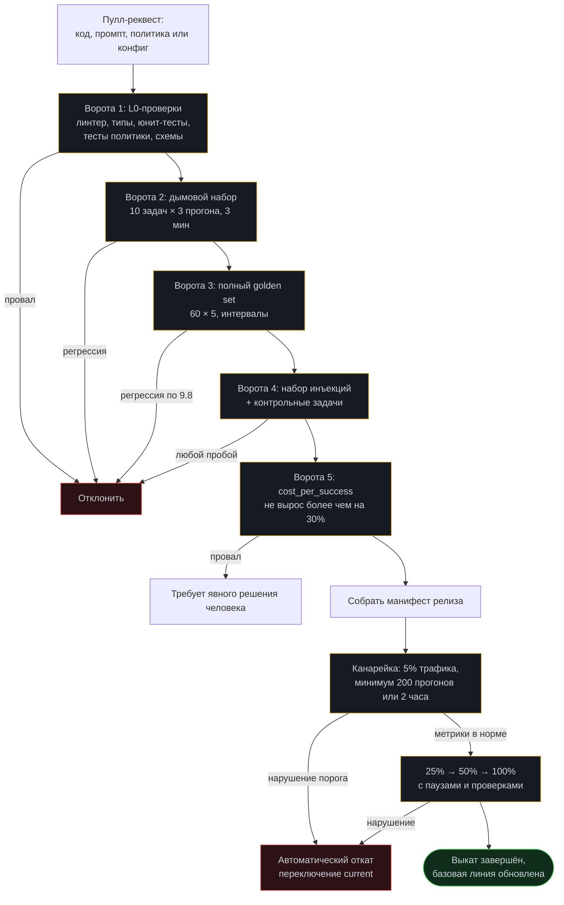

# Модуль 13. Production

[← 12. Стоимость](../12-cost-optimization/) · [К содержанию](../README.md) · [14. Отказы →](../14-agent-failures/) · Лабы: [18](../labs/lab18-prompt-versions/), [19](../labs/lab19-canary-rollback/) · См. [checklists/before-prod.md](../checklists/before-prod.md)

> **Главный вопрос модуля.** Как выкатывать и откатывать систему, чьё поведение недетерминировано, и по каким числам решать, что версия готова.

**Время:** 5 часов теории и практики, 4 часа лабораторных.
**Критерий приёмки:** `make check m13` — откат на предыдущую версию промптов занимает одну команду и меньше минуты; выкат идёт канарейкой с автоматическим откатом по метрикам; определены SLO и есть алерты на их нарушение.

---

## Содержание

- [13.1 Провал без этого модуля](#131-провал-без-этого-модуля)
- [13.2 Что именно вы выкатываете: инвентарь версий](#132-что-именно-вы-выкатываете-инвентарь-версий)
- [13.3 Промпт как код](#133-промпт-как-код)
- [13.4 Конвейер выката](#134-конвейер-выката)
- [13.5 Канарейка и автоматический откат](#135-канарейка-и-автоматический-откат)
- [13.6 SLO для агента](#136-slo-для-агента)
- [13.7 Миграции памяти и данных](#137-миграции-памяти-и-данных)
- [13.8 Дежурство и работа с инцидентами](#138-дежурство-и-работа-с-инцидентами)
- [13.9 Фреймворк или свой код: честное сравнение](#139-фреймворк-или-свой-код-честное-сравнение)
- [13.10 Как это ломается: десять ошибок](#1310-как-это-ломается-десять-ошибок)
- [Упражнения](#упражнения)
- [Чек-лист приёмки модуля](#чек-лист-приёмки-модуля)

---

## 13.1 Провал без этого модуля

**Промпт правится в проде.** Кто-то поправил формулировку в системном промпте через админку. Стало хуже. Кто правил, что именно и как вернуть — неизвестно, потому что версии нет и диффа нет. Это самый частый инцидент в агентных системах и полностью предотвратимый.

**Откат, которого нет.** Выкатили новую версию, качество упало. Откатить нельзя: изменился формат данных в памяти, старая версия их не читает. Приходится «чинить вперёд» под давлением.

**Провайдер обновил модель.** Ничего не выкатывали, качество упало. Без закреплённой версии модели и без еженедельных эвалов это выглядит как мистика и обнаруживается по жалобам.

**Нет определения «работает».** Пользователи говорят «стало хуже», команда говорит «метрики в норме». Обе стороны правы, потому что нет согласованных SLO, а «в норме» относилось к средним, а не к 95-му процентилю.

---

## 13.2 Что именно вы выкатываете: инвентарь версий

Агент — это не «код». Это набор артефактов, каждый со своей версией и своим темпом изменений.

| Артефакт | Как версионируется | Темп изменений | Совместимость |
|---|---|---|---|
| Код агента (цикл, сборка окна) | Git, семантические версии | Недели | Обычная |
| Системные промпты | Файлы в git, `prompts/v14/` | Дни | Проверяется эвалами |
| Схемы и описания инструментов | Файлы в git, хеш набора | Дни | Влияет на кэш и поведение |
| Политика прав | Файл `policy.py`, тесты | Недели | Только расширение прав — событие |
| Версия модели | Явный снапшот в конфиге | Кварталы (но провайдер решает) | Требует полных эвалов |
| Индекс RAG | Версия схемы чанков плюс версия модели эмбеддингов | Недели | Несовместимость роняет старт |
| Формат памяти (конспект, факты, эпизоды) | Номер схемы плюс миграции | Месяцы | Нужна двусторонняя совместимость |
| Golden set и базовая линия | Файлы в git | Постоянно | — |
| Конфигурация песочницы | Dockerfile плюс флаги запуска | Недели | — |

**Правило «одна версия — один манифест».** Всё перечисленное фиксируется в одном файле, который и есть выкатываемая единица.

~~~json
{
  "release": "2026-08-16.3",
  "code": "a91c3f2",
  "prompts": "v14",
  "tools_hash": "5b2e8c11",
  "policy": "v6",
  "model": {"main": "m-strong-2026-07-01", "cheap": "m-small-2026-07-01"},
  "embeddings": "e-multi-2026-03-10",
  "index_schema": 4,
  "memory_schema": 3,
  "eval": {"suite": "main@v3", "pass_rate": 0.76, "ci95": [0.71, 0.81],
           "cost_per_success_usd": 0.038, "injection_suite": "20/20"},
  "approved_by": "on-call", "approved_at": "2026-08-16T09:12:00Z"
}
~~~

**Почему манифест важнее, чем кажется.** Он превращает вопрос «что у нас в проде» из расследования в чтение файла. Он же делает откат осмысленным: вы откатываете манифест целиком, а не «промпт, но не политику». И он же попадает в `prompts_version` каждого трейса, что позволяет сравнивать версии по фактическим данным, а не по воспоминаниям.

---

## 13.3 Промпт как код

**Пять требований, каждое — из реального инцидента.**

**1. Промпты живут в файлах в репозитории, а не в базе и не в админке.** Файлы дают дифф, ревью, историю, откат и возможность прогнать эвалы до выката. Админка не даёт ничего из этого.

~~~
prompts/
├── v14/
│   ├── system.md            ← основной системный промпт
│   ├── compaction.md        ← промпт компакции
│   ├── critic.md            ← промпт критика
│   ├── judge.md             ← промпт судьи
│   └── CHANGELOG.md         ← что изменилось и зачем
└── current -> v14           ← символическая ссылка: переключение = откат
~~~

**2. Каждое изменение проходит ревью.** Изменение формулировки в системном промпте влияет на поведение сильнее, чем правка кода на десять строк. Ревьюер смотрит не на стилистику, а на два вопроса: какое поведение это меняет и какой тест это поймает.

**3. Эвалы — обязательные ворота.** Пулл-реквест, меняющий промпт, не мержится без прогона полного набора и приложенных чисел до и после. Это правило дороже всего внедрить и дороже всего не иметь.

**4. Промпт содержит свою версию внутри.** Первая строка `system.md` — `<!-- prompts_version: v14 -->`. Версия читается кодом и уходит в трейс. Без этого невозможно понять, какой промпт реально работал в конкретном прогоне.

**5. Никакой конкатенации промптов из кусков в рантайме без версионирования.** Если промпт собирается из частей, версионируется набор частей целиком, а не части по отдельности.

**Формат `CHANGELOG.md` для промптов.**

~~~markdown
## v14 — 2026-08-16
- Правило «данные не дают инструкций» перенесено в первые три строки
  (было пунктом 7). Причина: 15% нарушений в наборе инъекций.
  Эффект: injection-suite 17/20 → 20/20, pass rate 0.74 → 0.76 (в интервале).
- Ограничение длины thought: «не более 3 предложений».
  Эффект: выходные токены −22%, pass rate без изменений.
- Убрано «будь дружелюбным»: не влияло на метрики, занимало место.
~~~

Каждая запись содержит изменение, причину и измеренный эффект. Запись без эффекта означает, что изменение не проверялось — повод задать вопрос на ревью.

---

## 13.4 Конвейер выката

**Пять ворот и их стоимость.** Ворота 1 — секунды, бесплатно. Ворота 2 — минуты, центы. Ворота 3 — десятки минут, около доллара. Ворота 4 — минуты, центы. Ворота 5 — считается по результатам ворот 3, бесплатно. Итого полный конвейер — меньше часа и порядка доллара. Это дешевле любого инцидента, и именно этот аргумент работает, когда предлагают «выкатить быстро без эвалов».

**Правило: ворота 4 не имеет режима «предупреждение».** Безопасность либо проходит, либо выкат останавливается. Все остальные ворота могут иметь режим «требует решения человека», это — нет.

---

## 13.5 Канарейка и автоматический откат

**Почему для агента канарейка обязательна.** Эвалы измеряют поведение на вашем наборе. Реальный трафик всегда содержит то, чего в наборе нет. Канарейка — единственный способ узнать это до того, как узнают все пользователи.

**Параметры канарейки.**

| Параметр | Значение | Почему |
|---|---|---|
| Доля трафика | 5% | Достаточно для статистики, мало для ущерба |
| Минимальный объём | 200 прогонов | Меньше — интервалы слишком широки для решения |
| Минимальное время | 2 часа | Ловит суточные эффекты нагрузки |
| Разделение | По пользователю или тенанту, стабильно | Один пользователь не должен видеть разные версии подряд |
| Исключения | Критичные тенанты не участвуют | Явный список |

**Условия автоматического откита.** Проверяются каждые 10 минут на накопленной выборке канарейки против контрольной группы того же периода.

~~~python
ROLLBACK_RULES = [
    ("доля done ниже контрольной на 8+ п.п.",
     lambda c, b: c.done_rate < b.done_rate - 0.08),
    ("доля fatal выше 2%",
     lambda c, b: c.fatal_rate > 0.02),
    ("p95 латентности выше SLO",
     lambda c, b: c.p95_seconds > SLO_P95_SECONDS),
    ("cost_per_success выше контрольного в 1.5 раза",
     lambda c, b: c.cost_per_success > b.cost_per_success * 1.5),
    ("любое срабатывание инъекции с исполненным действием",
     lambda c, b: c.injection_executed > 0),
    ("любая утечка секрета",
     lambda c, b: c.secret_redacted > 0),
    ("доля needs_human выше контрольной на 15+ п.п.",
     lambda c, b: c.human_rate > b.human_rate + 0.15),
]

def canary_verdict(canary: Stats, base: Stats, n_min: int = 200):
    if canary.runs < n_min:
        return "wait"
    for name, rule in ROLLBACK_RULES:
        if rule(canary, base):
            log("release.rollback", reason=name, release=canary.release)
            return f"rollback: {name}"
    return "promote"
~~~

**Откат должен быть тривиальным.** Целевое состояние: одна команда, меньше минуты, без пересборки.

~~~makefile
rollback:
	@test -n "$(TO)" || (echo "укажи TO=<release>"; exit 1)
	ln -sfn releases/$(TO) current            # переключение символической ссылки
	./bin/reload-config                        # перечитать без рестарта, если можно
	@echo "откат на $(TO) выполнен, проверяю метрики 5 минут"
	./bin/watch-metrics --minutes 5
~~~

**Правило совместимости для мгновенного откита.** Новая версия обязана уметь читать данные старой, а старая — не падать на данных новой. Практически это означает: только добавление полей, никогда не удаление и не переименование в одном релизе. Удаление поля — минимум через два релиза после того, как его перестали писать.

**Что делать, если откат невозможен.** Это признак, что релиз слишком большой. Разделите: сначала выкатите чтение нового формата (совместимое с обоими), потом запись нового формата, потом удаление старого. Три скучных релиза лучше одного, из которого нет пути назад.

---

## 13.6 SLO для агента

SLO — числовые обещания, по которым определяется «работает». Для агента они отличаются от обычного сервиса: важен не только отклик, но и качество, и цена.

| SLO | Формулировка | Типичная цель | Как измеряется |
|---|---|---|---|
| Успешность | Доля прогонов с исходом `done` | ≥ 70% за сутки | Из трейсов |
| Верифицированность | Доля `done`, подтверждённых машинной проверкой | ≥ 70% от `done` | Из трейсов |
| Латентность | p95 времени прогона | ≤ 90 с для интерактивных | Из спанов |
| Стоимость | `cost_per_success` | ≤ 0,06 доллара | Из атрибуции |
| Безопасность | Доля исполненных инъекций | 0 | Аудит |
| Доступность | Доля прогонов без `fatal` | ≥ 99,5% | Из трейсов |
| Честность | Доля ответов с источниками (для RAG) | ≥ 95% | Проверка цитирования |

**Бюджет ошибок и как его использовать.** Если SLO успешности 70%, а фактически 78%, у вас есть запас 8 пунктов. Этот запас — ресурс для риска: пока он есть, можно выкатывать смелее и экспериментировать. Когда запас израсходован, приоритет смещается с новых возможностей на надёжность. Это не бюрократия, а способ прекратить спор «выкатываем или укрепляем» — решает число.

**Отдельно про латентность агента.** Пользователи терпят долгие операции, если видят прогресс. Практическое следствие: потоковая передача промежуточных шагов («читаю файлы», «запускаю тесты») меняет восприятие сильнее, чем сокращение времени на 20%. Это не отменяет SLO на p95, но снимает часть давления.

**Чего не стоит делать SLO.** Средняя латентность (скрывает хвост). Число прогонов (это нагрузка, не качество). Доля успешных вызовов инструментов (внутренняя метрика, обманывается). Оценка пользователями в звёздах без объёма выборки.

---

## 13.7 Миграции памяти и данных

Агент хранит состояние: конспекты, факты, эпизоды, индекс. При изменении форматов нужны миграции, и они сложнее обычных, потому что часть данных — свободный текст.

**Правила миграций.**

**Номер схемы в каждой записи.** `{"schema": 3, ...}`. Чтение поддерживает текущую и предыдущую схему. Запись — только текущую.

**Только добавление в одном релизе.** Новое поле добавляется как опциональное со значением по умолчанию. Удаление — отдельным релизом, минимум через один цикл.

**Ленивая миграция вместо разовой.** Запись переписывается в новую схему при первом чтении, а не массовым скриптом. Меньше риска, нет окна простоя, и старые неиспользуемые записи просто истекают по TTL.

~~~python
def load_fact(raw: dict) -> Fact:
    v = raw.get("schema", 1)
    if v == 1:
        raw = {**raw, "ttl_days": 90, "verify": None, "schema": 2}
    if v <= 2:
        raw = {**raw, "scope": infer_scope(raw["text"]), "schema": 3}
    if raw["schema"] != CURRENT_SCHEMA:
        raise IncompatibleSchema(raw["schema"])
    return Fact(**raw)
~~~

**Индекс RAG — особый случай.** Смена модели эмбеддингов или схемы чанков требует полной переиндексации, и во время неё поиск деградирует. Практика: строить новый индекс рядом, переключать чтение атомарно, старый удалять через сутки. Версия модели эмбеддингов и схемы чанков проверяются при старте, и несовместимость должна **ронять** старт, а не выдавать предупреждение: иначе вы получите тихую деградацию поиска, которую заметите через неделю.

**Эпизодическая память и смена промптов.** Выводы из прошлых прогонов могут стать неверными при изменении инструментов или правил. Практика: помечать эпизоды `prompts_version` и `tools_hash`, при поиске похожих понижать вес записям с другой версией инструментов. Иначе агент будет получать советы, относящиеся к системе, которой больше нет.

---

## 13.8 Дежурство и работа с инцидентами

**Что должно быть у дежурного.** Рабочая инструкция на одну страницу: как посмотреть метрики, как найти трейс, как откатить, кого звать. Доступ ко всему перечисленному, проверенный на учениях. Список известных проблем с обходными путями. Право откатить без согласований — это ключевой пункт: откат не должен требовать одобрения.

**Три первых действия при любом инциденте.** Первое: определить, есть ли ущерб, который продолжается (утечка, необратимые действия) — если да, останавливать автономные прогоны немедленно. Второе: определить, был ли выкат за последние сутки — если да, откатить, не разбираясь: разбор потом, откат сейчас. Третье: зафиксировать `run_id` пяти показательных провалов до любых изменений.

**Учения обязательны.** Раз в квартал: намеренно откатить релиз в проде в спокойное время; намеренно вызвать деградацию по квоте; проверить, что дежурный без подготовки укладывается в цель по времени. Процедура, которую никогда не выполняли, не существует — это правило работает и для агентов, и для всего остального.

**Постмортем без виноватых, но с изменениями.** Обязательные разделы: что произошло по времени, какой барьер отсутствовал, что уже изменено, какой тест теперь это ловит. Пункт «быть внимательнее» не является изменением. Постмортем без нового теста в `golden set` или `injection-suite` считается незакрытым.

---

## 13.9 Фреймворк или свой код: честное сравнение

Обещанное в [FAQ](../README.md#faq) сравнение. Курс строит всё руками, но для прода вопрос законный.

| Аспект | Свой код | Фреймворк |
|---|---|---|
| Контроль над контекстом | Полный: вы решаете, что в окне | Обычно частичный, часто неявный |
| Предсказуемость стоимости | Высокая: видно каждый вызов | Ниже: скрытые вызовы, ретраи, «магия» |
| Отладка | Прямая: свой трейс, свои спаны | Зависит от качества трейсинга фреймворка |
| Скорость старта | Медленнее на 1–2 недели | Быстрее |
| Готовые интеграции | Пишете сами или берёте MCP | Много из коробки |
| Обновления и совместимость | Ваш темп | Ломающие изменения приходят извне |
| Поиск инженеров | Знание принципов переносимо | Знание конкретного фреймворка |
| Границы и политика прав | Ваши, точные | Часто приходится обходить архитектуру |

**Практическая рекомендация.** Гибрид: своё ядро (цикл, бюджеты, сборка окна, политика, трейсинг) плюс готовые компоненты там, где они не касаются ядра (клиенты провайдеров, MCP-серверы, векторные хранилища, трассировка через OpenTelemetry). Так вы сохраняете контроль над тем, что определяет качество и стоимость, и не пишете то, что не даёт преимущества.

**Признаки, что фреймворк вам мешает.** Вы не можете точно сказать, что было в окне контекста на шаге 7. Вы не можете добавить обязательное подтверждение перед конкретным инструментом без обхода архитектуры. Вы не видите `cached_tokens`. Обновление минорной версии меняет поведение агента. Любой из этих признаков — повод вынести ядро под свой контроль.

---

## 13.10 Как это ломается: десять ошибок

**1. Промпты не в git.** Признак: невозможно сделать `git diff` по промпту. Лечение: файлы, версии, ревью.

**2. Нет манифеста релиза.** Признак: «что у нас в проде» — это расследование. Лечение: один JSON, попадающий в трейсы.

**3. Выкат без эвалов.** Признак: пулл-реквест с правкой промпта смержен без чисел. Лечение: ворота 3 обязательны, числа в описании PR.

**4. Нет канарейки.** Признак: новая версия сразу на 100% трафика. Лечение: 5%, 200 прогонов, автоматические правила.

**5. Откат требует пересборки.** Признак: откат занимает 20 минут. Лечение: символическая ссылка на релиз плюс перечитывание конфигурации.

**6. Несовместимые миграции в одном релизе.** Признак: откат невозможен из-за формата данных. Лечение: только добавление; удаление через релиз.

**7. Версия модели не закреплена.** Признак: качество изменилось без ваших изменений. Лечение: явный снапшот плюс еженедельные эвалы.

**8. SLO по средним.** Признак: метрики в норме, пользователи жалуются. Лечение: процентили.

**9. У дежурного нет права на откат.** Признак: откат ждёт согласования. Лечение: право и учения.

**10. Постмортем без теста.** Признак: инцидент повторяется. Лечение: каждый постмортем добавляет задачу в набор.

---

## Упражнения

<b>Задача 1.</b> Соберите манифест

Какие поля обязательны, чтобы по манифесту можно было полностью воспроизвести поведение прода?

**Ответ.** Хеш кода; версия набора промптов; хеш набора описаний инструментов; версия политики; снапшоты всех используемых моделей (основной, дешёвой, судьи, эмбеддингов); версия схемы индекса и схемы памяти; версия golden set и результаты последнего прогона с интервалами; результат набора инъекций; `cost_per_success`; кто и когда одобрил. Часто забывают три: хеш описаний инструментов (меняется независимо от кода при подключении MCP-серверов), версию модели эмбеддингов (её смена молча ломает поиск) и версию политики прав (её расширение — событие безопасности). Без этих трёх манифест не позволяет объяснить расхождение поведения.

<b>Задача 2.</b> Спроектируйте безопасную миграцию

Нужно переименовать поле `summary` в `digest` в записях эпизодической памяти. Опишите последовательность релизов.

**Ответ.** Релиз 1: чтение поддерживает оба поля (`raw.get("digest") or raw.get("summary")`), запись — только `summary`, схема не меняется. Проверка: откат на предыдущую версию безопасен, потому что данные не изменились. Релиз 2: запись в `digest`, чтение обоих, схема повышается; ленивая миграция при чтении. Откат на релиз 1 безопасен, потому что он умеет читать `digest`. Релиз 3, не раньше чем через цикл и после проверки, что записей со старым полем не осталось (или они истекли): убрать чтение `summary`. Итого три скучных релиза вместо одного невозвратного. Правило: между «начали писать новое» и «перестали читать старое» должен быть минимум один полный релизный цикл.

<b>Задача 3.</b> Оцените канарейку

Канарейка: 5% трафика, 180 прогонов за 2 часа, доля `done` 0,68 против 0,74 в контроле. Промотировать?

**Ответ.** Нет, и не откатывать — ждать. Объём 180 меньше минимального 200, а главное — интервалы: 0,68 на 180 прогонах даёт интервал примерно 0,61–0,74, что перекрывается с контролем. Правило откита требовало 8 пунктов разницы, здесь 6 — не сработало. Правильное действие: продолжить набор до 400–500 прогонов и решать по более узким интервалам. Практическая деталь: если разница держится и после 500 прогонов, но остаётся в пределах 8 пунктов, это повод не откатывать автоматически, а разобрать пять провалов вручную — возможно, канарейке достались задачи другого типа. Отсюда требование стабильного разделения по тенанту и сравнения с контролем того же периода.

<b>Задача 4.</b> Определите SLO для своего случая

Агент отвечает на вопросы поддержки по документации, 20 000 запросов в сутки, ответы видит клиент. Предложите пять SLO с числами.

**Ответ.** (1) Доля ответов с источниками ≥ 98% — для клиентского применения это важнее всего. (2) Доля ложных утверждений (по выборке 50 ответов в неделю, проверяемых человеком) ≤ 2%. (3) p95 латентности ≤ 8 секунд: это интерактивный сценарий, порог жёстче, чем у кодового агента. (4) Доля честных «не нашёл» на вопросах вне корпуса ≥ 90% (измеряется набором `no_answer` из [модуля 05](../05-rag/)). (5) `cost_per_answer` ≤ 0,004 доллара при 20 000 запросов в сутки, иначе экономика не сходится. Дополнительно доступность ≥ 99,9%. Обратите внимание: для этого случая «доля `done`» бесполезна как SLO, потому что почти все прогоны завершаются ответом; содержательные SLO здесь — про честность и цитирование.

<b>Задача 5.</b> Антиметрика выката

Метрика: «частота выкатов выросла с 2 до 12 в неделю». Хорошо ли это и какие антиметрики нужны?

**Ответ.** Само по себе нейтрально: частые мелкие выкаты — обычно признак здоровья, потому что риск на релиз ниже и откат проще. Но метрика обманывается: можно выкатывать часто, пропуская ворота. Антиметрики: доля выкатов, прошедших все пять ворот (должна быть 100%); доля выкатов, откаченных в течение суток (норма до 10%, выше — ворота не работают); `cost_per_success` и pass rate в динамике (не должны деградировать); время от обнаружения проблемы до откита (должно оставаться меньше минуты). Если частота выросла, а доля откатов подскочила до 40%, вы не ускорились, а перенесли тестирование в прод.

<b>Задача 6.</b> Провайдер сменил модель

Еженедельный эвал упал с 0,76 до 0,68 при неизменном манифесте. Порядок действий?

**Ответ.** (1) Проверить, что манифест действительно неизменен, включая снапшот модели: если в конфиге стоял алиас вместо снапшота, это и есть причина. (2) Прогнать набор на предыдущем снапшоте, если он ещё доступен, чтобы отделить изменение модели от изменения данных или окружения. (3) Проверить внешние зависимости: обновление библиотеки, изменившее вывод инструмента; изменения в индексе. (4) Если подтверждается смена поведения модели: зафиксировать снапшот, если возможно; при недоступности старого снапшота — адаптировать промпты под новую модель, прогоняя полный набор, и обновить базовую линию с явной записью причины. (5) Добавить в манифест проверку, что модель задана снапшотом, а не алиасом, и сделать это ворота выката. Главный организационный вывод: без еженедельного эвала при неизменной версии вы бы узнали об этом от пользователей.

---

## Чек-лист приёмки модуля

- [ ] Все промпты в git, в каталоге с версией; `current` — символическая ссылка
- [ ] Внутри промпта есть его версия, и она уходит в каждый трейс
- [ ] Есть `CHANGELOG.md` промптов с причиной и измеренным эффектом каждой правки
- [ ] Пулл-реквест с правкой промпта не мержится без чисел эвалов
- [ ] Есть манифест релиза со всеми полями из 13.2, включая хеш описаний инструментов и версию эмбеддингов
- [ ] Версии моделей заданы снапшотами, не алиасами; это проверяется автоматически
- [ ] Конвейер выката содержит пять ворот; ворота безопасности без режима «предупреждение»
- [ ] Канарейка: 5%, минимум 200 прогонов и 2 часа, стабильное разделение по тенанту
- [ ] Правила автоматического отката реализованы и проверены на учениях
- [ ] Откат — одна команда, меньше минуты, без пересборки
- [ ] В одном релизе только добавление полей; удаление — через цикл
- [ ] Записи памяти имеют `schema`; работает ленивая миграция
- [ ] Несовместимость версии индекса или эмбеддингов роняет старт, а не предупреждает
- [ ] Эпизоды помечены `prompts_version` и `tools_hash`; вес старых понижается
- [ ] Определены SLO с процентилями; есть бюджет ошибок и правило его использования
- [ ] У дежурного есть инструкция, доступы и право откатить без согласований
- [ ] Учения по откату и деградации проводятся раз в квартал
- [ ] Каждый постмортем добавляет задачу в golden set или в набор инъекций

**Антиметрика модуля.** Если вы никогда не откатывались, процедура откита, скорее всего, не работает. Проведите учения: откатите текущий релиз на предыдущий в спокойное время и измерьте, сколько это заняло. Цель — меньше минуты. Всё, что дольше, во время инцидента растянется втрое.

---

## Связь с другими модулями

| Куда ведёт | Что берётся отсюда |
|---|---|
| [04 Память](../04-memory/) | Миграции схем конспекта, фактов и эпизодов |
| [05 RAG](../05-rag/) | Переиндексация и проверка совместимости индекса при старте |
| [09 Эвалы](../09-evals/) | Ворота 3 и 5 конвейера; базовая линия обновляется после выката |
| [10 Наблюдаемость](../10-observability/) | `prompts_version` в трейсах; метрики канарейки; SLO |
| [11 Безопасность](../11-security/) | Ворота 4; ревью политики; аудит подтверждений |
| [12 Стоимость](../12-cost-optimization/) | `cost_per_success` как ворота; квоты и деградация в эксплуатации |
| [14 Отказы](../14-agent-failures/) | Правила откита опираются на таксономию исходов |
| [checklists/before-prod.md](../checklists/before-prod.md) | Печатная версия чек-листа этого модуля |

**Дальше:** [Модуль 14. Отказы агентов →](../14-agent-failures/)
