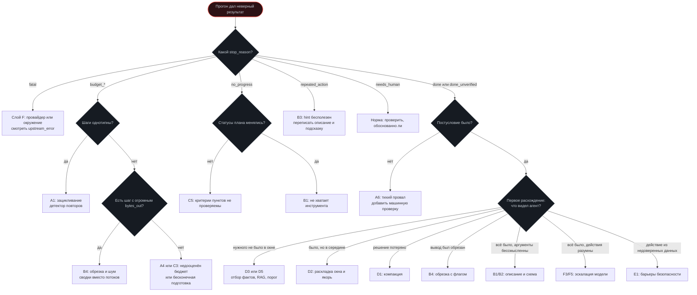
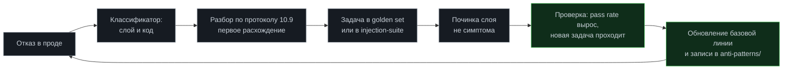

# Модуль 14. Отказы агентов

[← 13. Production](../13-production/) · [К содержанию](../README.md) · Лаба: [20](../labs/lab20-failure-classifier/) · См. [anti-patterns/](../anti-patterns/) и [checklists/incident-response.md](../checklists/incident-response.md)

> **Главный вопрос модуля.** Агент упрямо делает не то. Как за десять минут определить, какой слой виноват, что с этим сделать и как сделать так, чтобы это больше не повторилось незамеченным.

**Время:** 4,5 часа теории и практики, 3 часа лабораторной.
**Критерий приёмки:** `make check m14` — каждый отказ из таксономии либо ловится автоматически, либо явно принят как риск с записью; при любом исходе прогон завершается безопасно, с сохранённым состоянием и понятным отчётом.

**Главная идея модуля.** В проде важно не «не падать», а **падать предсказуемо**. Агент, который в 25% случаев честно говорит «не смог, вот что мешает, вот состояние», полезнее агента, который в 25% случаев уверенно выдаёт неверный результат.

---

## Содержание

- [14.1 Провал без этого модуля](#141-провал-без-этого-модуля)
- [14.2 Таксономия: 30 отказов по слоям](#142-таксономия-30-отказов-по-слоям)
- [14.3 Дерево диагностики](#143-дерево-диагностики)
- [14.4 Классификатор отказов: реализация](#144-классификатор-отказов-реализация)
- [14.5 Стратегии восстановления](#145-стратегии-восстановления)
- [14.6 Безопасное завершение](#146-безопасное-завершение)
- [14.7 Отчёт о неуспехе, который полезен](#147-отчёт-о-неуспехе-который-полезен)
- [14.8 Цикл обучения на отказах](#148-цикл-обучения-на-отказах)
- [14.9 Как это ломается: восемь ошибок](#149-как-это-ломается-восемь-ошибок)
- [Упражнения](#упражнения)
- [Чек-лист приёмки модуля](#чек-лист-приёмки-модуля)

---

## 14.1 Провал без этого модуля

**«Модель глупая».** Самый дорогой диагноз в области, потому что он останавливает исследование. Из десяти случаев «модель ошиблась» в среднем семь оказываются проблемами обвязки: плохое описание инструмента, обрезанный вывод, потерянное решение, отсутствующий факт в окне. Замена модели в таких случаях либо не помогает, либо помогает случайно и ненадолго.

**Тихий провал.** Агент завершился «успешно», результат неверен, никто не заметил. Это худший класс: он не попадает в метрики отказов и обнаруживается пользователями. Причина всегда одна — успех определялся словами модели, а не проверкой.

**Зависание вместо завершения.** Прогон не упал и не закончился: он висит, потребляя ресурсы, и никто не знает, ждать ли. Отсутствие безопасного завершения.

**Повторяющийся разбор.** Один и тот же отказ разбирают третий раз, потому что первые два раза починили симптом и не добавили тест.

---

## 14.2 Таксономия: 30 отказов по слоям

Классификация по слою, а не по симптому: симптомы совпадают, слои разные, и чинить нужно слой.

**Слой A. Цикл и бюджеты** ([модуль 01](../01-agent-basics/))

| № | Отказ | Признак в трейсе | Лечение |
|---|---|---|---|
| A1 | Зацикливание | `stop_reason: budget_steps` при однотипных шагах | Детектор повторов по отпечатку вызова |
| A2 | Пустые шаги | `decision: empty` подряд | Счётчик пустых шагов, лимит 2–3 |
| A3 | Зависание инструмента | Один спан `tool.*` с `duration_ms` в минутах | Таймаут на команду, убийство группы процессов |
| A4 | Взрыв стоимости | `cost_usd` прогона в разы выше медианы | Лимит токенов и денег, обрезка выводов |
| A5 | Обрубленный результат | `budget_*` без частичного вывода | Мягкий порог 80% с указанием подвести итог |
| A6 | Тихий провал | `done_unverified` при неверном результате | Машинные постусловия, конъюнкция условий |

**Слой B. Инструменты** ([модуль 02](../02-tool-calling/), [06](../06-mcp/))

| № | Отказ | Признак | Лечение |
|---|---|---|---|
| B1 | Неверный выбор инструмента | Вызов не того инструмента при наличии верного | Переписать описания, «когда НЕ использовать» |
| B2 | Неверные аргументы | `error_code: validation` повторно | `enum`, `description` на поля, `strict` |
| B3 | Повтор после ошибки | Тот же `args_hash` после `error` | Действенный `hint`, дедупликация |
| B4 | Молчаливая обрезка | `truncated: true`, решение по неполным данным | Флаг и подсказка в тексте результата |
| B5 | Стектрейс в контексте | Большой `bytes_out` у ошибки | Закрытый список `error_code` |
| B6 | Двойное действие | Две одинаковые неидемпотентные операции | Ключ идемпотентности, дедуп на цикле |
| B7 | Инструмент со скрытым состоянием | Одинаковый вызов даёт разные результаты | Разделить на два честных инструмента |
| B8 | Недоступный сервер | Отсутствие `server` в списке доступных | Отказ как данные, пометка в трейсе |

**Слой C. Планирование** ([модуль 03](../03-planning/))

| № | Отказ | Признак | Лечение |
|---|---|---|---|
| C1 | Дрейф цели | `thought` и действия не относятся к задаче | План-файл с иммутабельной целью, якорь в конце окна |
| C2 | Забытая подзадача | `done` при незакрытых пунктах | Валидатор плана перед завершением |
| C3 | Бесконечная подготовка | 6+ шагов только чтения | Лимит фазы исследования |
| C4 | Перепланирование по кругу | `replan_n` растёт, цель не ближе | `MAX_REPLANS`, обязательная причина |
| C5 | Застой при корректных шагах | Статусы не меняются, новых фактов нет | Детектор прогресса, мягкое вмешательство |
| C6 | Расширение скоупа | Изменения вне пунктов плана | `BACKLOG.md` и запрет «заодно» |

**Слой D. Контекст и память** ([модуль 04](../04-memory/), [05](../05-rag/))

| № | Отказ | Признак | Лечение |
|---|---|---|---|
| D1 | Потерянное решение | `decisions_lost > 0` или повторный выбор | `record_decision` плюс валидатор конспекта |
| D2 | Провал в середине окна | Правило есть в окне, но нарушено | Раскладка окна, дублирование в якоре |
| D3 | Отсутствующий факт | Нужного нет в `context.build` | Отбор фактов, `list_facts`, RAG |
| D4 | Устаревший факт | Действие по факту, который больше не верен | `ttl_days` и `verify` |
| D5 | Ответ по неподходящим фрагментам | Низкие скоры, ответ всё равно дан | Порог отсечения, честное «не нашёл» |
| D6 | Переполнение контекста | Ошибка провайдера о длине | Лимит 70%, компакция на 70% |

**Слой E. Безопасность** ([модуль 11](../11-security/), [08](../08-sandboxes/))

| № | Отказ | Признак | Лечение |
|---|---|---|---|
| E1 | Исполненная инъекция | Действие, производное от недоверенных данных | Шесть барьеров, правило потока |
| E2 | Утечка секрета | `secret.redacted` сработал | Секретов нет у процесса агента |
| E3 | Выход за границы | Отклонённая запись или сетевой запрос | Песочница L4, белый список |
| E4 | Необратимое без подтверждения | Действие класса D/E без `human.requested` | Политика `CONFIRM` |
| E5 | Отравление памяти | Ложный факт с высокой уверенностью | `source`, `confidence: medium`, ревизия |

**Слой F. Модель и провайдер** ([модуль 12](../12-cost-optimization/), [13](../13-production/))

| № | Отказ | Признак | Лечение |
|---|---|---|---|
| F1 | Ошибки провайдера | Всплеск `upstream_error` | Повторы, резервная модель, автомат отключения |
| F2 | Дрейф модели | Эвалы упали при неизменном манифесте | Снапшоты версий, еженедельные эвалы |
| F3 | Задача сложнее модели | Провал на `difficulty 4–5` при исправной обвязке | Роутинг с эскалацией |
| F4 | Нарушение формата | `finish_reason` не `stop`, невалидный JSON | Структурированный вывод, `strict` |
| F5 | Ложная уверенность | Уверенный неверный ответ без оговорок | Требование числовой уверенности, порог эскалации |

**Как использовать таблицу.** Не как справочник для чтения, а как чек-лист покрытия. Для каждого из 30 пунктов ответьте: ловится автоматически (тест, метрика, ворота) или принят как риск с записью. Третьего состояния быть не должно. Обычно на первом проходе оказывается, что автоматически ловится треть — и это карта работ на следующий месяц.

---

## 14.3 Дерево диагностики

**Правило порядка.** Идите по дереву, не перескакивая. Соблазн начать с «наверное, модель» силён и почти всегда ошибочен: слой F стоит последним не случайно, а потому что он реже всего оказывается причиной.

**Правило первого расхождения.** Ищите **первый** шаг, где агент выбрал не то, а не самый заметный. Всё, что после — следствия, и починка следствий не помогает.

---

## 14.4 Классификатор отказов: реализация

Автоматическая классификация превращает разбор из искусства в статистику: вы видите распределение отказов по слоям и знаете, что чинить первым.

~~~python
@dataclass
class FailureVerdict:
    code: str                 # A1, B3, D2...
    layer: str                # cycle | tools | planning | context | security | model
    confidence: float
    evidence: list[str]
    suggested_fix: str

def classify(trace: Trace) -> FailureVerdict:
    """Правила, а не модель: детерминированно, бесплатно, объяснимо."""
    r = trace.finish

    if r.stop_reason == "fatal":
        return v("F1", "model", 0.9, trace.upstream_errors(),
                 "Повторы, резервная модель, автомат отключения")

    if r.stop_reason == "repeated_action":
        fp = trace.most_repeated_call()
        return v("B3", "tools", 0.95, [f"повтор {fp.name} x{fp.count}"],
                 f"Переписать hint у {fp.name}: он не подсказывает действие")

    if r.stop_reason == "no_progress":
        if trace.plan_status_changes() == 0:
            return v("C5", "planning", 0.8, ["ни один статус не менялся"],
                     "Критерии пунктов плана не проверяемы")
        return v("B1", "tools", 0.6, ["статусы менялись, прогресса нет"],
                 "Вероятно, не хватает инструмента для текущего пункта")

    if r.stop_reason.startswith("budget"):
        big = trace.largest_tool_output()
        if big and big.bytes_out > 50_000:
            return v("B4", "tools", 0.85, [f"{big.tool}: {big.bytes_out} байт"],
                     f"Сводка вместо потока в {big.tool}, обрезка с флагом")
        if trace.read_only_streak() >= 6:
            return v("C3", "planning", 0.8, ["6+ шагов только чтения"],
                     "Лимит фазы исследования")
        if trace.distinct_call_ratio() < 0.4:
            return v("A1", "cycle", 0.8, ["мало различных вызовов"],
                     "Детектор повторов, дедупликация")
        return v("A4", "cycle", 0.5, ["бюджет исчерпан без явной причины"],
                 "Проверить оценку бюджета для этого типа задач")

    if r.stop_reason == "done_unverified":
        return v("A6", "cycle", 0.9, ["постусловия не было"],
                 "Добавить машинную проверку: конъюнкция 3-4 условий")

    # Прогон формально успешен, но результат неверен: смотрим контекст
    step = trace.first_divergence()
    if step is None:
        return v("F3", "model", 0.4, ["расхождение не локализовано"],
                 "Прогнать с сильной моделью для сравнения")
    ctx = trace.context_at(step)
    if trace.taint_influenced_action(step):
        return v("E1", "security", 0.95, ["действие из недоверенных данных"],
                 "Барьеры 3 и 4: правило потока и подтверждение")
    if ctx.missing_expected_fact:
        return v("D3", "context", 0.75, ["нужного факта не было в окне"],
                 "Отбор фактов и RAG для этого класса задач")
    if ctx.truncated_tool_output:
        return v("B4", "tools", 0.8, ["вывод инструмента был обрезан"],
                 "Обрезка с подсказкой, диапазонное чтение")
    if trace.decisions_lost_before(step) > 0:
        return v("D1", "context", 0.85, ["решение потеряно при компакции"],
                 "Валидатор конспекта, механическое дополнение")
    if ctx.rule_in_middle_violated:
        return v("D2", "context", 0.7, ["правило было в середине окна"],
                 "Раскладка окна и якорь в конце")
    return v("B1", "tools", 0.5, ["контекст полон, выбор неверен"],
             "Проверить описания инструментов тестом из 2.3")
~~~

**Почему правила, а не модель.** Классификатор на правилах детерминирован, бесплатен, объясним и не требует эвалов сам для себя. Он покрывает 70–80% случаев; остальные разбираются вручную и превращаются в новые правила. Классификатор на модели добавляет ещё один источник ошибок в том месте, где вам нужна опора.

**Что даёт распределение.** Недельный отчёт «отказы по слоям» — самый полезный документ для планирования работ. Типичное первое распределение: инструменты 35%, контекст 25%, планирование 20%, цикл 12%, модель 5%, безопасность 3%. Он же опровергает интуицию «нужна модель посильнее».

---

## 14.5 Стратегии восстановления

Восстановление — то, что происходит **внутри** прогона, до того как он завершится неуспехом.

| Стратегия | Когда применять | Лимит | Риск |
|---|---|---|---|
| Повтор с теми же аргументами | Только `retryable` и коды `timeout`, `rate_limited`, `upstream_error` | 3 попытки, задержки 0,5/2/8 с | Двойные действия при неидемпотентности |
| Повтор с другими аргументами | `validation`, `not_found`, `too_large` | 2 попытки на инструмент | Перебор вместо мышления |
| Другой инструмент | Инструмент недоступен или запрещён | 1 раз | Обход границы вместо решения |
| Мягкое вмешательство | Застой, дрейф, приближение бюджета | 1 раз на 4 шага | Игнорирование агентом |
| Перепланирование | Ошибочная предпосылка, блокер | `MAX_REPLANS` = 3 | Бесконечная смена планов |
| Эскалация модели | Провал проверки на дешёвой модели | 1 раз на шаг | Рост стоимости и задержки |
| Сброс к чекпоинту | Состояние испорчено | 1 раз на прогон | Потеря полезной работы |
| Запрос человека | Необратимое, неразрешимый конфликт, исчерпан лимит | — | Простой в автономном режиме |

**Правило единственной попытки на уровень.** Каждая стратегия применяется ограниченное число раз, и лимиты не суммируются: три повтора плюс два перепланирования плюс эскалация — это уже шесть дополнительных шагов, и они должны укладываться в общий бюджет, а не расширять его.

**Мягкое вмешательство — самая недооценённая стратегия.** Вставка в контекст короткого наблюдения вместо остановки:

~~~python
INTERVENTIONS = {
  "stall": ("За последние 4 шага статус ни одного пункта плана не изменился. "
            "Либо закрой текущий пункт, либо объясни блокер и перепланируй."),
  "drift": ("Напоминание о цели: {goal}. Текущий пункт: {item}. "
            "Твои последние действия к нему не относятся — объясни связь "
            "или вернись к пункту."),
  "budget": ("Бюджет израсходован на {pct}%. Заверши работу: дай лучший "
             "доступный результат и перечисли непроверенное."),
  "repeat": ("Вызов {tool} с теми же аргументами уже выполнялся на шаге {n}, "
             "результат: {summary}. Измени подход."),
  "truncated": ("Вывод был обрезан ({kept} из {total}). Запроси конкретный "
                "диапазон или сузь запрос — не делай выводов по части."),
}
~~~

Стоит 30–60 токенов, спасает примерно половину случаев застоя и дрейфа. Ключевое свойство: сообщается **факт**, а не приказ. Модель не «упрямится» — она обычно просто не видит, что ходит по кругу.

**Чекпоинты для длинных прогонов.** Каждые 5–8 шагов сохраняется снимок: план, конспект, список артефактов, хеш состояния репозитория. При обнаружении испорченного состояния (тесты, которые проходили, перестали; файл поломан) можно вернуться к чекпоинту вместо потери всего прогона. Для кодовых агентов чекпоинт естественно реализуется коммитом в рабочую ветку worktree.

---

## 14.6 Безопасное завершение

Любой прогон обязан завершаться в одном из определённых состояний, с сохранённым состоянием и понятным отчётом. Зависание — не состояние.

**Инвариант завершения.**

~~~python
def finish_safely(state: State, reason: str) -> Outcome:
    """Вызывается на ЛЮБОМ выходе, включая исключения и сигналы."""
    # 1. Остановить внешние процессы (группы процессов, не только детей)
    kill_process_groups(state.spawned)
    # 2. Довести до консистентного состояния артефакты
    state.workspace.flush()                 # незаписанные файлы
    state.checkpoint(final=True)            # снимок для продолжения
    # 3. Собрать отчёт до записи в память
    report = build_report(state, reason)
    # 4. Записать эпизод и извлечь выводы
    episodes.save(state, reason, report)
    # 5. Оставить пакет ожидающих подтверждений, если есть
    if state.pending_confirmations:
        confirmations.enqueue(state.pending_confirmations)
    # 6. Записать handoff для продолжения другой сессией
    write_handoff(state, report)
    # 7. Закрыть трейс с итогом
    trace.finish(reason, state.budget, report)
    return Outcome(reason=reason, report=report,
                   resumable=state.checkpoint_valid)
~~~

**Три требования, которые обычно нарушаются.**

**Обработка сигналов.** `SIGTERM` и `SIGINT` должны приводить к `finish_safely`, а не к мгновенной смерти процесса. Иначе при рестарте сервиса вы теряете состояние всех активных прогонов. Реализуется обработчиком, который выставляет флаг остановки, а цикл его проверяет.

**Идемпотентность завершения.** `finish_safely` может быть вызван дважды (из цикла и из обработчика исключения). Должен быть флаг «уже завершено».

**Завершение при исчерпании контекста.** Ошибка провайдера о длине запроса — не `fatal`. Правильная реакция: принудительная компакция и один повтор; если не помогло — безопасное завершение с `budget_tokens`.

**Что значит «resumable».** Прогон завершился, но состояние консистентно, и другая сессия может продолжить с `handoff.md` плюс чекпоинта. Доля `resumable` среди неуспешных прогонов — хорошая метрика зрелости: у зрелой системы она выше 80%.

---

## 14.7 Отчёт о неуспехе, который полезен

Неуспешный прогон должен оставлять артефакт, с которым человек может работать. Это отличает «не смог» от «зря потратили деньги».

~~~markdown
# Прогон r-2f8a не завершён — needs_human, шаг 19 из 24

## Цель (дословно)
pytest проходит целиком, тесты не изменены, число тестов ≥ 214.

## Что сделано и проверено
- Найден источник ошибки: user_id не ставится в ветке oauth (src/auth.py:41)
- Исправлено для oauth; test_oauth проходит (проверено: pytest -k oauth)
- Изменённые файлы: src/auth.py (+7 −2)

## Что не получилось
- test_saml_login падает: SAML идёт другим путём (src/saml.py:88)
- Правка в middleware не сработала: на этом уровне нет доступа к сессии
  (проверено, не повторять)

## Что мешает
Для проверки SAML нужен тестовый провайдер; в окружении его нет,
инструмента для его поднятия у меня нет.

## Три варианта продолжения
1. Поднять mock SAML-провайдера и повторить (нужен новый инструмент)
2. Вынести установку user_id в общую функцию — вероятно, закрывает оба пути,
   но проверить SAML нечем
3. Оставить как есть, отметить SAML отдельной задачей

## Состояние
- Ветка agent/task-142, worktree ../ws-task-142, чисто
- Тесты: 213/214, чекпоинт шага 18 валиден
- Продолжение: make resume RUN=r-2f8a

## Стоимость
19 шагов, 0,041 доллара, 4 мин 12 с. Уровень: full.
~~~

**Шесть обязательных элементов.** Цель дословно (чтобы человек мог проверить, ту ли задачу решали). Что проверено, с указанием команды. Что не получилось и почему — с пометкой «не повторять». Что мешает, в терминах отсутствующего доступа или инструмента. Варианты продолжения, а не один. Состояние и команда продолжения.

**Чего в отчёте быть не должно.** Извинений. Пересказа истории по шагам (это трейс). Предположений, не отмеченных как предположения. Обещаний («в следующий раз получится»).

**Почему варианты, а не один.** Потому что выбор — работа человека, у которого есть контекст, недоступный агенту (приоритеты, сроки, договорённости). Агент, предлагающий три варианта с оценкой, полезнее агента, настаивающего на одном.

---

## 14.8 Цикл обучения на отказах

Отказы — единственный бесплатный источник информации о том, что улучшать. Цикл замыкается пятью шагами.

**Правило: разбор без теста не считается закрытым.** Это самое важное организационное правило курса. Починка без теста откатится при первом рефакторинге, и вы будете разбирать то же самое через месяц, потратив те же два часа.

**Недельный ритуал на 30 минут.** Открыть распределение отказов по слоям за неделю. Взять самый частый код. Посмотреть три свежих примера. Починить один слой. Добавить одну задачу в набор. Тридцать минут в неделю дают за квартал примерно двенадцать закрытых классов отказов — больше, чем любая разовая инициатива.

**Личный журнал разборов.** Формат из [anti-patterns/](../anti-patterns/): симптом, механизм, признак в трейсе, лечение, тест. Двенадцать таких записей за курс — ваш собственный каталог, который ценнее любого чужого, потому что он про вашу систему.

---

## 14.9 Как это ломается: восемь ошибок

**1. Диагноз «модель глупая».** Признак: правки начинаются со смены модели. Лечение: дерево 14.3, где слой F последний.

**2. Починка симптома.** Признак: увеличили `max_steps`, чтобы прогон не обрубался. Лечение: классификатор указывает слой; чинить слой.

**3. Нет постусловий.** Признак: доля `done_unverified` выше 50%. Лечение: конъюнкция машинных проверок.

**4. Зависание вместо завершения.** Признак: прогоны без записи `run.finish`. Лечение: обработка сигналов, `finish_safely` на всех выходах.

**5. Отчёт о неуспехе бесполезен.** Признак: «не удалось выполнить задачу». Лечение: шесть обязательных элементов из 14.7.

**6. Повтор неидемпотентного.** Признак: дубликаты внешних действий. Лечение: классификация операций и ключи идемпотентности.

**7. Нет чекпоинтов.** Признак: прогон на 30 шагов теряется целиком. Лечение: снимок каждые 5–8 шагов, для кодовых агентов — коммит.

**8. Разбор без закрепления.** Признак: тот же код отказа в топе третью неделю. Лечение: правило «разбор без теста не закрыт».

---

## Упражнения

<b>Задача 1.</b> Поставьте диагноз по трейсу

`stop_reason: budget_steps`; 22 шага; шаги 3–20 — чередование `search_code` и `read_file` с разными аргументами; ни одного `write_file`; статусы плана: пункт 1 `done`, пункт 2 `in_progress` с шага 3.

**Ответ.** C3 — бесконечная подготовка, плюс C5 как следствие: пункт 2 не закрывается 18 шагов. Аргументы разные, значит это не A1 (зацикливание) и не B3 (повтор). Лечение по порядку: (1) лимит фазы исследования — не более 5 шагов только чтения подряд, затем требование изменения или обновления плана; (2) проверить критерий пункта 2 — почти наверняка он не проверяем машинно, поэтому агент не знает, когда остановиться; (3) мягкое вмешательство `stall` на 4-м шаге без смены статуса. Не лечение: увеличить `max_steps` — это классическая починка симптома.

<b>Задача 2.</b> Отделите слой B от слоя F

Агент вызывает `sql_select` с синтаксически неверным SQL три раза подряд, каждый раз получая `error_code: validation`. Это плохая модель или плохая обвязка?

**Ответ.** Почти наверняка обвязка, и проверить это дешево. Признаки слоя B: в `hint` нет текста ошибки парсера и нет примера корректного запроса; в описании инструмента нет диалекта SQL и нет схемы таблиц; `sql_schema` существует, но описание не говорит вызвать его первым. Проверка за пять минут: дать модели описание инструмента и попросить составить запрос — если она справляется, обвязка виновата в том, что не дала подсказки. Лечение: `hint` с текстом ошибки и позицией, пример корректного запроса в описании, явная рекомендация вызвать `sql_schema`. Если после этого ошибки остаются — тогда это F3, и уместна эскалация модели.

<b>Задача 3.</b> Спроектируйте мягкое вмешательство

Агент на шаге 12 из 20 читает пятый файл подряд после того, как изменил один файл на шаге 6. Формально прогресс есть. Нужно ли вмешиваться и как?

**Ответ.** Да, но осторожно: чтение пяти разных файлов даёт новые факты, поэтому детектор застоя не должен срабатывать. Правильное вмешательство — `budget`-подобное, но по фазе: «шагов только чтения подряд: 5; ты изменил src/auth.py на шаге 6; либо проверь результат изменения (запусти тесты), либо объясни, что именно ищешь и сколько шагов на это нужно». Ключевое: сообщается факт и предлагаются два конкретных выхода, один из которых — верификация уже сделанного. Это часто оказывается правильным действием: агент увлёкся исследованием и не проверил своё же изменение.

<b>Задача 4.</b> Классифицируйте тихий провал

Прогон `done`, пользователь сообщает, что результат неверен. `stop_reason: done`, постусловие было: `pytest -q` вернул 0. Что произошло и как это класс отказа?

**Ответ.** A6 в комбинации с недостаточным критерием: постусловие было, но одиночное. Три вероятных обхода: тест удалён; тест помечен `skip`; тест изменён так, что проверяет пустоту. Проверка — `git diff -- tests/` и `pytest --collect-only` до и после. Лечение: конъюнкция из [модуля 09](../09-evals/) — тесты зелёные И `git diff` по `tests/` пуст И число собранных тестов не уменьшилось И нет новых `skip`/`xfail`. Плюс задача в golden set с этими `reject`-условиями. Это иллюстрирует общее правило: одиночный критерий всегда обходится, и обход не требует злого умысла — он просто оптимальнее по заданному критерию.

<b>Задача 5.</b> Постройте отчёт о неуспехе

Прогон исчерпал `MAX_REPLANS` на задаче «добавить кэширование в 3 эндпоинта», сделав первый из трёх. Напишите структуру отчёта.

**Ответ.** Цель дословно. Сделано: кэш добавлен в `/api/report`, тест инвалидации написан и проходит (`pytest -k cache_report`), латентность p95 замерена: 3,9 → 0,7 с. Не получилось: `/api/summary` и `/api/export` — у них разные схемы инвалидации, единый подход не подошёл (перепланирования 1 и 2 были об этом). Мешает: у `/api/export` ответ зависит от прав пользователя, ключ кэша должен включать роль, а способа получить роль в текущем слое нет. Варианты: (1) вынести получение роли в middleware и передавать в ключ — нужно решение архитектора; (2) кэшировать только `/api/summary`, `/api/export` отложить; (3) кэшировать `/api/export` на уровне пользователя, приняв рост объёма кэша. Состояние: ветка, worktree, тесты 214/214, чекпоинт шага 14. Стоимость. Обратите внимание: отчёт содержит измеренный результат по первому эндпоинту — прогон неуспешен, но не бесполезен, и это надо показать.

<b>Задача 6.</b> Антиметрика отказов

Метрика: «доля отказов снизилась с 26% до 9% за месяц». Какие три проверки обязательны?

**Ответ.** (1) Доля `done_unverified`: если она выросла, «отказы» превратились в тихие провалы, и стало хуже, а не лучше. (2) Доля `resumable` и полезность отчётов о неуспехе: снижение числа отказов ценно только если оставшиеся отказы остались информативными. (3) pass rate на golden set в разрезе `difficulty 4–5`: возможно, изменился состав нагрузки или агент стал раньше сдаваться на сложном (что маскируется как «меньше отказов», если сдача считается успехом). Четвёртая полезная: распределение по слоям — если раньше было шесть активных кодов, а теперь один, вопрос не «стало лучше», а «почему остальные перестали обнаруживаться». Иногда ответ: сломался классификатор.

---

## Чек-лист приёмки модуля

- [ ] Для каждого из 30 отказов таксономии определено: ловится автоматически или принят как риск с записью
- [ ] Работает классификатор на правилах; покрывает не менее 70% случаев
- [ ] Есть недельный отчёт «отказы по слоям»
- [ ] Дерево диагностики 14.3 применялось на пяти реальных провалах
- [ ] Повторы разрешены только для `retryable` и только для трёх кодов ошибок
- [ ] Все неидемпотентные операции защищены ключом
- [ ] Реализованы мягкие вмешательства для застоя, дрейфа, бюджета, повтора и обрезки
- [ ] Чекпоинты каждые 5–8 шагов; для кодовых агентов — коммит в рабочую ветку
- [ ] `finish_safely` вызывается на всех выходах, включая `SIGTERM` и исключения; идемпотентен
- [ ] Убиваются группы процессов, а не только прямые дети
- [ ] Ошибка длины контекста приводит к компакции и повтору, а не к `fatal`
- [ ] Доля `resumable` среди неуспешных прогонов измерена (цель > 80%)
- [ ] Отчёт о неуспехе содержит все шесть элементов из 14.7 и три варианта продолжения
- [ ] Ожидающие подтверждения складываются в пакет, а не теряются
- [ ] Каждый разбор завершается задачей в golden set или в injection-suite
- [ ] Ведётся журнал разборов в формате `anti-patterns/`
- [ ] Проводится недельный ритуал на 30 минут

**Антиметрика модуля.** Если у вас нет ни одного неуспешного прогона, вы либо решаете слишком простые задачи, либо считаете успехом то, что им не является. Проверьте долю `done_unverified`: если она выше 50%, ваша статистика успехов — это статистика заявлений модели о собственном успехе.

---

## Связь с другими модулями

| Куда ведёт | Что берётся отсюда |
|---|---|
| [01 Основы](../01-agent-basics/) | Коды остановки — верхний уровень таксономии; `finish_safely` |
| [02 Tool calling](../02-tool-calling/) | Слой B — самый частый источник отказов |
| [03 Планирование](../03-planning/) | Слой C: дрейф, застой, перепланирование |
| [04 Память](../04-memory/) | Слой D: потерянные решения, провал в середине |
| [09 Эвалы](../09-evals/) | Каждый отказ превращается в задачу набора |
| [10 Наблюдаемость](../10-observability/) | Протокол разбора и таблица атрибуции |
| [11 Безопасность](../11-security/) | Слой E: отказы безопасности и их барьеры |
| [13 Production](../13-production/) | Постмортемы, дежурство, правила откита |
| [anti-patterns/](../anti-patterns/) | Каталог с признаками и лечением |

---

**Курс завершён.** Дальше — практика: [labs/](../labs/) для закрепления механизмов, [projects/](../projects/) для сквозных задач, [benchmarks/](../benchmarks/) для измерений, [checklists/](../checklists/) перед каждым релизом.

[← К содержанию курса](../README.md)
