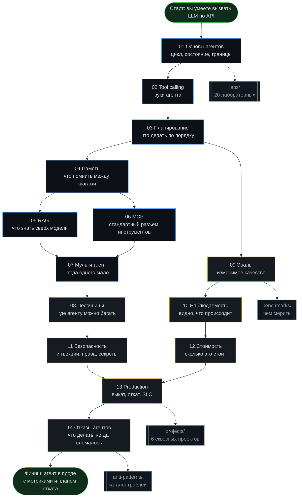
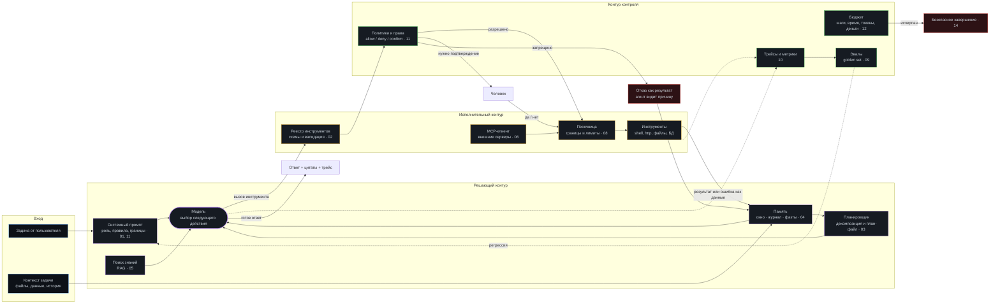

# Полный инженерный курс по AI-агентам на русском: от tool calling до production

> Практический курс-репозиторий о том, как строить агентов, которые работают не в демо, а в проде: с инструментами, памятью, песочницами, метриками, бюджетом и понятным поведением при отказах.

Курс инженерный, а не обзорный. Здесь почти нет рассуждений о том, «изменит ли ИИ мир», зато есть: минимальные работающие реализации каждого механизма, лабораторные с критериями приёмки, шаблоны для копирования, чек-листы перед релизом, каталог антипаттернов и набор бенчмарков, по которым можно честно сравнить две версии своего агента.

**Главный тезис курса.** Качество агента почти никогда не упирается в модель. Оно упирается в инженерию вокруг модели: как описаны инструменты, что попадает в контекст, где стоят проверки, что происходит при третьей подряд ошибке и сколько это стоит за тысячу запусков. Модель — двигатель. Курс — про всё остальное в автомобиле.

---

## Оглавление

**Начало**
- [Кому подходит курс](#кому-подходит-курс)
- [Что вы построите](#что-вы-построите)
- [Схема 1. Карта курса](#схема-1-карта-курса)
- [Как проходить: три трека](#как-проходить-три-трека)
- [Стек и требования](#стек-и-требования)
- [Быстрый старт за 20 минут](#быстрый-старт-за-20-минут)

**Модули**
- [01. Основы агентов](01-agent-basics/) — цикл, состояние, когда агент не нужен
- [02. Tool calling](02-tool-calling/) — схемы, валидация, ошибки, идемпотентность
- [03. Планирование](03-planning/) — декомпозиция, ReAct, план-файл, перепланирование
- [04. Память](04-memory/) — рабочая, эпизодическая, семантическая, компакция
- [05. RAG](05-rag/) — чанкинг, гибридный поиск, реранк, оценка качества
- [06. MCP](06-mcp/) — протокол, сервер, клиент, безопасные границы
- [07. Мульти-агент](07-multi-agent/) — когда оправдано, роли, протоколы обмена
- [08. Песочницы](08-sandboxes/) — изоляция, права, сеть, ресурсы
- [09. Эвалы](09-evals/) — golden set, LLM-as-judge, статистика, регрессии
- [10. Наблюдаемость](10-observability/) — трейсы, спаны, структурные логи, дашборд
- [11. Безопасность](11-security/) — prompt injection, права, секреты, аудит
- [12. Оптимизация стоимости](12-cost-optimization/) — кэш, роутинг, бюджеты, батчи
- [13. Production](13-production/) — деплой, версии промптов, откаты, SLO
- [14. Отказы агентов](14-agent-failures/) — таксономия, диагностика, восстановление

**Практика**
- [labs/](labs/) — 20 лабораторных с критериями приёмки
- [projects/](projects/) — 6 сквозных проектов от простого к сложному
- [benchmarks/](benchmarks/) — наборы задач и методика замера
- [templates/](templates/) — код и файлы для копирования
- [checklists/](checklists/) — что проверить перед каждым релизом
- [anti-patterns/](anti-patterns/) — каталог граблей с признаками и лечением

**Справочники**
- [Правила курса: 12 инженерных принципов](#правила-курса-12-инженерных-принципов)
- [Схема 2. Анатомия агента](#схема-2-анатомия-агента)
- [Глоссарий](#глоссарий)
- [Дорожная карта прогресса](#дорожная-карта-прогресса)
- [FAQ](#faq)

---

## Кому подходит курс

Курс рассчитан на инженера, который умеет писать код и читать чужой, но не строил агентов дальше «прикрутил функцию к чату». Полезен трём ролям.

**Бэкенд-инженеру**, которому поручили «прикрутить ИИ». Вы получите архитектурный словарь и понимание, где именно ломаются такие системы: не в модели, а в границах инструментов, в контексте и в отсутствии проверок.

**ML-инженеру**, который умеет работать с моделями, но не с продуктовыми контурами. Основная новизна для вас — модули про песочницы, наблюдаемость, стоимость и продакшен: то, что превращает прототип в сервис.

**Техлиду или архитектору**, который принимает решение «агент или обычный пайплайн». Для вас важны модули 01, 07, 09 и 12: там разбирается, когда агент экономически и инженерно неоправдан, и как это доказать числами до старта разработки.

**Что нужно знать заранее.** Python на уровне уверенного чтения и написания функций и классов. HTTP и JSON. Git. Базовое понимание асинхронности. Умение запустить Docker-контейнер. Всё остальное объясняется по ходу.

**Что знать не обязательно.** Устройство трансформеров, обучение моделей, линейная алгебра, глубокое знание какого-либо вендорского SDK. Курс намеренно построен так, чтобы код переносился между провайдерами.

---

## Что вы построите

К концу курса в вашем репозитории будет работающий агент с полным продакшен-контуром. Не игрушка — сервис, который можно показать команде.

| Итоговый артефакт | Что в нём есть | Где строится |
|---|---|---|
| Ядро агента | Цикл «наблюдение → решение → действие», ограничение шагов, стоп-условия, трассировка каждого шага | 01, 03 |
| Слой инструментов | Реестр инструментов, JSON-схемы, валидация входа, типизированные ошибки, идемпотентность, повторы | 02, 06 |
| Память | Скользящее окно, компакция, эпизодический журнал, векторное хранилище с фильтрами | 04, 05 |
| Изоляция | Контейнер с ограничением сети, ФС, CPU и памяти; белый список команд | 08, 11 |
| Оценка | Golden set из 60+ задач, автопрогон, доверительные интервалы, отчёт о регрессиях | 09, benchmarks |
| Наблюдаемость | OpenTelemetry-трейсы, структурные логи, метрики стоимости и латентности, дашборд | 10 |
| Экономика | Учёт токенов, кэш, роутинг по сложности, лимиты и деградация при исчерпании бюджета | 12 |
| Эксплуатация | Версионирование промптов, канареечный выкат, откат за минуту, SLO и алерты | 13 |
| Устойчивость | Классификатор отказов, стратегии восстановления, безопасное завершение | 14 |

**Проверка результата.** В конце каждого модуля есть критерий приёмки, сформулированный так, чтобы его можно было проверить командой в терминале, а не самоощущением. Например, для модуля 09 это «`make eval` выдаёт pass rate с доверительным интервалом и падает, если качество упало более чем на 5 процентных пунктов относительно сохранённой базовой линии».

---

## Схема 1. Карта курса

**Как читать карту.** Сплошные стрелки — зависимости по смыслу: без модуля 02 не имеет смысла модуль 03, потому что планировать нечего. Пунктир — практические разделы, к которым возвращаются постоянно, а не один раз. Ветка 05/06 параллельна: RAG и MCP независимы, берите в любом порядке или пропустите один, если он не нужен вашей задаче.

**Три критические точки.** Первая — переход 02 → 03: здесь большинство людей начинает усложнять раньше времени. Вторая — 09: без эвалов дальнейшие модули превращаются в улучшения вслепую. Третья — 13 → 14: в проде важно не «не падать», а падать предсказуемо.

---

## Как проходить: три трека

У курса три официальных маршрута. Выберите один и не смешивайте: смешивание приводит к тому, что теория уходит вперёд практики, и материал не закрепляется.

### Трек «Спринт» — 2 недели, ~25 часов

Для тех, кому нужно сдать работающего агента к дедлайну. Берём только критический путь и жёстко режем всё, что можно добавить позже.

| День | Модули | Практика | Результат дня |
|---|---|---|---|
| 1 | 01 | Лаба 01 | Цикл агента с лимитом шагов и трассировкой |
| 2 | 02 | Лабы 02, 03 | Три инструмента со схемами и валидацией |
| 3 | 02 | Лаба 04 | Типизированные ошибки и повторы |
| 4 | 03 | Лаба 05 | План-файл и перепланирование |
| 5 | 04 | Лаба 07 | Окно контекста и компакция |
| 6 | 09 | Лаба 13 | Golden set из 20 задач и `make eval` |
| 7 | резерв | — | Догоняем отставание, чиним долги |
| 8 | 08 | Лаба 12 | Контейнер с ограничениями |
| 9 | 11 | Лаба 16 | Разделение доверенного и недоверенного входа |
| 10 | 10 | Лаба 14 | Трейсы и структурные логи |
| 11 | 12 | Лаба 17 | Учёт токенов и лимит бюджета |
| 12 | 13 | Лаба 18 | Версии промптов и откат |
| 13 | 14 | Лаба 20 | Классификатор отказов |
| 14 | — | Проект 1 | Сдача: агент проходит golden set и имеет план отката |

Что пропускаем в этом треке: 05, 06, 07 целиком. Это осознанная жертва. RAG, MCP и мульти-агентность почти никогда не являются причиной провала первого агента, а вот отсутствие эвалов и песочницы — являются.

### Трек «Основной» — 6 недель, ~70 часов

Рекомендуемый по умолчанию. Проходим все 14 модулей, все 20 лабораторных, три проекта.

| Неделя | Модули | Лабы | Проект |
|---|---|---|---|
| 1 | 01, 02 | 01–04 | — |
| 2 | 03, 04 | 05–08 | Проект 1: агент-исследователь |
| 3 | 05, 06 | 09–11 | — |
| 4 | 07, 08 | 12, 15 | Проект 2: агент-редактор кода |
| 5 | 09, 10 | 13, 14 | — |
| 6 | 11, 12, 13, 14 | 16–20 | Проект 3: агент в проде |

**Ритм недели, который работает.** Два вечера — теория и разбор кода из модуля, два вечера — лабораторные, один вечер — «долги»: то, что не получилось, и рефакторинг своего кода под новые знания. Выходные не занимаем: курс рассчитан на то, что вы его закончите, а не на то, что вы выгорите к третьей неделе.

### Трек «Глубокий» — 3 месяца, ~160 часов

Для тех, кто хочет выйти на уровень, когда можно проектировать агентные системы для чужих команд. Всё из основного трека плюс: все 6 проектов, все бенчмарки с воспроизведением чисел, чтение первоисточников из [списка литературы](#faq), и обязательное упражнение «сломай чужого агента»: берёте два открытых агентных проекта и пишете отчёт о том, какого слоя обвязки в них нет.

**Дополнение к глубокому треку.** Каждые две недели пишите разбор одной ошибки: что сломалось, какой слой пропустил, какой тест теперь это ловит. Двенадцать таких разборов за курс — это ваш личный каталог антипаттернов, который ценнее любого чужого.

### Как понять, что модуль закрыт

Не по прочитанным строкам. Модуль закрыт, если выполнены три условия: критерий приёмки модуля проходит командой в терминале; вы можете объяснить коллеге на салфетке, зачем этот механизм, без слов «так принято»; вы знаете, в каком случае этот механизм вреден. Третье условие — самое важное и самое пропускаемое.

---

## Стек и требования

Курс намеренно минималистичен по зависимостям: чем меньше магии, тем понятнее, где ломается.

| Что | Версия | Зачем | Обязательно |
|---|---|---|---|
| Python | 3.11+ | Основной язык примеров; `TaskGroup` и `tomllib` из стандартной библиотеки | да |
| `uv` или `pip` | любая свежая | Установка зависимостей и запуск | да |
| Docker | 24+ | Песочницы в модуле 08, воспроизводимая среда | да |
| Make | любая | Единая точка входа: `make lab01`, `make eval` | да |
| Провайдер LLM | любой | Один ключ любого совместимого с OpenAI API провайдера | да |
| `ollama` или `llama.cpp` | свежая | Локальная модель для офлайн-лаб и тестов без расходов | нет |
| `sqlite3` | 3.35+ | Журнал прогонов, эпизодическая память | да (обычно уже есть) |
| Векторное хранилище | `sqlite-vec` / `chromadb` / `qdrant` | Модуль 05 | нет (есть fallback на numpy) |
| `jq` | 1.6+ | Разбор трейсов в терминале | нет |
| `graphviz` | любая | Рендер графов агента | нет |

**Принцип нейтральности провайдера.** Весь код курса обращается к модели через один тонкий адаптер `llm.chat(messages, tools=...)`. Смена провайдера — это правка одного файла и одной переменной окружения. Это не идеология, а практика: за время жизни курса вы почти наверняка смените модель хотя бы раз, и переписывать агента при этом не должно быть нужно.

**Расходы.** Основной трек можно пройти полностью на бесплатных или почти бесплатных лимитах, если использовать дешёвую модель для лаб и локальную для тестов. Ориентир: полный прогон всех лаб и golden set около 40 раз — это единицы долларов на дешёвой модели. В модуле 12 вы научитесь считать это заранее, а не удивляться в конце месяца.

**Отдельно про «не нужно».** Не нужен GPU. Не нужен облачный аккаунт. Не нужен фреймворк для агентов: в курсе есть отдельный подраздел о том, когда фреймворк помогает, а когда прячет от вас именно те места, которые вы должны контролировать.

---

## Быстрый старт за 20 минут

Цель — за двадцать минут получить работающий агент с одним инструментом и трассировкой. Не «hello world», а скелет, на который потом наращивается весь курс.

**Шаг 1. Клонирование и окружение.**

~~~bash
git clone https://github.com/justxor/Aiagentsfullcourse.git
cd Aiagentsfullcourse
cp templates/env/.env.example .env      # вписать свой ключ
uv venv && uv pip install -r requirements.txt
make doctor                              # проверка окружения: python, docker, ключ, сеть
~~~

`make doctor` — первая привычка курса. Он проверяет не «всё ли хорошо», а конкретные вещи: версию Python, наличие Docker и его работоспособность, наличие переменных окружения, доступность модели одним минимальным запросом, и права на запись в `runs/`. Если `doctor` красный — не переходите дальше: девять из десяти «странных ошибок агента» на первом дне это ненастроенное окружение.

**Шаг 2. Первый запуск.**

~~~bash
make lab01 TASK="сколько будет 17 факториал, посчитай через инструмент"
~~~

Вы увидите пошаговый трейс: что агент подумал, какой инструмент выбрал, с какими аргументами, что вернулось, и почему он решил остановиться. Это ключевой навык всего курса — читать трейс, а не гадать по финальному ответу.

**Шаг 3. Сломайте его специально.**

~~~bash
make lab01 TASK="посчитай факториал минус пяти"
~~~

Инструмент вернёт ошибку. Посмотрите, как агент на неё реагирует: сообщит ли пользователю, попробует ли ещё раз с тем же аргументом (плохой признак), или переформулирует. Это упражнение важнее первых двух: агент определяется не тем, как он ведёт себя в успешном случае, а тем, как он ведёт себя в неуспешном.

**Шаг 4. Посмотрите, сколько это стоило.**

~~~bash
make cost RUN=last
~~~

Токены на вход, токены на выход, число шагов, цена прогона, доля стоимости на «переписывание истории» (одна и та же история отправляется заново на каждом шаге — это главный источник расходов в агентах и тема модуля 12).

**Что у вас теперь есть.** Цикл, инструмент, трейс, обработка ошибки и счётчик стоимости. Это уже больше, чем в большинстве демо. Дальше курс наращивает на этот скелет всё остальное.

---

## Структура репозитория

~~~
Aiagentsfullcourse/
├── README.md                     ← вы здесь: карта, треки, принципы
├── Makefile                      ← единая точка входа для всего
├── requirements.txt
│
├── 01-agent-basics/              теория + минимальная реализация цикла
│   ├── README.md                 ← конспект модуля: 8–12 разделов
│   ├── theory.md                 ← формальная часть: определения, инварианты
│   ├── code/                     ← разбираемый код, запускается целиком
│   ├── exercises.md              ← 6–10 задач с ответами под спойлером
│   └── checklist.md              ← критерий приёмки модуля
├── 02-tool-calling/
├── 03-planning/
├── 04-memory/
├── 05-rag/
├── 06-mcp/
├── 07-multi-agent/
├── 08-sandboxes/
├── 09-evals/
├── 10-observability/
├── 11-security/
├── 12-cost-optimization/
├── 13-production/
├── 14-agent-failures/
│
├── labs/                         20 лабораторных
│   ├── README.md                 ← таблица лаб: время, зависимости, приёмка
│   ├── lab01-agent-loop/
│   │   ├── README.md             ← задание, критерии, подсказки, разбор
│   │   ├── starter/              ← заготовка с TODO
│   │   ├── solution/             ← эталонное решение
│   │   └── tests/                ← автопроверка: make check lab01
│   └── ...
│
├── projects/                     6 сквозных проектов
│   ├── README.md
│   ├── p1-research-agent/        ← бриф, требования, рубрика оценки
│   └── ...
│
├── benchmarks/                   как честно мерить
│   ├── README.md                 ← методика: прогоны, seed, интервалы
│   ├── suites/                   ← наборы задач в YAML
│   ├── runner/                   ← прогон и агрегация
│   └── baselines/                ← сохранённые базовые линии
│
├── templates/                    копировать в свой проект
│   ├── agent-skeleton/           ← каркас агента на 300 строк
│   ├── tool-schema/              ← шаблоны JSON-схем инструментов
│   ├── prompts/                  ← системные промпты с версионированием
│   ├── docker/                   ← Dockerfile песочницы, compose
│   ├── otel/                     ← конфиг трейсинга
│   └── env/
│
├── checklists/                   перед релизом
│   ├── before-first-run.md
│   ├── before-prod.md
│   ├── incident-response.md
│   └── code-review-agent.md
│
└── anti-patterns/                каталог граблей
    ├── README.md                 ← индекс: симптом → антипаттерн
    └── ap-01..ap-30.md
~~~

**Один принцип структуры.** Каждый модуль самодостаточен: его `README.md` можно читать отдельно, его `code/` запускается независимо, его `checklist.md` проверяется без остальных модулей. Это сделано специально: реальные люди не проходят курсы линейно, они приходят за конкретным механизмом.

---

## Что внутри каждого модуля

Таблица-навигатор. Столбец «главный вопрос» — то, на что модуль отвечает; если этот вопрос для вас уже решён, модуль можно пролистать.

| Модуль | Главный вопрос | Ключевые темы | Лабы | Критерий приёмки |
|---|---|---|---|---|
| [01 Основы](01-agent-basics/) | Чем агент отличается от пайплайна и когда он не нужен | Цикл наблюдение-решение-действие, состояние, лимит шагов, стоп-условия, детерминизм | 01 | Цикл не может уйти в бесконечность; каждый шаг записан в трейс |
| [02 Tool calling](02-tool-calling/) | Как дать модели руки, чтобы она их не отрубила | JSON-схемы, описания как интерфейс, валидация, типизированные ошибки, идемпотентность, параллельные вызовы | 02–04 | Ни один инструмент не выполняется без прохождения валидации; ошибка возвращается как данные, а не как исключение |
| [03 Планирование](03-planning/) | Кто решает порядок действий и что делать, когда план не сработал | Декомпозиция, ReAct, план-файл, критик, перепланирование, бюджет шагов | 05, 06 | План хранится вне контекста и обновляется явно; есть предел перепланирований |
| [04 Память](04-memory/) | Что помнить, что забыть и что записать на диск | Рабочее окно, компакция, эпизодический журнал, факты, TTL, конфликты | 07, 08 | Прогон на 50 шагов не растёт по контексту линейно; после компакции сохранены все решения |
| [05 RAG](05-rag/) | Как дать агенту знания, которых нет в модели | Чанкинг, эмбеддинги, гибридный поиск, реранк, цитирование, оценка retrieval | 09–11 | Recall@k измерен на своём наборе; каждый ответ содержит ссылку на источник |
| [06 MCP](06-mcp/) | Как перестать писать интеграции руками | Протокол, ресурсы, инструменты, промпты, свой сервер, границы доверия | 10 | Свой MCP-сервер поднимается и подключается двумя клиентами |
| [07 Мульти-агент](07-multi-agent/) | Когда несколько агентов лучше одного и почему обычно хуже | Роли, супервизор, обмен сообщениями, изоляция контекста, налог на оркестрацию | 15 | Есть числа: мульти-агент сравнён с одиночным на одном и том же наборе |
| [08 Песочницы](08-sandboxes/) | Где агенту можно бегать, чтобы не сломать ничего важного | Контейнер, права ФС, сеть, лимиты CPU и памяти, белые списки, таймауты | 12 | Агент физически не может выйти за пределы рабочего каталога и списка хостов |
| [09 Эвалы](09-evals/) | Как узнать, что стало лучше, а не «кажется лучше» | Golden set, критерии, LLM-as-judge, согласие с человеком, интервалы, регрессии | 13 | `make eval` выдаёт pass rate с интервалом и падает при регрессии более 5 п.п. |
| [10 Наблюдаемость](10-observability/) | Что произошло в прогоне, который упал ночью | Спаны и трейсы, структурные логи, корреляция, метрики, дашборд, семплирование | 14 | По `run_id` восстанавливается вся цепочка решений без запуска отладчика |
| [11 Безопасность](11-security/) | Что если во входных данных есть инструкции для агента | Prompt injection, доверенный и недоверенный контекст, least privilege, секреты, аудит, подтверждения | 16 | Набор из 20 инъекций не приводит ни к одному опасному действию |
| [12 Стоимость](12-cost-optimization/) | Почему счёт вырос в десять раз и как этого не допустить | Учёт токенов, кэш промптов, роутинг по сложности, сжатие истории, батчи, лимиты | 17 | Цена одного успешного результата известна и ограничена сверху |
| [13 Production](13-production/) | Как выкатывать и откатывать то, чьё поведение недетерминировано | Версии промптов, канарейка, feature flags, SLO, алерты, миграции памяти | 18, 19 | Откат на прошлую версию промпта — одна команда, меньше минуты |
| [14 Отказы](14-agent-failures/) | Что делать, когда агент упрямо делает не то | Таксономия из 30 отказов, дерево диагностики, стратегии восстановления, безопасное завершение | 20 | Каждый отказ из таксономии либо ловится, либо явно принят как риск |

**Структура каждого модульного `README.md`.** Одинаковая, чтобы можно было ориентироваться не читая: зачем это нужно (одна страница с примером провала без этого механизма); минимальная реализация (код, который работает); как это ломается (типичные ошибки с признаками); продвинутая часть; чек-лист; связь с другими модулями; задачи.

---

## Правила курса: 12 инженерных принципов

Эти правила проходят через все модули. Если вы запомните из курса только их, вы уже будете строить агентов лучше среднего.

**1. Агент — это цикл с бюджетом, а не диалог.** У любого прогона обязаны быть предел шагов, предел времени, предел стоимости и явное стоп-условие. Цикл без всех четырёх границ — это не агент, а способ потратить деньги.

**2. Инструменты — это API для не-человека.** Описание инструмента читает модель, а не разработчик. Плохое описание — самая частая и самая дешёвая в исправлении причина неверных вызовов. Прежде чем менять модель, перепишите описания.

**3. Ошибка — это данные, а не исключение.** Инструмент возвращает структурированную ошибку с полем «что делать дальше». Агент, который получает стектрейс, ведёт себя как человек, которому вручили дамп памяти.

**4. Контекст — дефицитный ресурс с неравномерной ценностью.** Начало и конец окна работают лучше середины. Всё, что попадает в контекст, должно оправдывать своё место. «На всякий случай добавил» — это минус к качеству, а не плюс.

**5. Ни одного улучшения без метрики.** Пока нет golden set, любые правки промпта — это перестановка мебели в темноте. Модуль 09 стоит раньше, чем хочется, именно поэтому.

**6. Недоверенный вход не даёт инструкций.** Всё, что пришло из веба, из файла пользователя, из письма или из результата инструмента, — данные. Инструкции приходят только из системного промпта и от пользователя по доверенному каналу.

**7. Права по минимуму, всегда.** Агенту выдаётся ровно тот набор действий, который нужен задаче, и ни одного больше. Расширение прав — отдельное осознанное решение с записью, а не побочный эффект удобства.

**8. Каждое действие должно быть обратимо или подтверждено.** Если действие необратимо (удаление, платёж, отправка письма) — либо оно требует подтверждения человека, либо у него есть проверенный откат. Третьего варианта нет.

**9. Недетерминизм требует наблюдаемости.** Систему, которая может дать два разных ответа на один вход, невозможно отлаживать логами уровня «ошибка». Нужны трейсы с полным входом и выходом каждого шага.

**10. Сложность добавляется последней.** Порядок попыток: один вызов модели, затем цепочка фиксированных шагов, затем агент с инструментами, затем мульти-агент. Переходите на следующий уровень только когда предыдущий доказанно не справился на вашем наборе задач.

**11. Промпт — это код.** Он версионируется, ревьюится, тестируется, катится канарейкой и откатывается. Промпт, который живёт в строковой константе и правится в проде, — это инцидент, который ещё не случился.

**12. Стоимость — это функциональное требование.** Не «оптимизируем потом». Цена успешного результата — такая же характеристика системы, как латентность, и её нужно знать с первого дня.

---

## Схема 2. Анатомия агента

Одна картинка, к которой курс возвращается в каждом модуле. Номера на блоках — номера модулей, где этот блок разбирается.

**Три вывода из схемы.**

Первый: модель — один блок из пятнадцати. Когда агент работает плохо, вероятность, что виноват именно этот блок, примерно один к пяти. Начинать диагностику с замены модели — значит с вероятностью 80% потратить время зря.

Второй: контур контроля не находится «после» — он находится между решением и действием. Политики стоят на пути каждого вызова инструмента, а не проверяют постфактум. Это принципиально: постфактум можно только сожалеть.

Третий: результат инструмента возвращается в память, а не напрямую в модель. Это даёт место, где можно обрезать, сжать, отфильтровать и пометить недоверенное. Агенты, где `tool_result` идёт прямо в историю без обработки, ломаются на первом же большом выводе команды.

---

## Дорожная карта прогресса

Копируйте в свой `PROGRESS.md` и отмечайте. Пункт считается закрытым, только если проходит соответствующий `make`-таргет.

~~~markdown
## Модули
- [ ] 01 Основы агентов        — make check m01
- [ ] 02 Tool calling          — make check m02
- [ ] 03 Планирование          — make check m03
- [ ] 04 Память                — make check m04
- [ ] 05 RAG                   — make check m05
- [ ] 06 MCP                   — make check m06
- [ ] 07 Мульти-агент          — make check m07
- [ ] 08 Песочницы             — make check m08
- [ ] 09 Эвалы                 — make check m09
- [ ] 10 Наблюдаемость         — make check m10
- [ ] 11 Безопасность          — make check m11
- [ ] 12 Стоимость             — make check m12
- [ ] 13 Production            — make check m13
- [ ] 14 Отказы                — make check m14

## Лабораторные
- [ ] 01 Цикл агента            - [ ] 11 Реранк и цитаты
- [ ] 02 Первый инструмент      - [ ] 12 Песочница
- [ ] 03 Схемы и валидация      - [ ] 13 Golden set и эвал
- [ ] 04 Ошибки и повторы       - [ ] 14 Трейсы OTel
- [ ] 05 План-файл              - [ ] 15 Супервизор и роли
- [ ] 06 Критик и рефлексия     - [ ] 16 Защита от инъекций
- [ ] 07 Окно и компакция       - [ ] 17 Бюджет и кэш
- [ ] 08 Эпизодическая память   - [ ] 18 Версии промптов
- [ ] 09 Индекс и поиск         - [ ] 19 Канарейка и откат
- [ ] 10 MCP-сервер             - [ ] 20 Классификатор отказов

## Проекты
- [ ] P1 Агент-исследователь        - [ ] P4 Агент поддержки с RAG
- [ ] P2 Агент-редактор кода        - [ ] P5 Мульти-агентный конвейер
- [ ] P3 Агент в проде              - [ ] P6 Автономный ночной прогон

## Вехи
- [ ] Первый агент прошёл 10 задач из golden set
- [ ] Известна цена одного успешного результата
- [ ] Прогон восстанавливается по трейсу без отладчика
- [ ] Набор инъекций не пробивает защиту
- [ ] Откат промпта занимает меньше минуты
- [ ] Ночной автономный прогон завершился без вмешательства
~~~

---

## Глоссарий

Короткая версия. Полные определения — в `README.md` соответствующего модуля.

| Термин | Определение | Модуль |
|---|---|---|
| Агент | Программа, которая в цикле выбирает следующее действие на основе результата предыдущего, имея бюджет и стоп-условие | 01 |
| Workflow | Заранее заданная последовательность вызовов модели без свободы выбора порядка. Дешевле, предсказуемее, чаще достаточно | 01 |
| Шаг (turn) | Один проход цикла: решение модели плюс, возможно, один или несколько вызовов инструментов | 01 |
| Tool calling | Механизм, при котором модель возвращает не текст, а структурированный запрос на вызов функции | 02 |
| Схема инструмента | JSON Schema аргументов плюс описание на естественном языке; фактический контракт между моделью и кодом | 02 |
| Идемпотентность | Свойство операции давать один результат при повторном вызове с теми же аргументами. Обязательно там, где есть повторы | 02 |
| ReAct | Схема «рассуждение → действие → наблюдение», повторяемая в цикле | 03 |
| План-файл | Явный список шагов вне контекста модели, который можно читать, править и сравнивать с фактом | 03 |
| Рабочее окно | Часть истории, реально отправляемая модели на текущем шаге | 04 |
| Компакция | Сжатие истории в конспект с сохранением решений и открытых вопросов | 04 |
| Эпизодическая память | Журнал прошлых прогонов: что делали, чем закончилось, какие выводы | 04 |
| RAG | Подмешивание найденных фрагментов знаний в контекст перед ответом | 05 |
| Чанк | Единица индексирования: фрагмент документа с метаданными и границами | 05 |
| Реранк | Переупорядочивание найденных фрагментов более точной моделью | 05 |
| MCP | Model Context Protocol — стандарт подключения инструментов, ресурсов и промптов к агенту | 06 |
| Супервизор | Агент, распределяющий подзадачи и собирающий результаты | 07 |
| Налог на оркестрацию | Накладные расходы мульти-агентности: лишние токены, задержки, потери в передаче | 07 |
| Песочница | Ограниченная среда исполнения: своя ФС, свои лимиты, свой список хостов | 08 |
| Радиус поражения | Максимальный ущерб от одного неверного действия агента | 08, 11 |
| Golden set | Фиксированный набор задач с критериями, на котором сравниваются версии | 09 |
| LLM-as-judge | Оценка ответа моделью по рубрике; требует проверки согласия с человеком | 09 |
| Регрессия | Падение качества относительно сохранённой базовой линии | 09 |
| Спан и трейс | Единица работы и дерево единиц одного прогона | 10 |
| Prompt injection | Инструкции во входных данных, рассчитанные на то, что агент их исполнит | 11 |
| Least privilege | Принцип минимальных достаточных прав | 11 |
| Кэш промпта | Переиспользование неизменной части запроса для снижения цены и задержки | 12 |
| Роутинг | Выбор модели по сложности задачи: дешёвая по умолчанию, дорогая по условию | 12 |
| Канарейка | Выкат новой версии на малую долю трафика с автоматическим откатом | 13 |
| SLO | Числовая цель по качеству сервиса, например «95% прогонов дешевле X и быстрее Y» | 13 |
| Безопасное завершение | Остановка с сохранением состояния и понятным отчётом вместо тихого зависания | 14 |

---

## FAQ

**Нужен ли фреймворк для агентов?**
Для обучения — нет, и курс намеренно строит всё руками: пока вы не написали цикл, реестр инструментов и компакцию сами, фреймворк будет прятать от вас именно те места, где всё ломается. Для продакшена — иногда да, и в модуле 13 есть подраздел с честным разбором: что фреймворк даёт (интеграции, трейсинг, ретраи), что забирает (контроль над контекстом, предсказуемость стоимости, простоту отладки) и по каким признакам принимать решение.

**Какую модель выбрать?**
Любую, которая поддерживает tool calling и структурированный вывод. Курс написан так, чтобы это не имело значения. Практический совет: держите две — дешёвую для основной работы и сильную для сложных шагов, и научитесь по метрикам определять, какие шаги реально требуют сильной. Это тема модуля 12.

**Можно ли пройти курс без платного API?**
Да, с оговоркой. Локальные модели через `ollama` справляются с лабораторными 01–08 и 12–14, но заметно хуже держат сложное tool calling и планирование. Рекомендация: локальная модель для отладки и прогона тестов, дешёвая облачная — для лаб, где важно качество решений.

**Курс про то, как пользоваться Cursor и Claude Code?**
Нет. Это курс про то, как строить агентов, а не как работать с готовыми. Про инженерию обвязки для готовых кодинг-агентов есть отдельный репозиторий-курс: [Harness_ru](https://github.com/justxor/Harness_ru). Два курса дополняют друг друга: тот — про обвязку вокруг чужого агента, этот — про устройство своего.

**Сколько строк кода в курсе?**
Около 4 000 строк Python, разбитых на самостоятельные фрагменты по 50–300 строк. Ни один пример не требует чтения других файлов, чтобы быть понятным. Финальный каркас из `templates/agent-skeleton/` — примерно 300 строк, и это осознанный предел: всё, что не влезло, вынесено в опциональные модули.

**Почему модуль про эвалы стоит девятым, а не последним?**
Потому что после него меняется способ работы. До эвалов вы улучшаете агента предположениями, после — измерениями. Логичнее было бы поставить его третьим, но для golden set нужен работающий агент с инструментами и планированием. Девятый — самый ранний возможный.

**Что делать, если агент работает, но иногда несёт чушь?**
Стандартный порядок из модуля 14: посмотреть трейс неудачного прогона; определить слой (описание инструмента, контекст, план, инструмент, модель); проверить, воспроизводится ли на фиксированном входе; добавить задачу в golden set; починить слой; убедиться, что pass rate вырос. Замена модели — последний шаг, а не первый.

**Насколько это всё устареет через год?**
Модели устареют, механизмы — нет. Tool calling, бюджеты, компакция, изоляция, эвалы, трейсинг, наблюдение за стоимостью — это инженерия, которая переживёт несколько поколений моделей. Названия конкретных API в курсе спрятаны за один адаптер именно поэтому.

---

## Литература и источники

**Первоисточники по агентам**
- Anthropic — *Building Effective Agents*: пять паттернов и главный водораздел «workflow против агента».
- Anthropic — *Writing effective tools for agents*: проектирование инструмента как интерфейса для модели.
- Anthropic — *Effective context engineering for AI agents*: что и почему попадает в окно.
- OpenAI — *A practical guide to building agents* и документация Responses/Agents API.
- Спецификация *Model Context Protocol* (`modelcontextprotocol.io`) и `agents.md` как формат контракта.

**Работы, объясняющие «почему»**
- Yao et al., 2022 — *ReAct*: чередование рассуждения и действия.
- Schick et al., 2023 — *Toolformer*: обучение вызову инструментов.
- Shinn et al., 2023 — *Reflexion*: самокритика как отдельный шаг цикла.
- Liu et al., 2023 — *Lost in the Middle*: почему середина контекста работает хуже.
- Guo et al., 2017 — *On Calibration of Modern Neural Networks*: завышенная уверенность.
- Greshake et al., 2023 — *Indirect Prompt Injection*: инъекция через данные, а не через ввод.
- OWASP — *Top 10 for LLM Applications*: рабочая таксономия рисков.
- Nygard — *Release It!*: таймауты, автоматы отключения, отсеки. Читается как книга про агентов, хотя написана до них.
- Google — *Site Reliability Engineering*: SLO, бюджет ошибок, дежурство.

**Как читать критически.** Любой вендорский материал описывает архитектуру, удобную его продукту. Полезная привычка: после статьи выписать одну рекомендацию, которая не переносится на другой стек, и объяснить себе почему. Это быстро учит отделять принцип от реализации.

---

## Как участвовать

Курс открыт для правок. Что особенно ценно: реальные отказы агентов с трейсами (в `anti-patterns/`), задачи для `benchmarks/suites/`, и уточнения, где текст расходится с практикой.

Правила простые. Одна правка — одна тема. Код должен запускаться на чистом окружении после `make doctor`. Утверждения о качестве и стоимости подкрепляются числом и способом его получения. Новый антипаттерн описывается по шаблону: симптом, механизм, признак в трейсе, лечение, тест, который его теперь ловит.

---

## Лицензия

Текст курса — CC BY 4.0. Код — MIT. Используйте в своих проектах и обучении, ссылка приветствуется.

---

**Если курс оказался полезен — поставьте звезду, это помогает другим его найти.**

Вопросы, ошибки и предложения — в Issues.

