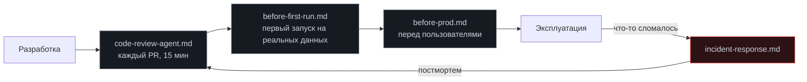

# Чек-листы

[← К содержанию курса](../README.md)

Четыре списка для четырёх моментов, когда легко забыть важное. Каждый рассчитан на реальное использование: пункты проверяемы, порядок значим, лишнего нет.

| Чек-лист | Когда применять | Время |
|---|---|---|
| [before-first-run.md](before-first-run.md) | Перед первым запуском агента на реальных данных | 20 мин |
| [before-prod.md](before-prod.md) | Перед выкатом на пользователей | 60 мин |
| [incident-response.md](incident-response.md) | Когда что-то пошло не так | по ходу |
| [code-review-agent.md](code-review-agent.md) | На ревью пулл-реквеста, меняющего агента | 15 мин |

---

## Правила пользования

**Чек-лист не заменяет понимание.** Он ловит забытое, а не учит. Если пункт непонятен, идите в соответствующий модуль по ссылке.

**Пункт либо выполнен, либо явно принят как риск.** Третьего состояния нет. «Потом сделаем» превращается в незакрытый пункт, о котором никто не помнит; вместо этого запишите: «принято как риск, ответственный X, срок Y».

**Чек-лист живёт и меняется.** После каждого инцидента задайте вопрос: какой пункт мог бы это предотвратить? Если такого пункта нет — добавьте. Если есть, но был пропущен — вопрос к процессу, а не к списку.

**Не превращайте в ритуал.** Список из шестидесяти пунктов, который проходят «галочками», хуже списка из пятнадцати, который читают. Если ваш чек-лист перестали читать, он слишком длинный.

---

## Что где проверяется

Обратите внимание на замыкание: постмортем инцидента меняет чек-лист ревью. Это единственный способ, которым списки становятся полезными, а не декоративными.

[← К содержанию курса](../README.md)
