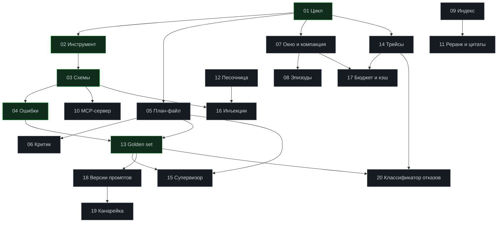

# Лабораторные: 20 работ с критериями приёмки

[← К содержанию курса](../README.md)

Лабораторные — основная форма практики в курсе. Каждая устроена одинаково: короткое задание, чёткий критерий приёмки, проверяемый командой, подсказки на случай затыка и разбор с объяснением, почему сделано именно так.

**Принцип.** Лаборатория не «повтори за мной», а «сделай так, чтобы прошла проверка». Заготовка (`starter/`) содержит `TODO` и не работает. Эталон (`solution/`) существует, но открывать его до трёх собственных попыток бессмысленно: вы получите чтение, а не навык.

---

## Как работать с лабораторной

~~~bash
make lab01                # запустить в текущем состоянии
make check lab01          # проверка приёмки: то, что должно позеленеть
make hint lab01           # следующая подсказка (по одной, не все сразу)
make solution lab01       # эталон: только после трёх попыток
make diff lab01           # сравнить своё решение с эталоном
~~~

**Структура каталога лабораторной.**

~~~
labs/lab01-agent-loop/
├── README.md          ← задание, критерии, подсказки, разбор
├── starter/           ← заготовка с TODO, не работает
│   └── agent.py
├── solution/          ← эталон
│   └── agent.py
└── tests/             ← автопроверка, запускается make check
    └── test_lab01.py
~~~

**Правило трёх попыток.** Затык дольше 25 минут — берите подсказку. Затык дольше часа с подсказками — открывайте эталон, но потом обязательно удалите его и напишите заново по памяти. Чтение решения даёт понимание, переписывание даёт навык.

**Правило «сломай специально».** У каждой лабораторной есть пункт «проверьте, что проверка падает». Тест, который никогда не падал, ничего не гарантирует. Это же правило действует для всего, что вы напишете в проде.

---

## Таблица лабораторных

| № | Лаборатория | Модуль | Время | Зависит от | Критерий приёмки |
|---|---|---|---|---|---|
| 01 | [Цикл агента](lab01-agent-loop/) | 01 | 90 мин | — | Цикл с четырьмя бюджетами не может уйти в бесконечность; каждый выход имеет код причины |
| 02 | [Первый инструмент](lab02-first-tool/) | 02 | 60 мин | 01 | Инструмент вызывается моделью корректно в 9 из 10 задач теста описаний |
| 03 | [Схемы и валидация](lab03-schemas/) | 02 | 90 мин | 02 | Три слоя валидации; ни один инструмент не исполняется без проверки |
| 04 | [Ошибки и повторы](lab04-errors/) | 02 | 90 мин | 03 | Закрытый список `error_code`; доля исправлений после ошибки выше 70% |
| 05 | [План-файл](lab05-plan-file/) | 03 | 90 мин | 01 | План в файле, цель иммутабельна, ровно один `in_progress`, валидатор плана зелёный |
| 06 | [Критик и рефлексия](lab06-critic/) | 03 | 90 мин | 05 | Машинный критик всегда первым; модель-критик на чистом контексте; лимит 2 итерации |
| 07 | [Окно и компакция](lab07-window-compaction/) | 04 | 120 мин | 01 | Прогон на 50 шагов не растёт линейно; `decisions_lost = 0` |
| 08 | [Эпизодическая память](lab08-episodic/) | 04 | 90 мин | 07 | Похожие эпизоды подмешиваются; измерено снижение числа шагов |
| 09 | [Индекс и поиск](lab09-index-search/) | 05 | 120 мин | — | recall@30 выше 0,90 на своём наборе из 60 вопросов |
| 10 | [MCP-сервер](lab10-mcp-server/) | 06 | 120 мин | 03 | Сервер поднимается, подключается двумя клиентами, негативные тесты путей падают корректно |
| 11 | [Реранк и цитаты](lab11-rerank-cite/) | 05 | 90 мин | 09 | recall@6 выше 0,80; `check_citations` не пропускает утверждений без источника |
| 12 | [Песочница](lab12-sandbox/) | 08 | 120 мин | — | Все негативные тесты изоляции проваливаются внутри контейнера |
| 13 | [Golden set и эвал](lab13-golden-set/) | 09 | 150 мин | 01–05 | `make eval` даёт pass rate с интервалом Уилсона и падает при регрессии |
| 14 | [Трейсы OpenTelemetry](lab14-otel-traces/) | 10 | 120 мин | 01 | Три вопроса из 10.2 закрываются за минуту по `run_id` |
| 15 | [Супервизор и роли](lab15-supervisor/) | 07 | 120 мин | 05, 13 | Мульти-агент сравнён с одиночным на 20 задачах; решение обосновано числами |
| 16 | [Защита от инъекций](lab16-injection-defense/) | 11 | 120 мин | 03, 12 | 20 сценариев не приводят к опасным действиям; 0% ложных отказов на контролях |
| 17 | [Бюджет и кэш](lab17-budget-cache/) | 12 | 120 мин | 07, 14 | Доля `cached_tokens` выше 50%; `cost_per_success` снижен без падения pass rate |
| 18 | [Версии промптов](lab18-prompt-versions/) | 13 | 90 мин | 13 | Промпты в файлах с версией; версия в трейсе; `CHANGELOG` с эффектами |
| 19 | [Канарейка и откат](lab19-canary-rollback/) | 13 | 120 мин | 18 | Откат одной командой меньше минуты; правила автоотката срабатывают на подставном ухудшении |
| 20 | [Классификатор отказов](lab20-failure-classifier/) | 14 | 120 мин | 14, 13 | Классификатор покрывает 70% случаев на 30 сохранённых провалах |

**Суммарное время:** около 36 часов. Это ядро практической части курса.

---

## Порядок прохождения

**Обязательная последовательность.** 01 → 02 → 03 → 04 задают фундамент: без цикла и слоя инструментов остальное не на что вешать. Дальше ветвление.

**Зелёным — то, что нельзя пропускать.** 01–04 и 13. Всё остальное можно взять в удобном порядке или отложить, если соответствующий механизм не нужен вашей задаче.

**Минимальный набор для трека «Спринт» (2 недели):** 01, 02, 03, 04, 05, 07, 12, 13, 14, 16, 17, 18, 20. Тринадцать из двадцати, около 24 часов.

---

## Формат README лабораторной

Чтобы вы знали, что ожидать внутри каждой.

~~~markdown
# Лаборатория 07. Окно контекста и компакция

Модуль: 04 · Время: 120 мин · Зависит от: lab01

## Задача
Одним абзацем: что должно работать после лабораторной.

## Что дано
Что уже есть в starter/, чего нет, какие фикстуры доступны.

## Критерий приёмки
Команда, которая должна вернуть 0, и что именно она проверяет.
Три-пять конкретных условий, каждое проверяемо.

## Шаги
5-8 шагов с указанием, что должно получиться после каждого.
Не «напиши функцию X», а «после этого шага прогон на 20 шагов
должен показывать постоянный размер окна».

## Проверьте, что проверка падает
Как специально сломать, чтобы убедиться: тест не декоративный.

## Подсказки

 по одной, от общей к конкретной. Четыре-пять штук.

## Разбор
Почему сделано так, какие альтернативы отброшены и почему,
на что смотреть в трейсе, какие числа считать нормой.

## Что дальше
Ссылка на следующую лабораторную и на раздел модуля.
~~~

---

## Проверка окружения перед началом

~~~bash
make doctor
~~~

Проверяет: версию Python (3.11+), наличие и работоспособность Docker, наличие `make`, `jq`, `git`; заполненность `.env`; доступность модели одним минимальным запросом; права на запись в `runs/`; наличие `pytest`.

**Правило.** Красный `doctor` — не начинайте лабораторные. Девять из десяти «странных ошибок» в первый день — это ненастроенное окружение, и час, потраченный на `doctor`, экономит день.

**Работа без ключей.** Лабораторные 01, 03, 04, 05, 07, 10, 12, 14, 18, 19, 20 полностью проходятся на `FakeLLM` и режиме replay — без сети и без расходов. Остальным нужна модель, но подойдёт локальная через `ollama` для всех, кроме 02, 06, 11, 13, 15, 16, где качество решений модели существенно.

---

## Как оценить себя

После каждой лабораторной три вопроса, и все три обязательны.

**Проходит ли проверка?** Формальный критерий.

**Можете ли объяснить механизм на салфетке за две минуты?** Без слов «так принято» и без обращения к коду. Если не можете — вы скопировали, а не поняли.

**Знаете ли, когда этот механизм вреден?** Самый важный и самый пропускаемый вопрос. У каждого механизма в курсе есть условия, при которых он ухудшает систему: компакция на коротких прогонах, мульти-агент без ограничений, RAG на маленьком корпусе, критик без машинных проверок. Если не можете назвать условие — вернитесь к разделу «когда не нужно» соответствующего модуля.

---

## Частые затыки и что с ними делать

| Затык | Обычная причина | Что делать |
|---|---|---|
| `make check` падает без понятного сообщения | Тест проверяет несколько условий, падает первое | Запустить `pytest -x -vv` напрямую, читать `assert` |
| Агент не вызывает инструмент | Описание инструмента, а не модель | Тест описаний из [раздела 2.3](../02-tool-calling/) |
| Прогон стоит подозрительно много | Не работает обрезка или компакция | `make cost RUN=last` и разбивка по шагам |
| Тесты изоляции проходят «слишком легко» | Проверяют не то (успех вместо провала команды) | Негативные тесты: успех теста = провал команды |
| Эвалы дают разные числа при каждом запуске | Один прогон на задачу | Минимум 5 прогонов, интервал Уилсона |
| Не попадает кэш промптов | Дата или идентификатор в начале окна | Проверить `cached_tokens`, вынести изменчивое после границы |

---

## Дальше

- [projects/](../projects/) — шесть сквозных проектов, где механизмы собираются вместе
- [benchmarks/](../benchmarks/) — наборы задач и методика замера
- [checklists/](../checklists/) — что проверить перед запуском и перед продом
- [anti-patterns/](../anti-patterns/) — каталог граблей с признаками и лечением

[← К содержанию курса](../README.md)
